---
title: Carte mère d'ordi de bureau Intel D945GCLF
...

Si vous voulez juste des instructions de flashage, jetez un coup d'oeil à
[../install/d945gclf.md](../install/d945gclf.md)

Cette carte mère est une carte mère de bureau mini-itx faites en 2008.
Elle utilise un processeur avec un seul coeur mais est 
[hyperthreadée](https://fr.wiktionary.org/wiki/Hyper-Threading), donc
pour le système d'exploitation il semble qu'il y a 2 threads.
La puce de flash est vraiment petite, 512Ko, donc grub2 ne passe pas, c'est
pourquoi libreboot doit utiliser seabios sur cette carte cible.
Le chiffrement du disque en entier ne sera pas possible, donc préparez-vous
en accordance.

Cette carte mère a un jeu de puces 945gc qui est l'équivalent de la 945gm
qui peut être trouvée dans le Lenovo x60/t60 ou le macbook2,1. Ce jeu de puces
inclut un contrôleur d'entrée/sortie IHC7.
La carte mère a un emplacement DIMM qui peut être remplit jusqu'à 2Go de
mémoire vive DDR2.

Au niveau de la connectivité, elle a un emplacement PCI, un port Ethernet 
10-100Mo/s, 4 emplacements et 4 ports USBs, avec un en-tête interne et 2
ports SATA.

La carte mère D945GCLF2 est une version améliorée de celle décrite ici.
Les diifférences sont: 1 en-tête USB de plus, l'Ethernet 10-100-1000Mo/s
et un processeur à deux coeurs (bénificiant aussi de l'hyperthreading).
Puisque la carte mère est presque identique (et le code source de coreboot
semble indiquer que ça marche, car la variable MAX\_CPU est définie sur 4), il
est cru que ça devrait marcher, mais ce n'est pas encore testé.

Remarques à propos du BIOS manufactureur:
--------------------------

-    Sans coreboot/libreboot cette carte mère est vraiment inutile, car
    le bios manufactureur/d'usine est très mauvais. Il ne veut pas démarrer
    sur n'importe quel disque dur connecté sur le port SATA ou USB.
    Avec libreboot ça marche bien.

-   Le bios du manufactureur protège en écriture le flashage donc ça
    nécessite un flashage externe pour installer libreboot sur cet
    appareil. Une fois que libreboot est flashé là-dedans il n'y a pas de
    flasher le micrologiciel intérieurement

Voici une image de la carte mère:
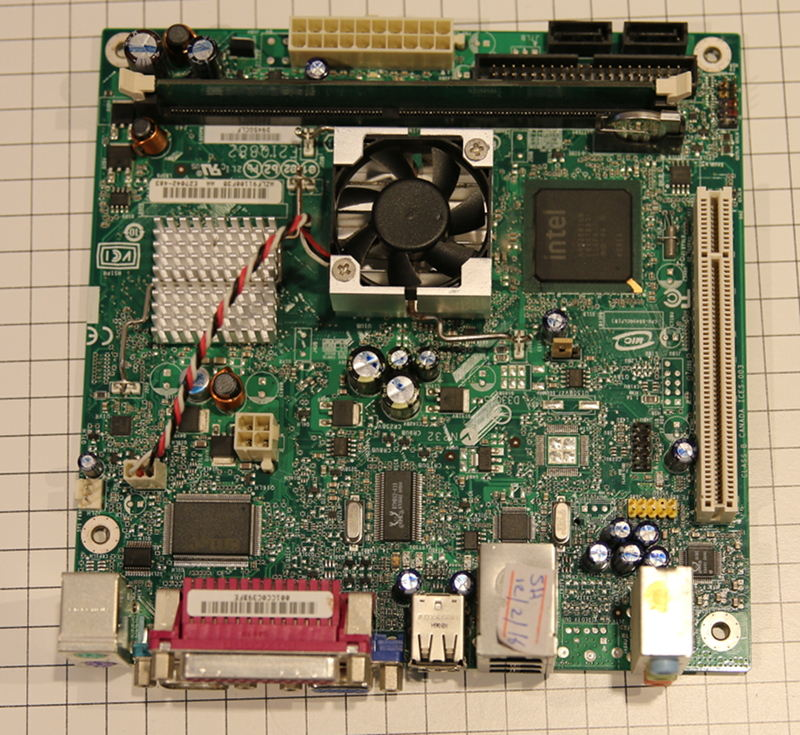\
Voici une image de la carte mère D945GCLF2:
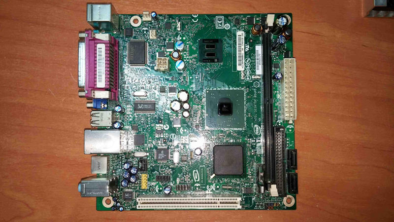{width="80%" height="80%"}\
Et de la puce de flash SPI SOIC8
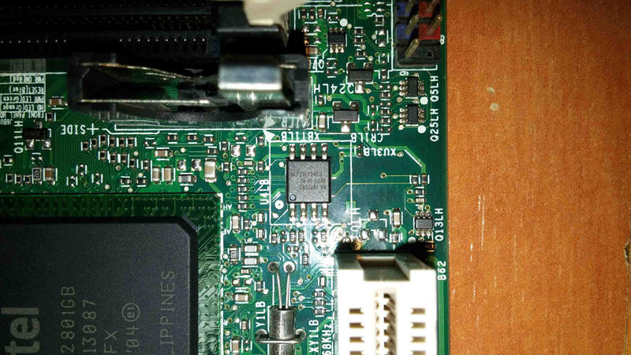{width="50%" height="50%"}

Comment remplacer la pâte thermique et le ventilateur
------------------------------------

Cette carte mère est équipée d'un ventilateur très merdique et bruyant qui n'a
pas de paliers, et donc ne peut pas être huilé et réparé correctement, ne
perdez pas votre temps a essayer de corriger celà, juste achetez un
ventilateur chinois de même taille\
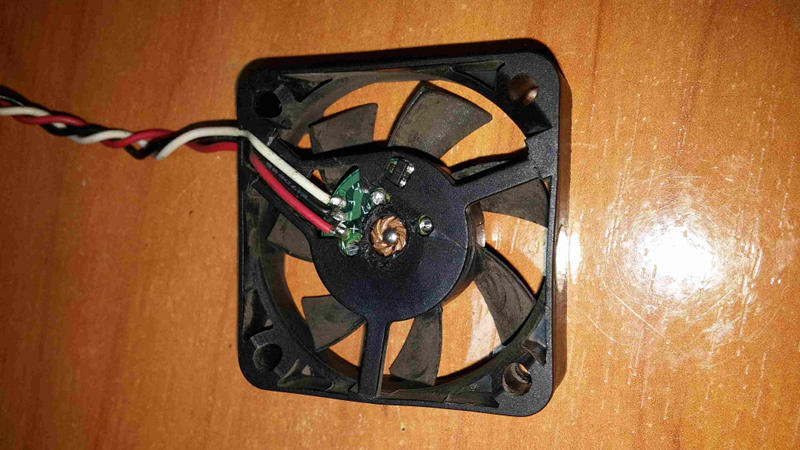{width="50%" height="50%"}
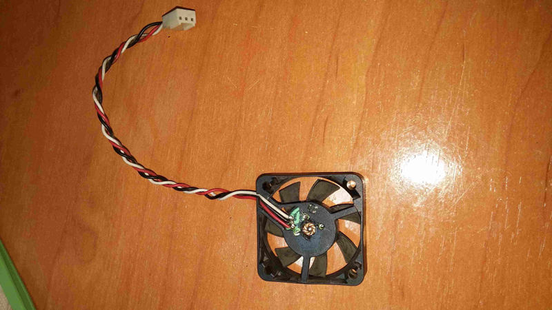{width="50%" height="50%"}\
Soyez sûr que le nouveau a le même câblage\
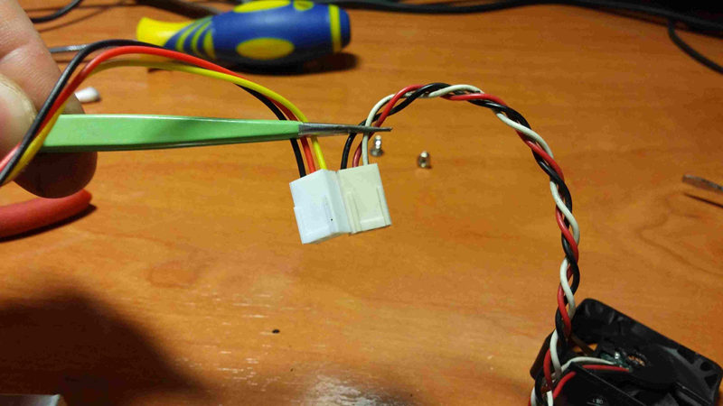{width="50%" height="50%"}\
Celui-ci est un nouveau, avec un palier et réparable\
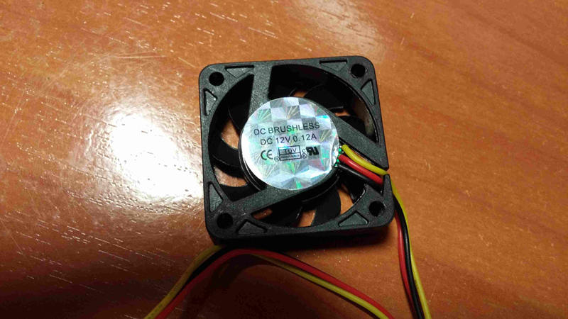{width="50%" height="50%"}
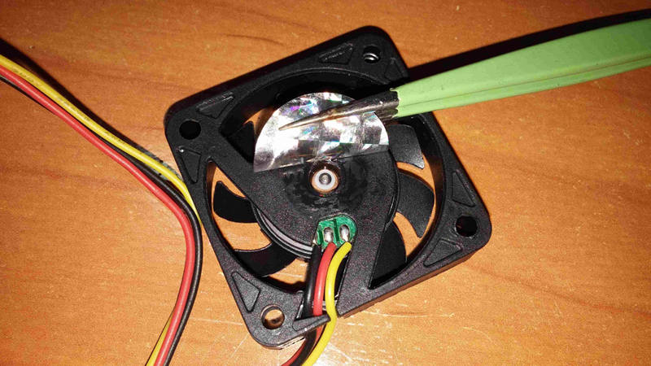{width="50%" height="50%"}\
Maintenant enlevez les deux dissipateurs en les tournant un peu, lentement,
ensuite nettoyez à la fois les silicones et les dissipateurs (il est
recommandé d'enlever tout d'abord la batterie du bios/cmos.\
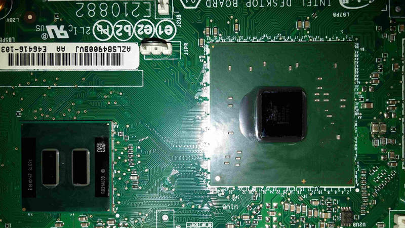{width="50%" height="50%"}\
Mettez un petit peu de pate thermique non conductrice sur les deux silicones
(seulement le silicone du processeur est montré dans cette image)\
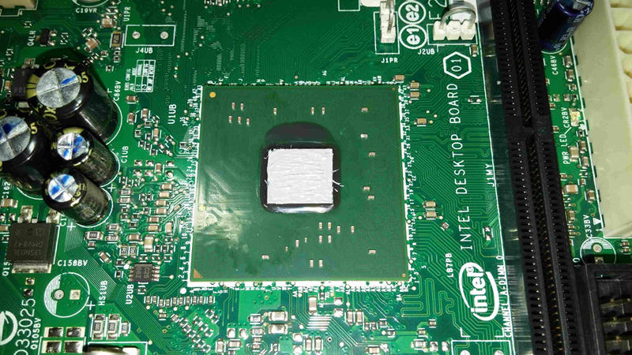{width="50%" height="50%"}\

Avant de monter un nouveau ventilateur, certains ont besoin de nouveaux vis
plus longs, soyez sûr de les avoir (sur la gauche est l'original, trop court
pour le nouveau ventilateur)\
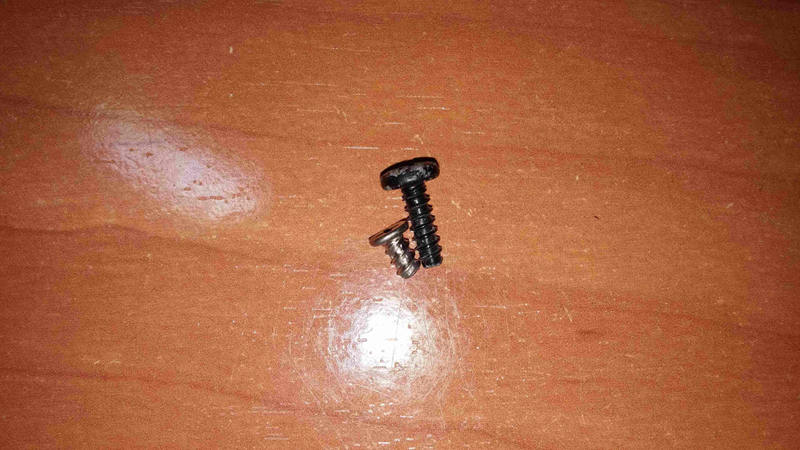{width="50%" height="50%"}\
Après cela,, montez votre nouveau ventilateur sur le dissipateur du processeur\
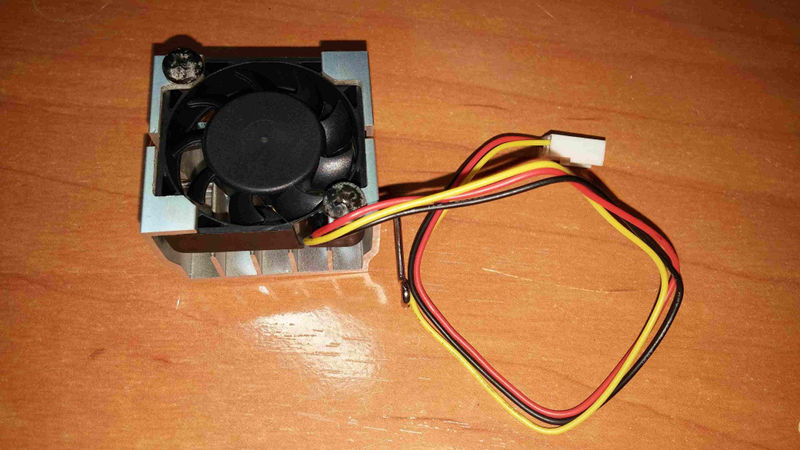{width="50%" height="50%"}\
Montez finalement les deux dissipateurs sur les deux puces, n'oubliez de
rebrancher le connecteur du ventilateur, et vous avez fini.

Copyright © 2016 Arthur Heymans <arthur@aheymans.xyz>\
Copyright © 2016 Vitaly Castaño Solana <vita\_cell@hotmail.com>\

Permission est donnée de copier, distribuer et/ou modifier ce document
sous les termes de la Licence de documentation libre GNU version 1.3 ou
quelconque autre versions publiées plus tard par la Free Software Foundation
sans Sections Invariantes,  Textes de Page de Garde, et Textes de Dernière de Couverture.
Une copie de cette license peut être trouvé dans [../fdl-1.3.md](fdl-1.3.md).
