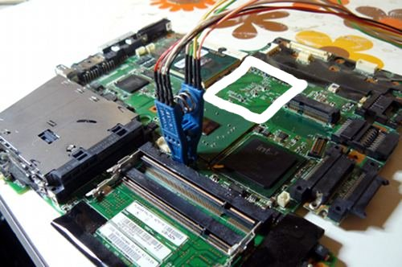

---
title: Liste de compatibilité matérielle 
x-toc-enable: true
...

Cette section concerne les compatibilités matérielles connues dans Libreboot.

Pour des instructions d'installation, référez vous à [../install/](../install/).

Liste de matériels supportés
--------------------------

Libreboot supporte les systèmes suivant dans la version actuelle:

### Ordinateurs de bureaux (AMD, Intel, x86)

-   [carte mère Gigabyte GA-G41M-ES2L](ga-g41m-es2l.md)
-   [carte mère Intel D510MO](d510mo.md)
-   [carte mère ASUS KCMA-D8](kcma-d8.md)
-   [Intel D945GCLF](d945gclf.md)
-   [Apple iMac 5,2](imac52.md)

### Serveurs/stations de travail(AMD, x86)

-   [carte mère ASUS KFSN4-DRE](kfsn4-dre.md)
-   [carte mère ASUS KGPE-D16](kgpe-d16.md)

### Ordinateurs portables (ARM)

-   [ASUS Chromebook C201](c201.md)

### Ordinateurs portables (Intel, x86)

-   [Lenovo ThinkPad X60/X60s](#list-of-supported-thinkpad-x60s)
-   [Lenovo ThinkPad X60 Tablet](#list-of-supported-thinkpad-x60-tablets)
-   [Lenovo ThinkPad T60](#supported-t60-list) (quelques exceptions)
-   [Lenovo ThinkPad X200](x200.md)
-   [Lenovo ThinkPad R400](r400.md)
-   [Lenovo ThinkPad T400](t400.md)
-   [Lenovo ThinkPad T500](t500.md)
-   [Lenovo ThinkPad W500](t500.md)
-   [Apple MacBook1,1](#information-about-the-macbook11)
-   [Apple MacBook2,1](#information-about-the-macbook21)

'Supporté' veut dire que les scripts de compilation savent comment construire
des images ROM pour ces systèmes, et que les systèmes ont été testé (confirmé
fonctionnels). Il y a peut-être des exceptions; en d'autres mots, c'est une
liste de systèmes 'officiellement' supportés.

Mise à jour de l'EC\* sur les i945 (X60, T60) et GM45 (X200, T400, T500, R400, W500)
==============================================================

\*EC: Embedded Controller, ou contrôleur embarqué

Il est recommandée de mettre à jour le micrologiciel de l'EC à sa dernière
version.
Le [micrologiciel de l'EC](../../faq.md#ec-embedded-controller-firmware)
est à part de libreboot, donc nous ne le fournissons pas, mais si vous avez
encore le BIOS Lenovo alors vous pouvez juste exécuter l'utilitaire de mise à
jour du BIOS Lenovo, qui mettra à jour à la fois la version du BIOS et de
l'EC. Jetez un coup d'oeil à:

-   [../install/#flashrom](../install/#flashrom)
-   <http://www.thinkwiki.org/wiki/BIOS_update_without_optical_disk>

NOTE: ça peut seulement être fait quand vous utilisez le BIOS Lenovo. Comment
mettre à jour le micrologiciel de l'EC quand on exécute libreboot, est
inconnu. Libreboot remplace seulement le micrologiciel du BIOS, pas celui de l'EC.

Le micrologiciel d'EC mis à jour à quelques avantage p.ex une meilleure
gestion de la batterie.

Comment trouver la version de l'EC que vous avez (i945/GM45)
================================================

Dans GNU+Linux, vous pouvez essayez ceci:

    $ grep 'at EC' /proc/asound/cards

Exemple de sortie:

    ThinkPad Console Audio Control at EC reg 0x30, fw 7WHT19WW-3.6

7WHT19WW est la version dans une notation différente, utilisez un moteur de
recherche pour trouver la version normale - dans le cas ici c'est 1.06 pour
X200 Tablet.

Jeux de puces WiFi recommandés
-------------------------

Les suivants sont connus pour bien marcher:

-   les cartes mini PCI express utilisant le jeu de puces Atheros AR9285 (p.ex
    Atheros AR5B95) - 802.11n
-   Les dongles USB utilsant le jeu de puce AR9271 (p.ex Unex DNuA 93-F) -
    802.11n
-   N'importe quels jeux de puces listés sur 
    <https://h-node.org/wifi/catalogue/en/1/1/undef/undef/yes?>

Ce qui suit a été mentionné sur IRC, mais c'est inconnu du projet libreboot si
ceux là marche avec le kernel linux-libre (c'est à tester):

-   ar5bhb116 ar9382 ABGN
-   \[0200\]: Qualcomm Atheros AR242x / AR542x Adapteur réseau sans fil 
    (PCI-Express) \[168c:001c\]

Liste des ThinkPad X60s supportés
-------------------------------

L'initialisation native de la carte graphique ('graphiques natifs') qui
remplace la ROM propriétaire option VGA ('[BIOS vidéo](https://fr.wikipedia.org/wiki/BIOS_vid%C3%A9o)'
ou 'VBIOS'), et voici tout les écrans LCDs compatibles:

Pour trouver quel panneau LCD vous avez, voyez:
[../misc/\#get\_edid\_panelname](../misc/#get_edid_panelname).

-   TMD-Toshiba LTD121ECHB: \#
-   CMO N121X5-L06: \#
-   Samsung LTN121XJ-L07: \#
-   BOE-Hydis HT121X01-101: \#

Vous pouvez enlever la carte mère X61/X61s du chassis et installer une carte
mère d'un X60/X60s à la place (pour flasher libreboot). Le chassis est
identique dans sa majorité et les carte mères sont de même forme/taille.

Le X60 vient de base avec un jeu de puce WiFi Intel qui ne marche pas du tout
sans micrologiciel propriétaire, et pendant que le BIOS de Lenovo s'exécute le
système refusera de démarrer si vous changer la carte WiFi. Heuresement, ça se
remplace très facilement; enlevez juste la carte et installez une autre
*après* que libreboot est installé. Voyez
[\#recommended\_wifi](#recommended_wifi) pour des remplacements.

Liste de ThinkPad X60 Tablets supportés
--------------------------------------

L'initialisation native de la carte graphique ('graphiques natifs') qui
remplace la ROM propriétaire option VGA ('[BIOS vidéo](https://fr.wikipedia.org/wiki/BIOS_vid%C3%A9o)'
ou 'VBIOS').

Pour trouver quel panneau LCD vous avez, voyez:
[../misc/\#get\_edid\_panelname](../misc/#get_edid_panelname).

Il y a 6 écrans LCD connus pour le X60 Tablet:

-   *X60T XGA (1024x768):*
    -   BOE-Hydis HV121X03-100 (marche)
    -   Toshiba Matsushita LTD121KC9B (marche)
    -   Samsung LTN121XP01 (ne marche pas. écran blanc)
    -   BOE-Hydis HT12X21-351 (ne marche pas. écran blanc)
-   *X60T SXGA+ (1400x1050):*
    -   BOE-Hydis HV121P01-100 (marche)
    -   BOE-Hydis HV121P01-101 (marche)

La majorité des X60Ts ont seulement un stylet, mais certains ont le tactile
ainsi que le stylet; le tactile/multitouches ne marche pas, seulement le
stylet marche.

Most X60Ts only have digitizer (pen), but some have finger (touch)
aswell as pen; finger/multitouch doesn't work, only digitizer (pen)
does.

Vous pouvez enlever la carte mère X61/X61s du chassis et installer une carte
mère d'un X60/X60s à la place (pour flasher libreboot). Le chassis est
identique dans sa majorité et les carte mères sont de même forme/taille.
*Il est connu si celà s'applique aussi entre le X60 Tablet et le X61 Tablet*

Le X60 Tablet vient de base avec un jeu de puce WiFi Intel qui ne marche pas du tout
sans micrologiciel propriétaire, et pendant que le BIOS de Lenovo s'exécute le
système refusera de démarrer si vous changer la carte WiFi. Heuresement, ça se
remplace très facilement; enlevez juste la carte et installez une autre
*après* que libreboot est installé. Voyez
[\#recommended\_wifi](#recommended_wifi) pour des remplacements.

Un utilisateur avec un X60T qui a le stylet+tactile a rapporté qu'il a
pu faire marcher le tactile. Ils ont utilisé linuxwacom au libellé git
0.25.99.2 et avait le suivant dans leur xorg.conf:

    # Now, for some reason (probably a bug in linuxwacom),
    # the 'Touch=on' directive gets reset to 'off'.
    # So you'll need to do
    # $ xsetwacom --set WTouch Touch on
    #
    # tested with linuxwacom git 42a42b2a8636abc9e105559e5dea467163499de7

    Section "Monitor"
         Identifier             "<default monitor>"
         DisplaySize     245 184
    EndSection

    Section "Screen"
         Identifier "Default Screen Section"
         Monitor    "<default monitor<"
    EndSection

    Section "InputDevice"
         Identifier  "WTouch"
         Driver      "wacom"
         Option      "Device" "/dev/ttyS0"
    #    Option      "DebugLevel" "12"
         Option      "BaudRate" "38400"
         Option      "Type" "touch"
         Option      "Touch" "on"
         Option      "Gesture" "on"
         Option      "ForceDevice" "ISDV4"
    #    Option      "KeepShape" "on"
         Option      "Mode" "Absolute"
         Option      "RawSample" "2"
    #    Option      "TPCButton" "off"
         Option      "TopX" "17"
         Option      "TopY" "53"
         Option      "BottomX" "961"
         Option      "BottomY" "985"
    EndSection

    Section "ServerLayout"
      Identifier    "Default Layout"
      Screen        "Default Screen Section"
      InputDevice   "WTouch" "SendCoreEvents"
    EndSection

Liste des T60 supportés 
------------------

L'initialisation native de la carte graphique ('graphiques natifs') qui
remplace la ROM propriétaire option VGA ('[BIOS vidéo](https://fr.wikipedia.org/wiki/BIOS_vid%C3%A9o)'
ou 'VBIOS').

Pour trouver quel panneau LCD vous avez, voyez:
[../misc/\#get\_edid\_panelname](../misc/#get_edid_panelname).

*Quelques variantes du T60 ont des cartes graphiques ATI, et tout les
ordinateurs portables T60p ont des cartes graphiques ATI. Celles-ci sont
incompatibles ! Voyez [\#thinkpad-t60-ati-gpu-and-thinkpad-t60-intel-gpu-differences](#thinkpad-t60-ati-gpu-and-thinkpad-t60-intel-gpu-differences)
pour savoir comment remédier à cela*

Écrans LCD testés qui marchent:

-   IDtech N141XC (14.1" 1024x768)
-   TMD-Toshiba LTD141ECMB (14.1" 1024x768)
-   TMD-Toshiba LTD141EN9B (14.1" 1400x1050) (FRU P/N 41W1478 recommandé pour
    la carte d'inverseur)
-   Samsung LTN141P4-L02 (14.1" 1400x1050) (FRU P/N 41W1478 recommandé pour la
    carte d'inverseur)
-   LG-Philips LP150E05-A2K1 (15.1" 1400x1050) (P/N 42T0078 FRU 42T0079 or P/N
    41W1338 recommandé pour la carte d'inverseur)
-   Samsung LTN150P4-L01 (15.1" 1400x1050) (P/N 42T0078 FRU 42T0079 or P/N
    41W1338 recommandé pour la carte d'inverseur) (n'est pas un écran T60
    officiel autant que j'en sais, mais ça marche) 
-   BOE-Hydis HV150UX1-100 (15.1" 1600x1200) (P/N 42T0078 FRU 42T0079 or P/N
    41W1338 recommandé pour la carte d'inverseur)
-   Samsung LTN141XA-L01 (14.1" 1024x768)

Écrans LCDs testés: *ne marchent pas encore (incompatibles; voyez
[../future/\#lcd\_i945\_incompatibility](../future/#lcd_i945_incompatibility))*

-   LG-Philips LP150X09 (15.1" 1024x768)
-   Samsung LTN150XG (15.1" 1024x768)
-   LG-Philips LP150E06-A5K4 (15.1" 1400x1050) (par ailleurs, n'est pas un
    écran T60 officiel)
-   Samsung LTN154X3-L0A (15.4" 1280x800)
-   IDtech IAQX10N (15.1" 2048x1536) (pas d'affichage de GRUB, l'affichage dans
    GNU+Linux est chaud) (P/N 42T0078 FRU 42T0079 or P/N 41W1338
    recommandé pour la carte d'inverseur)
-   IDtech N150U3-L01 (15.1" 1600x1200) (pas d'affichage de GRUB, l'affichage dans
    GNU+Linux marche) (P/N 42T0078 FRU 42T0079 or P/N 41W1338 recommandé
    pour la carte d'inverseur)

*Les écrans LCD suivant ne sont pas testés. Si vous avez un de ces écrans
alors envoyez un rapport!*

-   BOE-Hydis HT14X14 (14.1" 1024x768)
-   Boe-Hydis HT14P12 (14.1" 1400x1050) (FRU P/N 41W1478 recommandé pour la
    carte d'inverseur)
-   CMO (IDtech?) 13N7068 (15.1" 1024x768)
-   CMO (IDtech?) 13N7069 (15.1" 1024x768)
-   BOE-Hydis HV150P01-100 (15.1" 1400x1050) (P/N 42T0078 FRU 42T0079
    or P/N 41W1338 recommandé pour la carte d'inverseur)
-   BOE-Hydis HV150UX1-102 (15.1" 1600x1200) (P/N 42T0078 FRU 42T0079
    or P/N 41W1338 recommandé pour la carte d'inverseur)
-   IDtech IAQX10S (15.1" 2048x1536) (P/N 42T0078 FRU 42T0079 or P/N
    41W1338 recommandé pour la carte d'inverseur)
-   Samsung LTN154P2-L05 (42X4641 42T0329) (15.4" 1680x1050)
-   LG-Philips LP154W02-TL10 (13N7020 42T0423) (15.4" 1680x1050)
-   LG-Philips LP154WU1-TLB1 (42T0361) (15.4" 1920x1200) *(pour T61p
    mais ça pourrait marcher dans le T60. On ne sait pas!)*
-   Samsung LTN154U2-L05 (42T0408 42T0574) (15.4" 1920x1200) *(pour
    T61p mais ça pourrait marcher dans le T60. On ne sait pas!)*

Il est inconnu si oui ou non les écrans 1680x1050 (15.4") et 1920x1200 (15.4")
utilisent une carte d'inverseur différente que les écrans 1280x800.

Le T60 vient de base avec un jeu de puce WiFi Intel qui ne marche pas du tout
sans micrologiciel propriétaire, et pendant que le BIOS de Lenovo s'exécute le
système refusera de démarrer si vous changer la carte WiFi. Heuresement, ça se
remplace très facilement; enlevez juste la carte et installez une autre
*après* que libreboot est installé. Voyez
[\#recommended\_wifi](#recommended_wifi) pour des remplacements.

Différences d'un ThinkPad T60 avec carte graphique ATI ou Intel
----------------------------------------------------------------

Si votre T60 est un modèle 14.1 ou 15.1 pouces (") avec un GPU ATI, ça ne
marchera pas par défaut avec libreboot mais vous pouvez remplacer la carte
mère avec celle d'un autre T60 ayant un GPU d'Intel, et ensuite libreboot
devrait marcher.

Autant que j'en sache, les cartes mères du T60 14.1" (GPU Intel) et 15.1" (GPU
Intel) sont les mêmes; des 'espaceurs' sont utilisés sur celle tu T60 15.1".
Dans n'importe quel cas, il fait bon sens d'en trouver une qui est sûre de
rentrer dans votre chassis.

As far as I know, 14.1" (Intel GPU) and 15.1" (Intel GPU) T60
carte mères are the same, where 'spacers' are used on the 15.1" T60.
In any case, it makes sense to find one that is guaranteed to fit in
your chassis.

Il y a aussi un T60 15.4" avec un GPU Intel.

Note: les ordinateurs portables T60*p* ont tous des graphiques ATI. Ils ne
peuvent pas être utilisés avec libreboot dans n'importe quelles circonstances.

La carte mère T60 suivante (voyez la zone surligné en blanc) montre un espace
vide là où devrait être un GPU ATI (cette carte mère particulière a un GPU
Intel):\

La raison pour laquelle le GPU ATI sur le T60 n'est pas supporté est dû au
VBIOS (BIOS Vidéo) qui est non libre. Le VBIOS pour le GPU Intel sur le
X60/T60 a été déconstruit, et remplacé avec du logiciel libre et donc marchera
dans libreboot.

Le 'BIOS Vidéo' est ce qui initialise les graphiques.

Voyez: <https://fr.wikipedia.org/wiki/BIOS_vid%C3%A9o>.\
Dans les faits, le manque de VBIOS libre en général est un gros problème dans
coreboot, et est un raison (parmi d'autres) pourquoi beaucoup d'adaptions pour
coreboot ne sont pas en accord avec le but de libreboot.

Théoriquement, le ThinkPad T60 avec un GPU ATI peut marcher avec libreboot et
avoir des images ROM compilé pour, néamoins en pratique ça ne pourra pas être
utilisable en tant qu'ordinateur portable parce qu'il n'y aura pas d'affichage
visuel du tout. Cela dit, une telle configuration est acceptable pour un
serveur 'sans tête' (avec une console série/ssh en tant qu'affichage).

Informations à propos du macbook1,1
--------------------------------

There is an Apple laptop called the macbook1,1 from 2006 which uses the
same i945 chipset as the ThinkPad X60/T60. A developer ported the
[MacBook2,1](#information-about-the-macbook21) to coreboot, the ROM images also work on the
macbook1,1.

You can refer to [\#information-about-the-macbook21](#information-about-the-macbook21)
for most of this. Macbook2,1 laptops come with Core 2 Duo processors
which support 64-bit operating systems (and 32-bit). The MacBook1,1
uses Core Duo processors (supports 32-bit OS but not 64-bit), and it is
believed that this is the only difference.

It is believed that all models are compatible, listed here:

-   <http://www.everymac.com/ultimate-mac-lookup/?search_keywords=MacBook1,1>

### Compatible models

Specifically (Order No. / Model No. / CPU):

-   MA255LL/A / A1181 (EMC 2092) / Core Duo T2500 *(testé - marche)*
-   MA254LL/A / A1181 (EMC 2092) / Core Duo T2400 *(testé - marche)*
-   MA472LL/A / A1181 (EMC 2092) / Core Duo T2500 (untested)

Unbricking: [this page shows disassembly
guides](https://www.ifixit.com/Device/MacBook_Core_2_Duo) and mono's
page (see [\#information-about-the-macbook21](#information-about-the-macbook21))
shows the location of the SPI flash chip on the carte mère. [How to remove the carte mère](https://www.ifixit.com/Guide/MacBook+Core+2+Duo+PRAM+Battery+Replacement/529).

No method is yet known for flashing in GNU+Linux while the Apple
firmware is running. You will need to disassemble the system and flash
externally. Reading from flash seems to work. For external flashing,
refer to [../install/bbb\_setup.md](../install/bbb_setup.md).

Information about the macbook2,1
--------------------------------

Il y a un ordinateur portable d'Apple nommé le macbook2,1, sorti vers la fin
2006 ou début 2007 qui utilise le même jeu de puce que ThinkPad X60 et
ThinkPad T60. Un développeur a adapté coreboot à son macbook2,1, et maitenant
libreboot peut s'exécuter dessus.

Mono Moosbart est la personne qui a écrit l'adaption pour le macbook2,1.
Référencé ci-dessous sont des copies (mises à jour au temps de l'écriture,
2014-06-30) des pages que cette personne a écrite lors de l'adaption de
coreboot sur leur macbook2,1. Elles sont incluses ici au cas où le site
principal s'arrête pour une raison quelconque, puisqu'il inclus un tas
d'informations utiles.

Sauvegardes faites utilisant `wget`:

    $ wget -m -p -E -k -K -np http://macbook.donderklumpen.de/
    $ wget -m -p -E -k -K -np http://macbook.donderklumpen.de/coreboot/

Utilisez `-e robots=off` si vous utilisez cette astuce pour d'autres sites et
que le site restreint l'utilisation de robots.txt

### Installer des distributions GNU+Linux (sur le micrologiciel EFI d'Apple)

Comment démarrer un ISO:  gravez le sur un CD (comme vous le feriez
normallement) et maintenez la touche Alt/Ctrl appuyée pendant que vous
démarrez.
Le chargeur d'amorçage détectera le CD GNU+Linux en tant que 'Windows' (parce
qu'Apple pense que GNU+Linux n'existe pas). Installez le comme d'habitude.
Quand vous démarrez à nouveau, maintenez appuyé Alt/Ctrl encore une fois.
L'installation (sur le disque dur) sera encore une vois vue comme 'Windows'
(ce n'est pas actuellement Windows, mais Apple aime à penser qu'Apple et
Microsoft est tout ce qui existe).
Maintenant pour installer libreboot, suivez
[../install/\#flashrom\_macbook21](../install/#flashrom_macbook21).

### Page wiki Coreboot

-   <https://www.coreboot.org/Board:apple/macbook21>

### Modèles Compatibles

Il est cru que tout les modèles listés ci-dessous sont compatibles:

-   <http://www.everymac.com/ultimate-mac-lookup/?search_keywords=MacBook2,1>

Spécificiquement  (Order No. / Model No. / CPU):

-   MA699LL/A / A1181 (EMC 2121) / Intel Core 2 Duo T5600 *(testé -
    marche)*
-   MA701LL/A / A1181 (EMC 2121) / Intel Core 2 Duo T7200 *(testé -
    marche)*
-   MB061LL/A / A1181 (EMC 2139) / Intel Core 2 Duo T7200 (non testé)
-   MA700LL/A / A1181 (EMC 2121) / Intel Core 2 Duo T7200 *(testé -
    marche)*
-   MB063LL/A / A1181 (EMC 2139) / Intel Core 2 Duo T7400 (marche)
-   MB062LL/A / A1181 (EMC 2139) / Intel Core 2 Duo T7400 *(testé -
    marche)*

Également digne d'intérêt:
[../git/\#config\_macbook21](../git/#config_macbook21).

Débousillage:
[cette page montre des guides de désassemblage](https://www.ifixit.com/Device/MacBook_Core_2_Duo)
et la page de Mono (voir au dessus) montre la place de la puce flash SPI sur
la carte mère.
[Comment retirer la carte mère](https://www.ifixit.com/Guide/MacBook+Core+2+Duo+PRAM+Battery+Replacement/529).

Pour le flashage externe, référez-vous à [../install/bbb\_setup.md](../install/bbb_setup.md).

Vous aurez besoin de remplacer OS X avec GNU+Linux avant de flasher Libreboot.
(OSX ne s'exécutera pas du tout dans Libreboot).

### Problèmes et solutions

Il y a un seul bouton souris, néamoins le tapotage multi-doigts marche.
La durée de la batterie est pauvre comparé au X60/T60. Le logo Apple à
l'arrière est un trou, ça veut dire qu'il brille. Vous devriez 
[le couvrir](http://cweiske.de/tagebuch/tuxbook.htm)

*Le MacBook2,1 est fourni avec une webcam qui ne marche pas avec du logiciel
libre. Les webcams sont un risque de sécurité et de confidentialité;
couvrez-là ! Ou enlevez-la.*

*The MacBook2,1 comes with a webcam which does not work with free
software. Webcams are a privacy and security risk; cover it up! Or
remove it.*

Des problèmes plus poussés ont des solutions:

#### Activer AltGr

Le clavier a une touche entrée de pavé numérique au lieu d'un AltGr. La
première touche sur le côté droit de la barre espace est la touche Apple
"command". Sur sa droite est la touche entrée de pavé numérique. Nous pouvons
la faire agir en tant qu'AltGr.

Si votre système d'exploitation est Trisquel ou une autre distribution basée
dpkg, il y a une solution facile. Sous root (ou sudo) exécutez

    # dpkg-reconfigure keyboard-configuration

et sélectionnez l'option "apple laptop", laissez les autres paramètres avec
leur défauts jusqu'à qu'on vous propose l'option "Use Keypad Enter as AltGr".
Sélectionnez ceci. La touche entrée du pavé numérique agira alors partout
comme un AltGr.

Pour Parabola ou d'autres distributions basées sur systemd vous pouvez activer
AltGr manuellement. Ajoutez simplement la ligne

    KEYMAP_TOGGLE=lv3:enter_switch

au fichier /etc/vconsole.conf puis redémarrez l'ordinateur.

#### Activez le touché à 3 doigts

Un utilisateur a soumis un utilitaire pour activer le tapotage a 3 doigts sur
cet ordinateur portable. C'est disponibles dans
*resources/utilities/macbook21-three-finger-tap* dans le répertoire git de
libreboot.

A user submitted a utility to enable 3-finger tap on this laptop. It's
available at *resources/utilities/macbook21-three-finger-tap* in the
libreboot git repository.

#### Rendre le pavé tactile moins mou

Les kernels Linux de version 3.15 ou ultérieurs peuvent rendre le pavé tactile
extrêmement lent. Un utilisateur a rapporté qu'il pouvait avoir une meilleure
réponse du pavé tactile avec le contenu suivant dans leur xorg.conf:

    Section "InputClass"
     Identifier "Synaptics Touchpad"
     Driver "synaptics"
     MatchIsTouchpad "on"
     MatchDevicePath "/dev/input/event*"
     Driver "synaptics"
    # The next two values determine how much pressure one needs
    # for tapping, moving the cursor and other events.
     Option "FingerLow" "10"
     Option "FingerHigh" "15"
    # Do not emulate mouse buttons in the touchpad corners.
     Option "RTCornerButton" "0"
     Option "RBCornerButton" "0"
     Option "LTCornerButton" "0"
     Option "LBCornerButton" "0"
    # One finger tap = left-click
     Option "TapButton1" "1"
    # Two fingers tap = right-click
     Option "TapButton2" "3"
    # Three fingers tap = middle-mouse
     Option "TapButton3" "2"
    # Try to not count the palm of the hand landing on the touchpad
    # as a tap. Not sure if helps.
     Option "PalmDetect" "1"
    # The following modifies how long and how fast scrolling continues
    # after lifting the finger when scrolling
     Option "CoastingSpeed" "20"
     Option "CoastingFriction" "200"
    # Smaller number means that the finger has to travel less distance
    # for it to count as cursor movement. Larger number prevents cursor
    # shaking.
     Option "HorizHysteresis" "10"
     Option "VertHysteresis" "10"
    # Prevent two-finger scrolling. Very jerky movement
     Option "HorizTwoFingerScroll" "0"
     Option "VertTwoFingerScroll" "0"
    # Use edge scrolling
     Option "HorizEdgeScroll" "1"
     Option "VertEdgeScroll" "1"
    EndSection

Copyright © 2014, 2015, 2016 Leah Rowe <info@minifree.org>\
Copyright © 2017 Eemeli Blåsten <https://drblasten.com>\

Permission est donnée de copier, distribuer et/ou modifier ce document
sous les termes de la Licence de documentation libre GNU version 1.3 ou
quelconque autre versions publiées plus tard par la Free Software Foundation
sans Sections Invariantes,  Textes de Page de Garde, et Textes de Dernière de Couverture.
Une copie de cette license peut être trouvé dans [../fdl-1.3.md](fdl-1.3.md).
