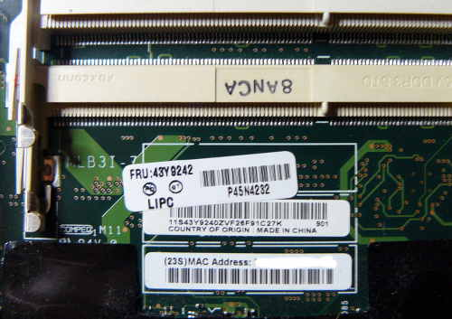

---
title: Changer l'adresse MAC
...

Introduction (GM45+e1000)
=========================

Cette section est appliquable à tous les ordinateurs portables supportés par Libreboot avec le série de mobile 4 de jeu de puces (comme montré dans `$ lspci`)
qui utilise le contrôleur ethernet e1000 (p.E. T400, X200).
Le R500 est une exception à celà car il n'utilise pas le e1000
intégré.

Sur ces ordinateurs portables, l'[adresse MAC](https://en.wikipedia.org/wiki/MAC_address) pour le contrôleur ethernet gigabit intégré est stockée à l'intérieur de la puce flash, au côté de Libreboot et d'autres données de configuration.
Dès alors, installer Libreboot l'écrasera.

Donc, pour ces ordinateurs portables, Libreboot préconstruit contient dèjà une adresse MAC générique dans la section de configuration. Cette adresse est `00:f5:f0:40:71:fe` dans les builds datant d'avant le 01/16/2020 et `00:4c:69:62:72:65` dans ceux d'après.
À moins que vous la changiez, votre ordinateur démarrera et l'utilisera. Ça peut mener à des problèmes réseaux s'il y plus d'un ordinateur sous Libreboot dans un même réseau de couche 2 (p.e. sur le même commutateur/switch).
Le commutateur (postman) ne pourra simplement pas savoir à qui
délivrer/router l'information puisque les adresses MACs seront les
mêmes.

Pour prévenir ces collisions d'adresses, vous pouvez soit modifier
le Libreboot précompilé pour utiliser une adresse de votre choix ou
vous pouvez changer l'adresse via les scripts de démarrage de votre
système d'exploitation.

Dans tout les cas, c'est une bonne idée de noter quelque part
l'adresse d'origine qu'avait votre ordinateur.

Obtenir l'adresse MAC existante
==================================

L'adresse MAC existante peut être obtenue grâce aux méthodes
suivantes:

1.  Exécutez `ip link` ou `ifconfig` dans un terminal/console;
    trouvez votre périphérique réseau (p.e. **enpXXX** ou **ethXXX),
    et cherchez pour un ensemble de 12
    [nombres hexadécimaux](https://fr.wikipedia.org/wiki/Hexadecimal)
    délimités par des ":" .
    Par exemple: `00:f3:f0:45:91:fe`.

    * `$ ip link`

         `... link/ether ??:??:??:??:??:?? brd ...`

    * Alternativement:

        `$ ifconfig`

        `... ether ??:??:??:??:??:?? txqueuelen ...`

2.  Sinon vous pouvez lire l'étiquette blanche qui se trouve souvent
    sur la carte mère, en dessous des barettes mémoires:
    

3.  L'adresse MAC est habituellement écrite sur la coque/chassis de l'ordinateur
    portable. Celle-ci sera incorrecte si la carte mère a été changée et que les
    autocollants n'étaient pas mis à jour.

Changer l'adresse MAC dans le système d'exploitation
================================================

Il y a 3 manières portable entre systèmes pour le faire:

1. En utilisant le paquet iproute2:

    `# ip link set <interface> down`

    `# ip link set dev <interface> address 00:4c:69:62:72:65`

    `# ip link set <interface> up`

2.  En utilisant l'ancienne commande ifconfig:

    `# ifconfig <interface> hw ether 00:4c:69:62:72:65`

3.  En utilisant le paquet macchanger.

3. Using the macchanger package.

Vous pouvez utiliser une de ces trois méthodes dans les scripts
d'initialisation de votre système d'exploitation, ou vous pouvez
choisir la propre configuration réseau du système d'exploitation.
Référez-vous à la documentation de votre système d'exploitation sur
comment faire ceci.

Changer l'adresse MAC dans Libreboot
=====================================

Voyez [ici](../gnulinux/grub_cbfs.md#changeMAC).

Copyright © 2017 Fedja Beader <fedja@protonmail.ch>

Copyright © 2014, 2015 Leah Rowe <info@minifree.org>

Permission est donnée de copier, distribuer et/ou modifier ce document
sous les termes de la Licence de documentation libre GNU version 1.3 ou
quelconque autre versions publiées plus tard par la Free Software Foundation
sans Sections Invariantes,  Textes de Page de Garde, et Textes de Dernière de Couverture.
Une copie de cette license peut être trouvé dans [../fdl-1.3.md](fdl-1.3.md).
