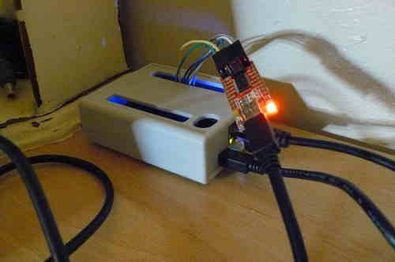
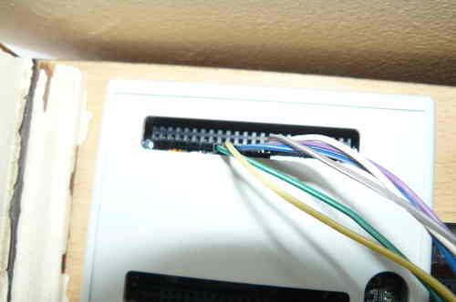
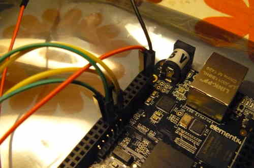
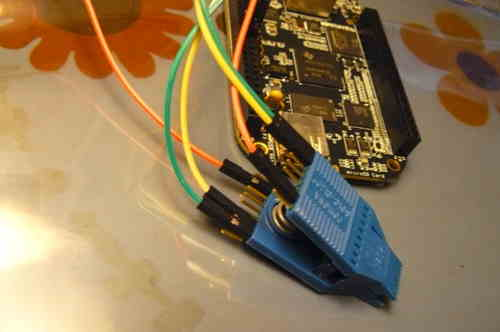

---
title: Comment programmer une puce flash SPI avec le BeagleBone Black ou Teensy 3.1
...

Ce document existe en tant que guide pour lire ou écrire dans une puce
flash SPI avec le BeagleBone Black, utilisant le logiciel
[flashrom](http://flashrom.org/Flashrom). Un BeagleBone Black, révision C a
été utilisé lors de la création de ce guide, mais des révisions plus ancienne
pourrait peut-être aussi marcher.

***À NOTER: l'utilisation du BeagleBone Black est seulement à titre d'exemple,
ne l'achetez à moins que vous LE voulez spécifiquement.*** *Il y a beaucoup
d'ordinateur monocarte (SBC, Single Board Computer) à architecture ARM qui
sont capables de programmation système interne (par flashage externe) et ils
exécutent aussi bien cette tâche. L'utilisation commune d'arbre des
périphériques (devicetree) sur ces appareils permet de les configurer de façon
similaire, mais pas identique, donc un peu de recherche est à faire de votre
côté. Mais il est possible d'utiliser des appareils plus petits comme la stm32
bluepill avec un autre ordinateur pour arriver à des résultats semblables.*

*Note: ce guide a été écrit pour Debian Stretch 9.5, qui est le dernier
système d'exploitation pour BeagleBone Black à la date de Juin 2019.
Il est possible que ces instructions sont obsolètes si de nouvelles versions
de systèmes d'exploitations supportées ont été publiées depuis.*

Il n'y avait pas de justification pour une section plus poussé pour le Teensy.
Référez-vous simplement à [cette page sur
flashrom.org](https://www.flashrom.org/Teensy_3.1_SPI_%2B_LPC/FWH_Flasher#ISP_Usage)
pour des informations sur comment le configurer, et corrélez celà avec les
PINs de la puce de flash SPI montrés dans d'autres guides de la documentation
libreboot sur chaque carte mère.
Au temps de l'écriture de ceci, le teensy est testé bon pour le flashage sur
le ThinkPad X200, mais ça devrait marcher pour d'autres cibles.
Voici une photo de la mise en place du teensy:
<http://h5ai.swiftgeek.net/IMG_20160601_120855.jpg>

Passons au BeagleBone Black...

Matériel requis
=====================

Liste de courses (des images du matos sont montrées plus tard):

-   Un programmeur SPI externe compatible [Flashrom](http://flashrom.org)
    *BeagleBone Back*, référé souvent en tant que 'BBB' (rev. C), est
    hautement recommandé. Vous pouvez en acheter un depuis
    [Adafruit](https://www.adafruit.com) (USA),
    [ElectroKit](http://electrokit.com) (Sweden) ou de n'importe qui figurant
    dans la liste des fournisseurs listés sur le [site web de
    BeagleBoard](http://beagleboard.org/black) (regardez en dessous de
    'Acheter'). Nous recommandons ce produit parce que nous savons qu'il
    marche bien pour nos missions et ne nécessite aucun logiciel non-libre.

-   Scotch isolant: couvrez entièrement le dessous du BBB (la partie qui
    repose sur la surface de la carte mère). C'est important de s'assurer que
    rien ne court-circuite lorsqu'on place le BBB sur une carte mère. La
    majorité des magasins de bricolage/électronique en ont. Optionnellement,
    vous pouvez utiliser la partie basse d'une [enclosure plastique
    Hammond](http://www.hammondmfg.com/1593HAM.htm#BeagleBoneBlack).
-   Des pinces pour se connecter sur la puce de flash: si vous avez une puce
    flash SOIC-16 (16 pins), vous aurez besoin des *Pomona 5252* ou équivalent.
    Pour les puces flash SOIC-8 (8 pins), vous aurez besoin des *Pomona 5250*
    ou équivalent. Vérifiez quelle puce vous avez avant de commander une
    pince.
    Aussi, vous ferez bien d'acheter deux pinces ou plus car elles se cassent
    facilement. [Farnell element 14](http://farnell.com/) vend celles-ci et
    livre dans de nombreux pays. Certaines personnes trouvent qu'il est
    difficile de s'en procurer, espécialement en Amérique du Sud.
    Si vous connaissez de bon fournisseurs, veuillez silvouplait contacter le
    projet libreboot avec les informations concernées. *Si vous ne pouvez pas
    vous procurer une pince pomona, d'autres pinces marcheront peut-être, p.ex
    3M, mais elles ne sont pas aussi fiables. Vous pouvez aussi souder
    directement les fils sur la puce si ça vous convient; les pinces sont
    juste là pour le comfort pour tout dire..*
-   *Alimentation externe 3.3V DC* pour alimenter la puce flash: une
    alimentation ATX / PSU (ou électrique, commune sur les ordinateurs de bureau Intel/AMD)
    feront l'affaire pour ça. Un PSU de laboration (DC, ajusté 3.3V)
    fonctionnera aussi.
        -    Avoir un multimètre peut être utile pour vérifier que l'on
             fournit bien 3.3V.
-   *Alimentation externe 5.5V DC* ([connecteur coaxial](https://en.wikipedia.org/wiki/Coaxial_power_connector), pour
    alimenter le BBB: ce dernier peut se faire alimenter via USB, mais une
    alimentation dédiée est recommandée. Celles-ci devrait être facile à
    trouver dans la plupart des magasins vendant de l'électronique. OPTIONEL.
    Seulement nécessaire si vous n'alimentez pas par USB, ou si vous voulez
    utiliser le [debug EHCI](../misc/bbb_ehci.md).
-   *Broches / câbles volants* (broches 2.54mm/0.1"): vous devrez vous
    procurer des câbles male--male, male--femelle et femelle--femelle de 10cm.
    Prenez-en beaucoup. D'autres noms possibles pour ces cables/fils/cuivrés
    sont:
        - câbles volants
        - cables de montage (puisqu'ils sont souvent utilisés sur les planches
          de montages)
        - vous pouvez aussi peut-être faire ces câbles vous-memes.

    [Adafruit](https://www.adafruit.com) en vend comme beaucoup d'autres.
    *Certaines personnes trouvent qu'ils sont difficiles à acheter. veuillez
    silvouplait contacter le project libreboot si vous connaissez de bon
    vendeurs.* Il est aussi possible que vous fabriquez ces câbles vous-même.
    Pour les connecteurs PSU, utiliser de long câbles, p.ex 20cm, est
    acceptable et vous pouvez les étendre si besoin.
-   *Câble USB Mini A-B* (le BeagleBone est déjà probablement fournit avec
    l'un d'eux.) - *OPTIONEL - seulement nécessaire pour le [déboguage
    EHCI](../misc/bbb_ehci.md) ou pour un accés ssh/série sans câble Ethernet
    (module kernel g\_multi)*
-   *Cable FTDI TTL ou carte de déboguage*: utilisé pour accéder la console
    série sur le BBB. [Cette
    page](http://elinux.org/Beagleboard:BeagleBone_Black_Serial) contient une
    liste de tels câbles. *OPTIONNEL\---seulement nécessaire pour la console
    série sur le BBB, si vous n'utilisez pas SSH via ethernet.*

Mettre en place le PSU 3.3V DC
==========================

Le brochage des PSU ATX peut être lu sur cette [page
Wikipédia](https://fr.wikipedia.org/wiki/Bloc_d%27alimentation#Alimentation_ATX).

Vous pouvez utiliser le pin 1 ou 2 (fil orange) sur un PSU ATX 20-pin ou
24-pin pour du 3.3V, et n'importe quels sources terre/masse (câbles noir)
pour la terre.
Court-circuitez (?) PS\_ON\# / Power on (fil vert; pin 16 sur le PSU ATX 24
pin, ou le pin 14 sur un PSU ATX 20 pin) à la terre (fil noir juste à côté) en
utilisant un câble/attache-feuilles/câble volant, puis allumez le PSU en
connectant à la masse PS\_ON\# (c'est aussi la manière donc une carte mère ATX
allume un PSU).

*N'utilisez PAS les pins 4 et 6, ou 19 et 20 sur un PSU ATX 20 pins, ou encore
21, 22 et 23 sur un PSU ATX 24 pins. Ces fils (les rouges) sont du 5V, et ils
TUERONT votre puce de flash. Ne fournissez JAMAIS plus de 3.3V à votre puce de
flash (si c'est une puce de flash 3.3V; les puces flash SPI de 5V et 1.8V
existent, mais elles sont rares. Vérifiez toujours quel voltage votre puce
flash supporte. La majorité de celles-ci prennent du 3.3V).*

Vous avez seulement besoin d'une alimentation 3.3V et une masse pour la puce
flash, après avoir raccordé PS\_ON\# à la terre/masse.

L'extrémité mâle d'un câble de broche 2.54mm ou 0.1 pouces n'est pas assez
épais pour rester connecté de façon constante sur le PSU ATX par lui même.
Lors de la connexion de câbles de broche sur le PSU ATX, utilisez une
extrémité femelle attaché à un bout de fil plus épais (vous pourriez utiliser
un attache-feuille), ou faites rentrer/glisser l'extrémité mâle du câble
volant sur les côté du trou dans le connector, au lieu de passer dans le
centre.

Voici un exemple de mise en place:


Accéder au système d'exploitation du BBB
=========================================

Suivez les instructions [de démarrage](https://beagleboard.org/getting-started)
pour installer la dernière version de Debian sur le BBB. Il est recommandé de
télécharger l'édition eMMC IoT Flasher, qui écrira son image sur l'eMMC
intégrée.

Le système d'exploitation sur le BBB peut être accédé via SSH, avec comme nom
d'utilisateur 'debian' et comme mot de passe 'temppwd'. Suivez les
instructions sur la page de démarrage pour plus de détails.

Vous allez aussi utiliser le système d'exploitation sur votre BBB pour
programmer une puce flash SPI.

Alternatives à SSH (en cas ou SSH échoue)
---------------------------------------

Vous pouvez aussi utiliser une carte mère de déboguage FTDI, et accéder à la
console série via GNU `screen`:
    # screen /dev/ttyUSB0 115200

Voici quelques photos d'exemples:
 \

Vous pouvez aussi connecter le cable USB du BBB à un autre ordinateur et une
nouvelle interface réseau apparaîtra avec sa propre adresse IP. Elle est
directement accessible par SSH, ou screen:
    
    # screen /dev/ttyACM0 115200

Vous pouvez aussi accés à la console uboot en utilisant la méthode par
connexion série
au lieu de SSH.

Mettre en place spidev sur le BBB
============================

Authentifiez vous dans le BBB en utilisant soit SSH ou une console série comme
décrit dans [\#bbb\_access](#bbb_access).

*Notez: les commandes suivantes sont exécutées en tant que root. Pour les
exécuter à partir d'un compte utilisateur normal, ajoutez-vous au groupe
`gpio` afin de configurer les pins et le groupe `spi` pour accéder au
spidev.*

Exécutez les commandes suivantes pour activer spidev:

    # config-pin P9.17 spi_cs
    # config-pin P9.18 spi
    # config-pin P9.21 spi
    # config-pin P9.22 spi_sclk

Vérifiez que les périphériques sont maintenant existant:

    # ls /dev/spidev*

Sortie:

    /dev/spidev1.0  /dev/spidev1.1  /dev/spidev2.0  /dev/spidev2.1

Maintenant le BBB est prêt à être utilisé pour le flashage. Le fichier de
service systemd suivant peut être optionnellement être créé et activé pour
rendre ce changement persistant après redémarrage(s).

```
[Unit]
Description=Enable SPI function on pins

[Service]
Type=oneshot
ExecStart=config-pin P9.17 spi_cs
ExecStart=config-pin P9.18 spi
ExecStart=config-pin P9.21 spi
ExecStart=config-pin P9.22 spi_sclk
RemainAfterExit=yes

[Install]
WantedBy=multi-user.target
```
Attrapez flashrom depuis l'archive des versions de libreboot, ou compilez
le depuis libreboot\_src/git si vous avez besoin. Un binaire d'architecture
ARM (compilé statiquement) de flashrom existe dans les versions de
libreboot\_util. Mettez ce binaire sur votre BBB.

Vous aurez peut-être besoin de ich9gen, si vous allez flasher un ordinateur
portable ICH9-M (tel que le X200). Obtenez-le depuis le dossier
libreboot\_util, ou compilez le depuis libreboot\_src, et transférez le
binaire d'architecture ARM sur votre BBB.

Finalement, prenez votre image ROM que vous aimeriez flasher et transférez la
sur votre BBB.

Maitenant, testez flashrom:

    # ./flashrom -p linux_spi:dev=/dev/spidev1.0,spispeed=512

Sortie:

    Calibrating delay loop... OK.
    No EEPROM/flash device found.
    Note: flashrom can never write if the flash chip isn't found automatically.

Ça veut dire que ça marche (la pince n'est pas connecté à quelconque puce
flash, donc l'erreur est normale).

Connecter le Pomona 5250/5252
===============================

Utilisez cette image en tant que référence quand vous connectez le pomona au
BBB: <http://beagleboard.org/Support/bone101#headers> (D0 = MISO ou connecte
sur MISO).

Ce qui suit montre comment connecter la (les?) pince(s) sur BBB (sur la broche
P9), pour un SOIC-16 (pince: Pomona 5252):

     NC              -       - 21
     1               -       - 17
     NC              -       - NC
     NC              -       - NC
     NC              -       - NC
     NC              -       - NC
     18              -       - 3.3V (PSU)
     C'est comme ceci qu'il faudra se connecter. Les nombres font
    références au numéros des pins sur BBB, sur les branchements près de la
    prise jack DC.

    Vous aurez peut-être besoin de connecter les pins 1 et 9 (raccordez à
    l'alimentation 3.3V). Ceux-là (les pins) sont HOLD# et WP#. Sur certains
    systèmes ils sont ouverts, si la puce flash est attaché à la carte mère;
    Si vous flashez une puce qui n'est pas connectée à la carte, il est
    presque certains que vous auriez à les connecter.

    Schéma de câblage d'un SOIC16 (plus d'informations disponibles en ligne,
    ou dans la fiche technique de votre puce flash):
    HOLD    1-16    SCK
    VDD 2-15    MOSI
    N/C 3-14    N/C
    N/C 4-13    N/C
    N/C 5-12    N/C
    N/C 6-11    N/C
    SS  7-10    GND
    MISO    8-9 WP

Le suivant montre comment connecter une pince sur le BBB (sur la broche P9),
pour un SOIC-8 (pince: Pomona 5250):
     18              -       - 1
     22              -       - NC
     NC              -       - 21
     3.3V (PSU)      -       - 17 - c'est le pin 1 sur la puce flash
     C'est comme ceci qu'il faudra se connecter. Les nombres font
    références au numéros des pins sur BBB, sur les branchements près de la
    prise jack DC.

    Vous aurez peut-être besoin de connecter les pins 3 et 7 (raccordez à
    l'alimentation 3.3V). Ceux-là (les pins) sont HOLD# et WP#. Sur certains
    systèmes ils sont ouverts, si la puce flash est attaché à la carte mère;
    Si vous flashez une puce qui n'est pas connectée à la carte, il est
    presque certains que vous auriez à les connecter.

    Schéma de câblage d'un SOIC8 (plus d'informations disponibles en ligne, ou
    dans la fiche technique de votre puce flash):
    SS  1-8 VDD
    MISO    2-7 HOLD
    WP  3-6 SCK
    GND 4-5 MOSI

`N/C = pas de connexion`

*NE connectez PAS encore le 3.3V (PSU). Connectez le SEULEMENT une fois que le
pomona est connecté sur la puce flash.*

*Vous aurez aussi besoin de connecter le fil NOIR (masse/terre) du PSU 3.3V au
pin 2 sur le BBB (broche P9). C'est installable sans crainte maintenant (c'est
à dire, avant que vous connectez le pomona sur la puce flash); en fait, vous
devriez.*

Si vous avez besoin d'étendre les fils du psu 3.3V, utilisez juste les fils
Mâles-Femelles de même couleur, *mais* gardez les autres fils courts et de
même taille (30cm ou moins).
Gardez à l'esprit que la taille n'est pas inversement proportionnelle à la
qualité du signal, donc tester des longueurs différentes aménera des résultats
différents.
La même chose vaut pour spispeed.

Vous devriez maintenant avoir quelque chose qui ressemble à ça:\
 

Copyright © 2014, 2015 Leah Rowe <info@minifree.org>\
Copyright © 2015 Patrick "P. J." McDermott <pj@pehjota.net>\
Copyright © 2015 Albin Söderqvist\

Permission est donnée de copier, distribuer et/ou modifier ce document
sous les termes de la Licence de documentation libre GNU version 1.3 ou
quelconque autre versions publiées plus tard par la Free Software Foundation
sans Sections Invariantes,  Textes de Page de Garde, et Textes de Dernière de Couverture.
Une copie de cette license peut être trouvé dans [../fdl-1.3.md](fdl-1.3.md).
