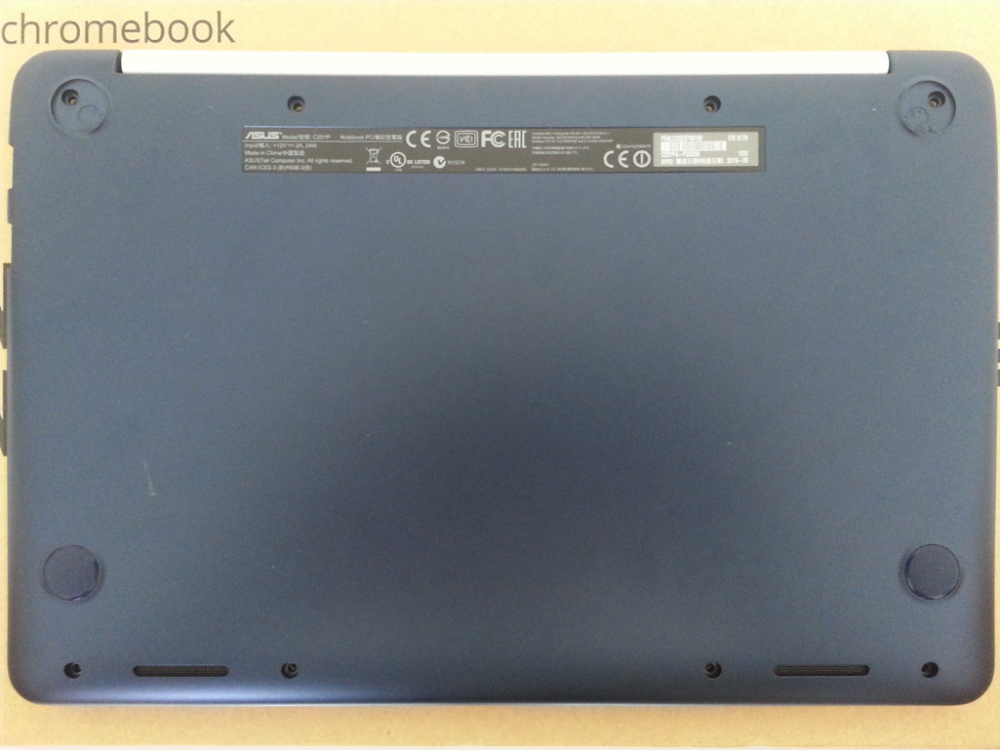

---
title: Guide d'installation pour l'ASUS Chromebook C201
x-toc-enable: true
...

Ces instructions servent installer Libreboot sur l'ASUS Chromebook C201 (plus
connu sous le nom de [*veyron speedy*](../misc/codenames.md)). Puisque
l'appareil est livré avec Coreboot, les instructions d'installation avant et
après le flashage de Libreboot pour la première fois sont les mêmes.

*Si vous utilisez libreboot\_src ou git, alors soyez sûr premièrement que 
vous avez compilé les sources (voyez [../git/\#build](../git/#build)).*

Jetez un coup d'oeil à la [liste des images ROM](#rom) pour voir quelle image
est compatible avec votre appareil.

Libreboot peut être installé depuis l'appareil en interne, en disposant de
privièges suffisants. Le processus d'installation nécessite l'utilisation de
*la version modifié de flashrom par Google*, qui supporte le reflashage de la
flash SPI du Chromebook.
Sinon, le flashage extérieur marchera avec la version en amont de flashrom.

*La version modifiée de flashrom par Google* est du logiciel libre et son code
source est rendu disponible par Google:
[flashrom](https://chromium.googlesource.com/chromiumos/third_party/flashrom/).\
Elle n'est pas encore distribuée avec libreboot. Cependant, elle est
préinstallé sur l'appareil, au côté de ChromeOS.

Installer Libreboot intérieurement nécessite des privilèges systèmes suffisants
sur l'appareil. Quand la machine a ChromeOS d'installé (ce qui est le cas
initiallement), il est nécessaire d'obtenir les privilèges root/racine dans
ChromeOS pour être capâble d'accéder un terminal root (root shell).

Obtenir les privilèges root sur ChromeOS
--------------------------------

Afin d'obtenir les privilèges root sur ChromeOS, le mode développeur doit être
activé depuis l'écran du mode de récupération ainsi que les fonctionnalités de
déboguage.

Les instructions pour accéder à [l'écran du mode de
récupération](../depthcharge/#recovery_mode_screen) et [activer le mode
développeur](../depthcharge/#enabling_developer_mode) sont disponibles sur la
page dédiée à [depthcharge](../depthcharge/).

Une fois le mode développeur activé, l'appareil démarrera l'[écran du mode
développeur](../depthcharge/#developer_mode_screen). ChromeOS peut être
démarré en attendant 30 secondes (le délai est raccourcit dans Libreboot)
ou en pressant *Ctrl + D*

Après que le système a démarré, l'accés root peut être activé en cliquant sur
le lien *Activer les fonctionnalités de déboguage*. Un dialogue de
confirmation demandera s'il faut oui ou non procéder.\
Après confirmation en cliquant sur *Procéder*, l'appareil redémarrera et
demandera que le mot de passe root soit défini. Finalement, l'opération doit
être confirmée en cliquant sur *Activer*.

Après avoir défini le mot de passe root, il devient possible de s'authentifier
en tant que root. Un prompt tty peut être obtenu en pressant *Ctrl + Alt +
Next*. La touche *Next* est celle en haut à gauche du clavier.

Préparer l'appareil pour l'installation
---------------------------------------

Avant d'installer Libreboot sur l'appareil, son logiciel et matériel doit être
préparé afin de permettre la procédure d'installation, et de s'assurer que les
fonctionnalités de sécurité ne se mettent pas sur le
chemin.

Configurer les paramètres de démarrages acceptés
------------------------------------------------

Il est recommandé d'avoir accés à l'[écran du mode
développeur](../depthcharge/#developer_mode_screen) et de configurer les
[paramètres de démarrage
acceptés](../depthcharge/#configuring_verified_boot_parameters) suivants:

-   Vérification de signature des kernels: *désactivé*
-   Démarrage sur périphérique externe: *activé*

Ces changements peuvent être inversés plus tard, quand l'appareil est connu
pour marcher.

Enlever la vis de protection en écriture
--------------------------------

Puisque une partie du flash SPI est protégé en écriture par une vis, il est
nécessaire de l'enlever et de permettre à Libreboot d'écrire dans la partie
*en lecture seulement* de la flash.

Pour accéder à la vis, l'appareil doit être ouvert. Il y a 8 vis à enlever de
derrière l'appareil, comme montré dans l'image ci-dessous. Deux d'entre eux
sont cachés sous les coussinets du haut. Après avoir enlevé les vis, la partie
en plastique du clavier peut être enlevée du reste avec précaution.
*Faites attention: il y a des câbles attachés!* Il est recommandé de basculer
au dessus la partie en plastique du clavier, comme montré sur l'image
ci-dessous. La vis de protection en écriture est située à côté de la puce
flash SPI, entourée en rouge dans l'image ci-dessous.
Elle doit être enlevée.

 

Le vis de protection en écriture peut être remis en place plus tard, quand
l'appareil est connu pour être en bon état de marche.

Installer Libreboot dans la flash SPI
=====================================

La flash SPI (qui contient Libreboot) est divisée en de nombreuses partitions
qui sont utilisées pour implémenter des parties du système de sécurité de.
Libreboot est installée dans la partition *en lecture seulement* de coreboot,
qui devient écrivable après que le vis de protection en écriture a été enlevé.

Installer Libreboot intérieurement, depuis l'appareil
------------------------------------------------

Avant d'installer Libreboot dans la flash SPI depuis l'intérieur, l'appareil
doit être remonté.

Tout les fichiers de la version (ou build) `veyron_speedy` doivent être
transférés sur l'appareil.

Les opérations suivantes doivent être exécutés avec des privilèges root sur
l'appareil (ici en utilisant le compte `root`). De plus, le script
`cros-flash-replace` doit être rendu exécutable:

    # chmod a+x cros-flash-replace

La flash SPI doit être lue en premier:
    
    # flashrom -p host -r flash.img

*Note: c'est peut-être une bonne idée de copier le fichier flash.img produit
et de le stocker hors de l'appareil à des fins de sauvegarde.*

Ensuite, le script `cros-flash-replace` doit être exécuté comme ceci:

    # sudo bash ./cros-flash-replace flash.img coreboot ro-frid

Si quelconque erreur surgit, c'est définitivement une mauvaise idée d'aller
plus loin.

L'image flash résultante peut être ensuite flashée en retour:

    # flashrom -p host -w flash.img

Dans le texte en sortie de la commande, vous devriez voir le suivant:

    Verifying flash... VERIFIED.

Éteignez. L'appareil démarrera maintenant sous Libreboot.

Installer Libreboot extérieurement, avec un programmeur de flash SPI
-----------------------------------------------------------------

Avant d'installer Libreboot intérieurement sur la flash SPI, l'appareil doit
être ouvert.

La flash SPI est située à côté de la vis de protection en écriture. Sa
disposition est indiquée dans l'image ci-dessous. Notez qu'il n'est pas
nécessaire de connecter `WP#` puisque après avoir enlevé la vis, il se hisse
faiblement à 3.3V. Avant d'écrire sur la puce extérieurement, la batterie doit
être débranchée. Le connecteur de la batterie est située en dessous du
dissipateur de chaleur, et doit être dévissé du reste de la boîte/structure.
Il est situé sur la droite et a des câbles colorés, comme montré sur l'image
ci-dessous.

Tous les fichiers de la version (ou build) `veyron_speedy` doivent être
transféré à l'hôte.

Les opérations suivantes doivent être exécutés avec des privilèges root sur
l'hôte (ici en utilisant le compte `root`). En plus, le script
`cros-flash-replace` devra être rendu exécutable:

    # chmod a+x cros-flash-replace

La flash SPI doit être lue en premier (en utilisant le bon programmeur spi):

    # flashrom -p *programmeur* -r flash.img

*Note: c'est peut-être une bonne idée de copier le fichier flash.img produit
et de le stocker hors de l'appareil à des fins de sauvegarde.*

Ensuite, le script `cros-flash-replace` doit être exécuté comme ceci:

    # ./cros-flash-replace flash.img coreboot ro-frid

Si quelconque erreur surgit, c'est définitivement une mauvaise idée d'aller
plus loin.

L'image flash résultante peut être ensuite flashée en retour (en utilisant le
bon programmeur spi):

    # flashrom -p *programmeur* -w flash.img

Dans le texte en sortie de la commande, vous devriez voir le suivant:

    Verifying flash... VERIFIED.

Éteignez. L'appareil démarrera maintenant sous Libreboot.

Installer Debian
---------------------

Debian est recommandé pour cet appareil.

Voyez <https://wiki.debian.org/InstallingDebianOn/Asus/C201>.

Jetez aussi un coup d'oeil à l'entrée dans la LCM (liste de compatibilité
matérielle) pour les système d'exploitations (Debian, Devuan, Parabola):
<https://libreboot.org/docs/hardware/c201.md>

Copyright © 2015 Paul Kocialkowski <contact@paulk.fr>\
Copyright © 2017 Leah Rowe <info@minifree.org>\

Permission est donnée de copier, distribuer et/ou modifier ce document
sous les termes de la Licence de documentation libre GNU version 1.3 ou
quelconque autre versions publiées plus tard par la Free Software Foundation
sans Sections Invariantes,  Textes de Page de Garde, et Textes de Dernière de Couverture.
Une copie de cette license peut être trouvé dans [../fdl-1.3.md](fdl-1.3.md).
