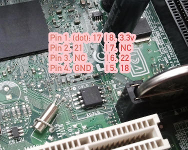

---
title: tutoriel de flashage de la carte mère D510MO
...

Ce guide est pour ceux qui veulent Libreboot sur leur carte mère Intel D510MO
alors qu'elle a toujours son BIOS originel.

Taille de la puce flash {#flashchips}
===============

Utilisez ceci pour trouver:

    # flashrom -p internal

Instructions de flashage {#clip}
=====================

Référez vous à [bbb\_setup.md](bbb_setup.md) pour savoir comment configurer le
BBB pour le flashage.

Voici l'image de la puce flash, pour référence:\

Copyright © 2016 Leah Rowe <info@minifree.org>\

Permission est donnée de copier, distribuer et/ou modifier ce document
sous les termes de la Licence de documentation libre GNU version 1.3 ou
quelconque autre versions publiées plus tard par la Free Software Foundation
sans Sections Invariantes,  Textes de Page de Garde, et Textes de Dernière de Couverture.
Une copie de cette license peut être trouvé dans [../fdl-1.3.md](fdl-1.3.md).
