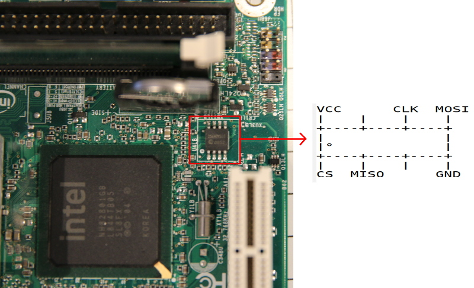

---
title: Tutoriel de flashage de la carte mère Intel D945GCLF 
...

Ce guide est pour ceux voulant Libreboot ceux leur carte mère Intel D945GCLF
alors que le BIOS originel est toujours présent.

Pour avoir des informations à propos de cette carte mère, allez dans
[../hardware/d945gclf.md](../hardware/d945gclf.md)

Instructions de flashage {#clip}
=====================

Référez vous à [bbb\_setup.md](bbb_setup.md) pour savoir comment configurer le
BBB pour le flashage.

Voici une image de la puce flash:

Copyright © 2016 Leah Rowe <info@minifree.org>\

Permission est donnée de copier, distribuer et/ou modifier ce document
sous les termes de la Licence de documentation libre GNU version 1.3 ou
quelconque autre versions publiées plus tard par la Free Software Foundation
sans Sections Invariantes,  Textes de Page de Garde, et Textes de Dernière de Couverture.
Une copie de cette license peut être trouvé dans [../fdl-1.3.md](fdl-1.3.md).
