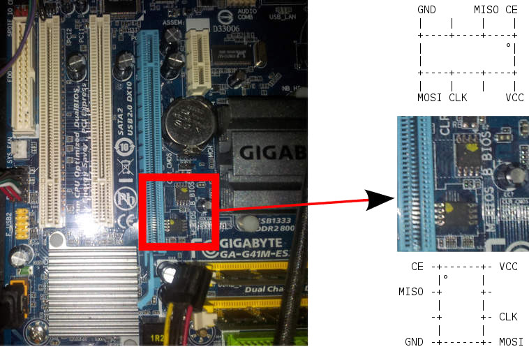

---
title: Tutoriel de flashage de la carte mère GA-G41M-ES2L
...

Ce guide est pour ceux voulant Libreboot sur leur carte mère Intel
GA-G41M-ES2L alors qu'ils ont le BIOS originel toujours présent.

Taille de la puce flash {#flashchips}
===============

Utilisez ceci pour la trouver:

    # flashrom -p internal

Instructions de flashage {#clip}
=====================

Référez vous à [bbb\_setup.md](bbb_setup.md) pour savoir comment configurer le
BBB pour le flashage externe. *Vous pouvez seulement reprogrammer une des
puces à la fois, et vous devez désactiver la puce que vous ne flashez pas, en
connectant le 3.3V au /CS de cette puce, de telle façon que vous aurez besoin
d'une seconde pince de test ou une petit pince de pin IC.*

Voici une image de la puce flash:\

Le flashage interne est possible. Démarrez avec le BIOS propriétaire et
GNU+Linux. Il y a 2 puces flash (une est de sauvegarde).

Flashez la première puce:

    ./flashrom -p internal:dualbiosindex=0 -w libreboot.rom

Flashez la seconde puce:

    ./flashrom -p internal:dualbiosindex=1 -w libreboot.rom

NOTE: vous pouvez toujours démarrer le système avec juste la puce flash
principale connectée, après avoir désoudé la puce de sauvegarde. Ça a été
testé pendant que Libreboot était déjà installé sur la puce principale.

NOTE: Vous aurez besoin de la dernière version de flashrom. Obtenez là depuis
leur dépôt SVN sur flashrom.org ou sur Git.

NOTE: dû à un bug dans le matériel, l'adresse MAC est codée en dur dans
coreboot-libre. Donc, vous devez définir votre propre adresse MAC dans votre
système d'exploitation.

Copyright © 2016 Leah Rowe <info@minifree.org>\

Permission est donnée de copier, distribuer et/ou modifier ce document
sous les termes de la Licence de documentation libre GNU version 1.3 ou
quelconque autre versions publiées plus tard par la Free Software Foundation
sans Sections Invariantes,  Textes de Page de Garde, et Textes de Dernière de Couverture.
Une copie de cette license peut être trouvé dans [../fdl-1.3.md](fdl-1.3.md).
