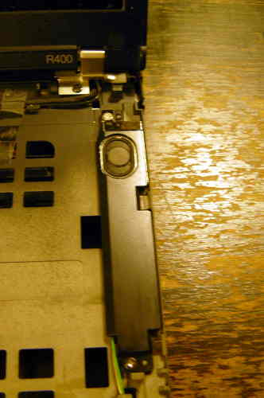
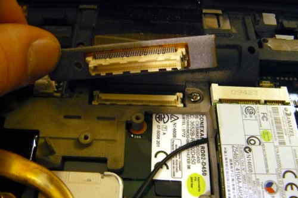
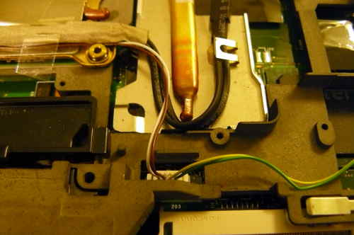
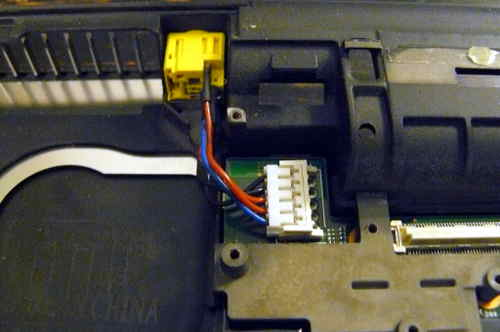
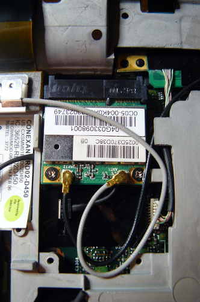

---
title: Flasher le R400 avec un BeagleBone Black
...

Instructions initales de flashage pour le R400.

Ce guide est pour ceux voulant libreboot sur leur ThinkPad R400 alors qu'ils
ont toujours le BIOS de Lenovo originel. Ce guide peut aussi être suivi
(adapté) si vous bousillez votre R400, afin de remettre d'aplomb la carte.

Avant de suivre cette section, assurez-vous silvouplaît en premier de configurer
proprement votre ROM libreboot. Bien que les images ROM sont fournies
pré-compilé dans le projet Libreboot, il y a quelques modifications que vous
aurez besoin de faire à celle que vous choisissez avant de la flasher.
(instructions référencée plus tard dans ce guide)

Libreboot T400 {#t400}
==============

Vous serez peut-être intéréssé par le plus petit, plus portable [Libreboot
T400](t400_external.md). 

Port série {#serial_port}
-----------

Le déboguage EHCI n'est peut-être pas nécessaire. Il a été rapporté que la
station d'appareillage (dock) pour cet ordinateur portable a un port série,
donc il serait peut-être possible d'utiliser ça à la place.

Une note à propos des processeurs
=================

Le [ThinkWiki](http://www.thinkwiki.org/wiki/Category:R400) a une liste de
processeurs pour ce système. Le Core 2 Duo P8400 ou P8600 marcherait dans
libreboot. Le Core 2 Duo T9600 a été confirmé fonctionnel, donc le T9400
marche problablement aussi. *Les Core 2 Duo T5870/5670 et Celeron M 575/585 ne
sont pas testés!*

Processeurs 4 coeurs
--------------

Incompatible. Ne les utilisez pas.

Une note à propos des cartes graphiques
=================

Certains modèles ont une carte graphique Intel, pendant que d'autres ont à la
fois une ATI et une Intel; c'est référencé en tant que "Double Graphiques
(Dual Graphics)" (précedemment "graphiques échangeables").
Dans le programme *BIOS setup* pour le lenovobios, vous pouvez spécifier au
système d'utiliser un des deux (mais pas les deux à la fois).

Libreboot est reconnu pour marcher sur des systèmes avec seulement la carte
graphique Intel, utilisant l'initialisation native des graphiques. Sur des
systèmes avec graphiques échangeables, la carte graphique Intel est utilisée
et celle ATI est désactivée, donc l'initialisation native des graphiques
marche partout pareil.

Pâte thermique processeur requise
==================

Voyez pour la [\#pâte](#paste).

Taille de puce flash {#flashchips}
===============

Utilisez ceci pour la trouver:
    
    # flashrom -p internal

Adresse MAC {#macadress}
===========

Référez-vous au document [mac\_address.md](../hardware/mac_address.md).

Configuration initiale BBB
=========================

Référez-vous au document [bbb\_setup.md](bbb_setup.md) sur comment configurer
le BBB pour le flashage.

Le suivant montre comment connecter une pince au BBB (sur la broche P9), pour
un SOIC-16 (pince: Pomona 5252):

    POMONA 5252 (corrélez avec le guide sur le BBB)
    ===  ethernet, jack et port VGA ====
     NC              -       - 21
     1               -       - 17
     NC              -       - NC
     NC              -       - NC
     NC              -       - NC
     NC              -       - NC
     18              -       - 3.3V (PSU)
     22              -       - NC - c'est le pin 1 sur la puce flash
    ===  port SATA ===
    C'est comme ceci que vous connecterez. Les nombres font références au
    numéro de pins sur le BBB, sur les fiches près de la fiche mâle DC.

Le suivant montre comment connecter une pince au BBB (sur la broche P9), pour
un SOIC-8 (pince: Pomona 5250):

    POMONA 5250 (corrélez avec le guide sur le BBB)
    ===  emplacements RAM  ====
     18              -       - 1
     22              -       - NC
     NC              -       - 21
     3.3V (PSU)      -       - 17 - c'est le pin 1 sur la puce flash
    ===  emplacement ou la prise mâle AC est connectée ===
    C'est comme ceci que vous connecterez. Les nombres font références au
    numéro de pins sur le BBB, sur les fiches près de la fiche mâle DC.

Désassemblage
-----------

Enlevez tous les vis:\
\
Enlevez le disque dur et le disque optique:\
\

Enlevez les vis de charnière:\
 

Enlevez le repose paume et le clavier:\
 

Enlevez ces vis, et ensuite enlevez le cadre:\
 

Enlevez les vis des hauts-parleurs, mais n'enlevez pas encore les
hauts-parleurs (juste laissez-les pendre):\
 

Enlevez ces vis, puis ensuite enlevez les plaques en métal:\
 

Enlevez les antennes de la carte wifi, puis ensuite commencez à les dérouter:\
 
 
 

Déconnectez le câble LCD de la carte mère:\
 
 

Enlevez les vis charnières, puis ensuite enlevez l'écran LCD:\
 
 

Enlevez ceci:\
 

Enlevez ce long câble (il y a 3 connexions):\
 
 

Enlevez le câble du haut-parleur, puis enlevez les hauts-parleurs:\

Enlevez les vis du dissipateur thermique, enlevez le ventilateur puis ensuite
enlevez le dissipateur/ventilo:\
 
 

Enlevez la batterie de la NVRAM:\
 

Enlevez cette vis:\
 

Déconnectez la prise mâle AC:\
 

Enlevez cette vis puis ensuite enlevez ce qui est en-dessous:\

Enlevez ceci:\

Soulevez la carte mère (qui est encore à l'intérieur de la cage) en partant du
côté sur la droite, l'enlevant complétement:
 

Enlevez toutes les vis, marquez chaque trou de telle façon que vous saurez les
réinsérer. Vous devriez placer les vis dans une disposition correspondant à
l'ordre qu'ils étaient avant enlevage: 

Enlevez la carte mère de la cage, et la puce flash SPI sera à côté des
emplacements mémoire:\
 

Connectez votre programmeur, puis ensuite connectez la masse (GND) et 3.3V\
 
 
 

Une alimentation (NdT:*PSU*) 3.3V dédiée a été utilisé pour créer ce guide,
mais une alimentation ATX fait aussi l'affaire:\

Bien sûr, soyez certain d'allumer votre alimentation:\

Maintenant, vous devriez être prêt à installer libreboot.

Les binaires de flashrom pour l'architecture ARM (testé sur un BBB) sont
distribués/fournis dans libreboot\_util. Alternativement, libreboot distribue
aussi le code source de flashrom pouvant être compilé.

Authentifiez-vous en tant que root sur votre BBB, en utilisant les
instructions dans le doc
[bbb\_setup.html\#bbb\_access](bbb_setup.html#bbb_access).

Testez afin de savoir si flashrom marche:

    # ./flashrom -p linux_spi:dev=/dev/spidev1.0,spispeed=512\

Dans ce cas là, la sortie était:

    flashrom v0.9.7-r1854 on Linux 3.8.13-bone47 (armv7l)
    flashrom is free software, get the source code at http://www.flashrom.org
    Calibrating delay loop... OK.
    Found Macronix flash chip "MX25L6405(D)" (8192 kB, SPI) on linux_spi.
    Found Macronix flash chip "MX25L6406E/MX25L6436E" (8192 kB, SPI) on linux_spi.
    Found Macronix flash chip "MX25L6445E/MX25L6473E" (8192 kB, SPI) on linux_spi.
    Multiple flash chip definitions match the detected chip(s): "MX25L6405(D)", "MX25L6406E/MX25L6436E", "MX25L6445E/MX25L6473E"
    Please specify which chip definition to use with the -c <chipname> option.

Comment sauvegarder factory.rom (changez l'option -c en accordance selon votre
puce flash):

    # ./flashrom -p linux_spi:dev=/dev/spidev1.0,spispeed=512 -r

factory.rom

    # ./flashrom -p linux_spi:dev=/dev/spidev1.0,spispeed=512 -r

factory1.rom

    # ./flashrom -p linux_spi:dev=/dev/spidev1.0,spispeed=512 -r

factory2.rom

Note: l'option `-c` n'est pas nécessaire dans la version de flashrom patchée
par libreboot, parce que les définitions redondantes de puces flash dans
*flashchips.c* ont été enlevée.

Maintenant comparez les 3 images:

    # sha512sum factory*.rom

Si les hashs correspondent, alors copiez juste l'un d'eux (le factory.rom)
dans un endroit sûr (sur un disque connecté sur un autre système, pas le BBB).
C'est utile pour le travail d'ingénérie inversé, au cas où il y a un
comportement désirable dans le micrologiciel originel qui pourrait être
répliqué dans coreboot et libreboot.

Suivez les instructions dans le document 
[../hardware/gm45\_remove\_me.html\#ich9gen](../hardware/gm45_remove_me.html#ich9gen)
pour changer l'adresse MAC à l'intérieur de l'image ROM de libreboot, avant de
la flasher. Bien qu'il y a une adresse MAC par défaut à l'intérieur de l'image
ROM, c'est ce que vous voulez. *Soyez sûr de toujours changer l'adresse MAC
par une qui est correcte pour votre machine.*

Maintenant flashez là:

    # ./flashrom -p linux_spi:dev=/dev/spidev1.0,spispeed=512 -w
        path/to/libreboot/rom/image.rom -V

Vous verrez peut-être des erreurs, mais si ça dit `Verifying flash...
VERIFIED` à la fin, alors c'est flashé et ça devrait démarrer. Si vous voyez
des erreurs, essayez encore (et encore et encore); le message `Chip content is
identical to the requested image` est aussi un indicateur d'une installation
fructueuse.

Exemple de sortie lors de l'exécution de la commande ci-dessus:

    flashrom v0.9.7-r1854 on Linux 3.8.13-bone47 (armv7l)
    flashrom is free software, get the source code at http://www.flashrom.org
    Calibrating delay loop... OK.
    Found Macronix flash chip "MX25L6405(D)" (8192 kB, SPI) on linux_spi.
    Reading old flash chip contents... done.
    Erasing and writing flash chip... FAILED at 0x00001000! Expected=0xff, Found=0x00, failed byte count from 0x00000000-0x0000ffff: 0xd716
    ERASE FAILED!
    Reading current flash chip contents... done. Looking for another erase function.
    Erase/write done.
    Verifying flash... VERIFIED.

Pâte thermique (IMPORTANT)
=========================

Parce qu'une partie de cette procédure a impliqué d'enlever le dissipateur,
vous allez devoir appliquer une nouvelle pâte. L'Arctic MX-4 fait le job.
Vous aurez aussi besoin d'alcool isopropyl et un tissu anti électricité statique
pour nettoyer.

Quand vous réinstallez le dissipateur, vous devez d'abord nettoyer toute
vieille pâte avec l'alcool et le tissu. Ensuite, appliquez la nouvelle pâte.
L'Artic MX-4 est aussi bien meilleure que celle par défaut utilisée sur ces
machines.

NOTE: la photo ci-dessus est dans des buts d'illustration seulement, et ne
montre pas comment appliquer proprement la pâte thermique. D'autres guides en
ligne détaillent la bonne procédure d'application.

Wi-Fi
====

Le R400 est fournit avec un jeu de puce WiFi Intel, qui ne marche pas sans
logiciel propriétaire. Pour une liste de jeux de puces qui marchent sans
logiciel propriétaire, voyez le document
[../hardware/\#recommended\_wifi](../hardware/#recommended_wifi).

Certains ordinateurs portables R400 peuvent être fournis avec un jeu de puce
Atheros, mais ont seulement le protocole 802.11g.

Il est recommandé que vous installiez un nouveau jeu de puce WiFi. Ça peut
seulement être fait après avoir installé Libreboot, parce que le micrologiciel
original a une liste blanche de puces approuvés, et refusera de démarrer si
vous utilisez un carte wifi 'non autorisée'.

Les photos suivantes montrent un Atheros AR5B95 en train d'être installé, pour
remplacer la puce Intel dont le R400 a été fourni avec:
 

WWAN
====

Si vous avez une carte WWAN/3G et/ou un lecteur de carte sim, enlevez les
définitevement. La carte WWAN-3G a du micrologiciel propriétaire à
l'intérieur; la technologie est identique à celle utilisée dans les téléphones
mobiles, car elle peut traquer vos mouvements.

À ne pas confondre avec le WiFi (le WiFi est OK).

Mémoire
======

Vous aurez besoin que de la RAM de type DDR3 SODIMM PC3-8500 soit installé, en
paire identique en vitesse/taille. Les paires non correspondantes ne
marcheront pas. Vous pouvez aussi installer un seul module (voulant dire que
l'un des emplacements sera vide) dans l'emplacement (*slot*) 0.

Soyez sûr que la RAM que vous achetez soit de densité 2Rx8.

[Cette page](http://www.forum.thinkpads.com/viewtopic.php?p=760721) pourrait
être utile pour des informations sur la compatibilité de la RAM (note:
l'initialisation de la RAM dans coreboot est différente, donc cette page
pourrait être des conneries)

La photo suivante montre 8Go (2x4Go) de RAM installée:\

Démarrez là!
--------

Vous devriez voir quelque chose comme ceci:

 

Maintenant [installez GNU+Linux](../gnulinux/).

Copyright © 2014, 2015 Leah Rowe <info@minifree.org>\
Copyright © 2018 Nico Rikken <nico@nicorikken.eu>\

Permission est donnée de copier, distribuer et/ou modifier ce document
sous les termes de la Licence de documentation libre GNU version 1.3 ou
quelconque autre versions publiées plus tard par la Free Software Foundation
sans Sections Invariantes,  Textes de Page de Garde, et Textes de Dernière de Couverture.
Une copie de cette license peut être trouvé dans [../fdl-1.3.md](fdl-1.3.md).
