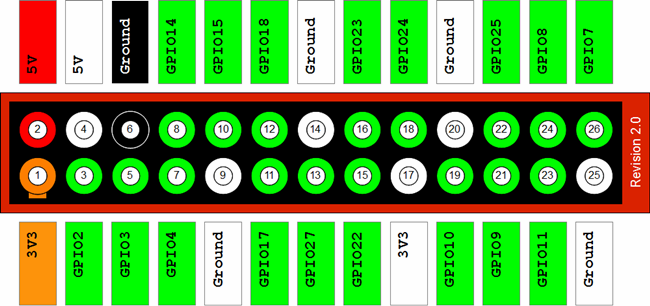

--
title: Comment programmer une puce flash SPI avec la Raspberry Pi
...

Ce document existe comme un guide pour lire de ou écrire dans une puce flash 
SPI avec la Raspberry Pi, utilisant le logiciel [flashrom](http://flashrom.org/Flashrom)
La plupart des révisions de la RPi devrait marcher.

Le projet Libreboot recommande d'utiliser [GNU+Linux sans blob]()

Le projet Libreboot recommande l'utilisation de [GNU+Linux sans blobs](https://blog.rosenzweig.io/blobless-linux-on-the-pi.html)
sur la Raspberry Pi, pour éviter d'avoir à éxecuter des logiciels non-libres. C'est devenu
seulement possible en Février 2017 et les instructions ci-dessous ne sont 
pas encore mises à jour avec les étapes nécessaires, donc silvouplaît ne suivez pas les
étapes ci-dessous à moins que vous consentez à éxecuter des logiciels non-libre sur votre
Raspberry Pi.

Cela concerne seulement les puces flash SOIC-8 pour l'instant. Le guide pour les
SOIC-16 viendra plus tard (pour l'instant, ça devrait être facile pour vous de déduire ce
qu'il y a faire pour les SOIC-16).

Raspberry Pi (ThinkPad X60/T60 et Macbook 2,1)
------------------------------------------------

La Raspberry Pi (un ordinateur GNU+Linux versatile pour \$25) peut être utilisé comme
un outil de flashage de BIOS, grâce à ses broches GPIO et son support de SPI.

Note: La Raspberry Pi Model A n'est pas supportée, puisqu'elle n'a pas de broches GPIO.
### Désassembler les ThinkPad

Suivez le [manuel de maintenance matérielle X60](http://download.lenovo.com/ibmdl/pub/pc/pccbbs/mobiles_pdf/42x3550_04.pdf)
ou le [manuel de maintenance matérielle T60](http://download.lenovo.com/ibmdl/pub/pc/pccbbs/mobiles_pdf/42t7844_04.pdf) pour
désassembler l'ordinateur portable, jusqu'à ce que vous pouvez accéder la puce BIOS.

Pour des photos, suivez le [Guide Libreboot de Récupération du T60](t60_unbrick.md).

    Sur le X60, la puce BIOS est sur le bas de la carte mère, sous une 
    couche de ruban adhésif noir protecteur.

    Sur le T60, la puce BIOS est juste en dessous du repose main, mais
    bloqué par une plaque en magnésium (que vous aurez à enlever).

### Brochage pince Pomona

Diagramme des 26 pins GPIO de la Raspberry Pi modèle B ( pour le modèle B+
avec 40 pins, commencez a compter depuis la droite et ignorez les 14 pins
restants):

 

     8-pin pour le X60:

    ~~~~ LCD (Devant) ~~~~
            8765
            ----
            |  |
            ----
            1234
    ~~~ Repose-paume (arrière) ~~

  Pin \#   Nom du pin SPI  BP (Seeed)   BP (Spkfun)   [Beagleboard Black](http://beagleboard.org/Support/bone101#headers)   [Raspberry Pi](images/rpi/0000.jpg)
  -------- -------------- ------------ ------------- --------------------------------------------------------------------- -------------------------------------
  1        CS             White        Red           Pin 17                                                                24
  2        MISO           Black        Brown         Pin 21                                                                21
  3        *pas utilisé*     *pas utilisé*   *pas utilisé*    *pas utilisé*                                                            *pas utilisé*
  4        GND            Brown        Black         Pin 1                                                                 25
  5        MOSI           Gray         Orange        Pin 18                                                                19
  6        CLK            Purple       Yellow        Pin 22                                                                23
  7        *pas utilisé*     *pas utilisé*   *pas utilisé*    *pas utilisé*                                                            *pas utilisé*
  8        3.3V           *red*        White         [3.3V PSU RED](bbb_setup.md)      17

Soyez sûr que les brochages sont correct; sinon, flashrom échouera lors de la
détection de la puce, ou détectera une puce `0x0`. Finalement, rendez-vous sûr
que la pince Pomona est en contact avec les fils en métal de la puce. Ça peut
être un challenge, mais continuez à essayer.

### Comment alimenter la puce flash

Il y a deux façons d'alimenter la puce: brancher un adaptateur AC (courant
alternatif) sans allumer l'ordinateur portable, et utiliser le 8ième pin 3.3V.

J'ai découvert que les puces SST marche le mieux avec le 8ième pin, alors que
les puces Macronix nécessitent un adaptateur AC pour être alimentées.

*Ne connectez jamais en même temps le 8ième pin et l'adaptateur AC en même
temps.*

Vos résulats peuvent varier.

Lire la puce flash
----------------------

Premiérement, inspectez visuellement (avec une loupe grossissante) le type de
puce flash sur la carte mère.

Ensuite, téléchargez et compilez la dernière version du code source de
Flashrom sur la Raspberry Pi.

    sudo apt-get install build-essential pciutils usbutils libpci-dev libusb-dev libftdi1 libftdi-dev zlib1g-dev subversion libusb-1.0-0-dev
    svn co svn://flashrom.org/flashrom/trunk flashrom
    cd flashrom
    make
    sudo modprobe spi_bcm2708
    sudo modprobe spidev

Si votre puce est une SST, exécutez cette commande:

    sudo ./flashrom -p linux_spi:dev=/dev/spidev0.0 -r test.rom

Si votre puce est une Macronix, exécutez cette commande:

    sudo ./flashrom -c "MX25L1605" -p linux_spi:dev=/dev/spidev0.0 -r test.rom

Ensuite, vérifiez la somme de contrôle md5 du cliché mémoire:

    md5sum test.rom

Exécutez la commande `flashrom` encore une fois pour générer un deuxième
cliché mémoire. Ensuite, vérifiez la somme de contrôle md5 du deuxième cliché
mémoire:

    md5sum test.rom

Si les sommes de contrôles se correspondent après 3 essais, `flashrom` s'est
débrouillé pour lire la puce flash précisément (mais pas toujours
correctement). Vous devriez peut-être essayer de flasher libreboot maintenant.

Flasher Libreboot
------------------- 

Note: remplacez `/chemin/vers/libreboot.rom` avec l'emplacement de votre ROM
choisie, tel quel `../bin/x60/libreboot_usqwerty.rom`

Si votre puce est une SST, exécutez cette commande:

    sudo ./flashrom -p linux_spi:dev=/dev/spidev0.0 -w /chemin/vers/libreboot.rom

Si votre puce est une Macronix, exécutez cette commande:

    sudo ./flashrom -c "MX25L1605" -p linux_spi:dev=/dev/spidev0.0 -w
    /chemin/vers/libreboot.rom

Une fois que cette commande montre le suivant en sortie, le flashage a été
complété avec succés. Sinon, juste reflashez.

    Reading old flash chip contents... done.
    Erasing and writing flash chip... Erase/write done.
    Verifying flash... VERIFIED.

### Sources

-   [Scruss - Simple ADC with the Raspberry
    Pi](http://scruss.com/blog/2013/02/02/simple-adc-with-the-raspberry-pi/)
-   [Flashing coreboot on a T60 with a Raspberry Pi -
    the\_unconventional's
    blog](https://web.archive.org/web/20150709043222/http://blogs.fsfe.org:80/the_unconventional/2015/05/08/coreboot-t60-raspberry-pi/)
-   *Flashage avec pince Pomona sur SOIC*
    -   [Arch Linux Wiki - Installing Arch Linux on
        Chromebook](https://wiki.archlinux.org/index.php/Chromebook)
    -   [Google Drive - Raspberry Pi SOIC Clip
        connection](https://drive.google.com/folderview?id=0B9f62MH0umbmRTA2Xzd5WHhjWEU&usp=sharing)
    -   [rPI with Flashrom and SOIC Clip
        Powerpoint](http://satxhackers.org/wp/hack-content/uploads/2013/04/rPI_flashrom.pdf)

### Diagrammes de brochages pour la Raspberry Pi

  MCP   3008 Pin   Pi GPIO Pin \#   Pi      Nom de pin
  ----- ---------- ---------------- --------------------
  16    `VDD`      1                `3.3 V`
  15    `VREF`     1                `3.3 V`
  14    `AGND`     6                `GND`
  13    `CLK`      23               `GPIO11 SPI0_SCLK`
  12    `DOUT`     21               `GPIO09 SPI0_MISO`
  11    `DIN`      19               `GPIO10 SPI0_MOSI`
  10    `CS`       24               `GPIO08 CE0`
  9     `DGND`     6                `GND`

-   Source: [Perl & Raspberry Pi - Raspberry Pi GPIO
    Pinout](http://raspberrypi.znix.com/hipidocs/topic_gpiopins.htm)

Raspberry Pi (ThinkPad X200)
-----------------------------

### Requis:

-   Un processeur d'architecture x86, x86_64, ou arm7l (pour changer l'adresse
    MAC dans l'image libreboot.rom)
-   Raspberry Pi et ses périphériques
-   pince SOIC accordée
-   6 fils volants (*jumpers*) femelle - femelle
-   une connection internet
-   des tournevis

Suivez le [guide d'installation initiale du ThinkPad X200](x200_external.md)
afin de désassembler l'ordinateur portable et d'accéder à la puce rom du BIOS.

Note: `x86#` fait référence aux commandes devant être exécutée sur
l'ordinateur à architecture x86, et `pi#` se référe aux commandes devant être
lue sur la Pi. Une bonne pratique est de faire un répertoire de travail pour
garder vos trucs libreboot à l'intérieur.

    x86# mkdir ~/work

Si vous utilisez Raspbian, vous pouvez exécutez **sudo raspi-config**, activer
le SPI dans le menu Avancé et ensuite spidev sera activé. Simple, hein?

If you're running Raspian, you can do **sudo raspi-config**, enable SPI
under Advanced and then spidev will be enabled. Simple, eh?

[Téléchargez libreboot depuis leur page des versions](../../download/). Pour
votre sécurité, vérifiez aussi la signature GPG.

    x86# gpg --keyserver prefered.keyserver.org --recv-keys 0x656F212E

    x86# for signature in $(ls *.sig); do gpg --verify $signature; done

Installez les dépendances:

    pi# sudo apt-get update && sudo apt-get install libftdi1 libftdi-dev libusb-dev libpci-dev subversion libusb-1.0-0-dev pciutils, zlib, libusb, build-essential

Téléchargez et compilez flashrom.

    pi# svn co svn://flashrom.org/flashrom/trunk ~/flashrom

    pi# cd ~/flashrom

    pi# make

    pi# sudo make install

Sur votre machine x86, changez l'adresse MAC de l'image libreboot.rom

    x86# cd ~/work/libreboot_bin/

Changez les adresses MAC dans les images Libreboot pour qu'elles correspondent
à la votre.

    x86# ./ich9macchange XX:XX:XX:XX:XX:XX

Déplacez l'image libreboot.rom sur votre Pi

    x86# scp ~/work/libreboot_bin/<chemin_vers_libreboot.rom>
    pi@votre.pi.addresseIP:~/flashrom/libreboot.rom

Éteignez votre Pi, notez votre modèle de puce rom, et branchez la pince

    pi# sudo shutdown now -hP

Nom du modèle de la puce

Brochage. Vous allez peut-être télécharger l'image afin de zoomer sur le
texte.
text.

  Pin \#   Nom pin SPI   Raspberry Pi Pin \#
  -------- -------------- ---------------------
  1        *pas utilisé*     *pas utilisé*
  2        3.3V           1
  3        *pas utilisé*     *pas utilisé*
  4        *pas utilisé*     *pas utilisé*
  5        *pas utilisé*     *pas utilisé*
  6        *pas utilisé*     *pas utilisé*
  7        CS\#           24
  8        S0/SIO1        21
  9        *pas utilisé*     *pas utilisé*
  10       GND            25
  11       *pas utilisé*     *pas utilisé*
  12       *pas utilisé*     *pas utilisé*
  13       *pas utilisé*     *pas utilisé*
  14       *pas utilisé*     *pas utilisé*
  15       S1/SIO0        19
  16       SCLK           23

Note: Le rail d'alimentation 3.3V du raspberry Pi devrait être suffisant pour
alimenter la puce pendant le flashage, donc aucune source d'alimentation
externe devrait être nécessaire; cependant, au temps de l'écriture de ceci, ça
a seulement été testé et confirmé pour une puce, la MX25L6405D.

Voici la fiche de spécifications Macronix afin que vous puissiez ajuster comme
nécessaire votre
brochage pour les puces 8 pin 4Mo

À présent connectez votre pince SOIC à la puce rom avant d'allumer votre Pi.

Allumez votre Pi, et exécutez le suivant. Assurez-vous d'échanger
"votre\_nom\_de\_puce" avec le bon modèle/nom de votre puce. Assurez qu'elle
peut être lue avec succés. Si vous ne pouvez pas lire la puce et que vous
recevez une erreur similaire à "no EEPROM detected" alors vous devriez vous
assurez que les fils MISO/MOSI ne sont pas inversés, vérifiez avec un
multimètre si oui ou non le voltage est bon et que la masse est connectée
entre le "programmeur" et la cible.

    pi# cd ~/flashrom

    pi# ./flashrom -p linux_spi:dev=/dev/spidev0.0,spispeed=512 --chip <votre_nom_de_puce> -r romread1.rom

    pi# ./flashrom -p linux_spi:dev=/dev/spidev0.0,spispeed=512 --chip <votre_nom_de_puce> -r romread2.rom

    pi# ./flashrom -p linux_spi:dev=/dev/spidev0.0,spispeed=512 --chip <votre_nom_de_puce> -r romread3.rom

    pi# sha512sum romread*.rom

Si il y a des sommes de contrôles sha512 identiques alors vous pouvez
généralement assumer qu'il est sûr de flasher votre ROM.

    pi# ./flashrom -p linux_spi:dev=/dev/spidev0.0,spispeed=512 --chip <votre_nom_de_puce> -w libreboot.rom

Ça peut échouer un nombre de fois, mais continuez et quand vous obtenez le
message
`Verifying flash... Verified` ou
`Warning: Chip content is identical to the requested image` alors vous avez
fini.

Éteignez votre Pi, réassemblez votre machine, et installez un SE libre pour un
grand bien !

Raspberry Pi (C720 Chromebook)
-------------------------------

La Raspberry Pi (un ordinateur GNU+Linux polyvalent pour 25\$) peut être
utilisé en tant qu'outil de flashage de BIOS, grâce à ses pins GPIO et son
support de SPI.

### {#user-content-what-you-need .anchor}De quoi avez-vous besoin

-   \$25 - Raspberry Pi Modèle B (Rev.2 ou plus haut)
-   \$10-20 - Pince Pomona pour SOIC-8
    -   En général fournit avec de bon fils colourés *femelle à femelle*

### {#user-content-raspberry-pi-pinouts.anchor}Brochages Raspberry Pi

Brochages GPIO:

 

> \*Diagramme fait par ["Pacman" des forums 
> Win-raid\*](http://www.win-raid.com/t58f16-Guide-Recover-from-failed-BIOS-flash-using-Raspberry-PI.md)

Brochages SOIC:

### {#user-content-plugging-in-the-soic-clip.anchor}Brancher la pince pour SOIC 

Nous devons connecter la Raspberry Pi à la pince pour SOIC comme montré dans
le diagramme ci-dessous (en utilisant les fils f-f généralement inclus avec la
pince Pomona).

(C720 seulement?) le diagramme dépicte une connexion "pontée". Vous aurez
besoin d'en faire une avec un fil en cuivre:

Branchez les fils dans la pince comme montré ci-dessous:

Branchez l'autre extrémité des fils dans la Raspberry Pi comme montré
ci-dessous:

(C720 seulement?) branchez les fils pontés comme montré ci-dessous:

Finalement, mettez la pince Pomona pour SOIC sur la puce:

### Flashrom

[Une fois que tout est mis en place, flashrom marche d'entrée de jeu.](http://www.flashrom.org/RaspberryPi)

### Sources

-   *Flashage avec pince Pomona pour SOIC*
    -   [Arch Linux Wiki - Installing Arch Linux on
        Chromebook](https://wiki.archlinux.org/index.php/Chromebook)
    -   [Google Drive - Raspberry Pi SOIC Clip
        connection](https://drive.google.com/folderview?id=0B9f62MH0umbmRTA2Xzd5WHhjWEU&usp=sharing)
    -   [rPI with Flashrom and SOIC Clip
        Powerpoint](http://satxhackers.org/wp/hack-content/uploads/2013/04/rPI_flashrom.pdf)
    -   [Tnhh - Unbricking Chromebook with
        Beaglebone](http://www.tnhh.net/2014/08/25/unbricking-chromebook-with-beaglebone.md)
-   *Use a DIY DIP System to flash an desoldered BIOS chip*
    -   [Viktak - How to recover laptop after failed BIOS
        flash](http://diy.viktak.com/2014/07/how-to-recover-laptop-after-failed-bios.md)
    -   [Win-Raid - Recover from Failed BIOS Flashing using Raspberry
        Pi](http://www.win-raid.com/t58f16-Guide-Recover-from-failed-BIOS-flash-using-Raspberry-PI.md)

Copyright © 2014, 2015 Lawrence Wu <sagnessagiel@gmail.com>\
Copyright © 2015 snuffeluffegus <>\
Copyright © 2015 Kevin Keijzer <>\
Copyright © 2016 Leah Rowe <info@minifree.org>\

Cette page est disponible sous la licence [CC BY SA 4.0](../cc-by-sa-4.0.txt)
