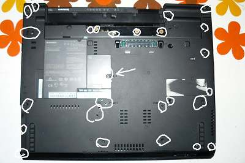
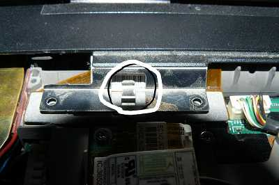
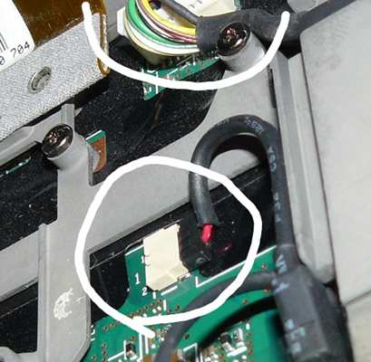
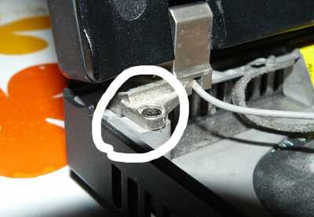
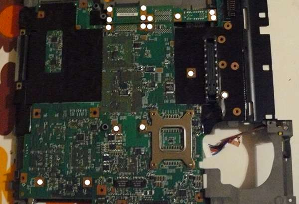
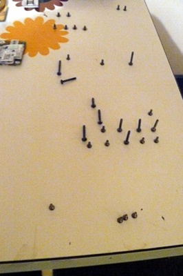
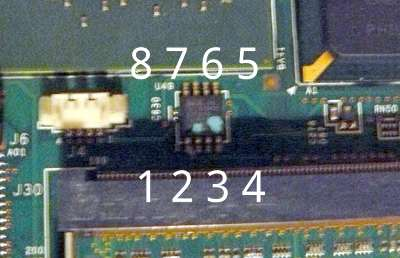
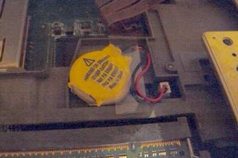
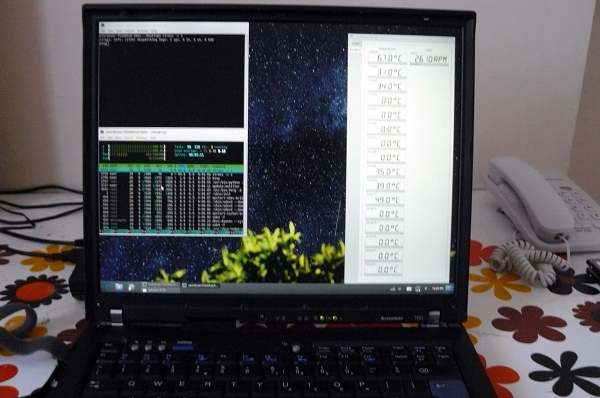

---
title: Guide de récupération du T60
x-toc-enable: true
...

Cette section documente comment récupérer après un mauvais flashage empêchant
le démarrage de votre ThinkPad T60.

Type de bousillage 1: bucts non réinitialisé {#bucts\_brick}
==============================

Vous avez encore le BIOS Lenono, ou Libreboot était en cours d'exécution et
vous avez flashé une autre ROM; et 'bucts 1' était défini et la ROM n'a pas
été `dd`\* ou alors le BIOS Lenovo était présent et libreboot n'était pas
flashé.\

Dans ce cas là, la récupération est facile: réinitialisez BUC.TS à 0 en
enlevant cette pièce jaune cmos (c'est une batterie) puis en la remettant une
ou deux minutes après:\
\

\*Ces commandes dd devraient être appliquées à toutes images ROM pour T60
nouvellement compilés (les images ROM dans les archives des binaires ont déjà
ça d'appliqué!):\
    
    # dd if=coreboot.rom of=top64k.bin bs=1 skip=\$\[\$(stat -c %s
coreboot.rom) - 0x10000\] count=64k\
    # dd if=coreboot.rom bs=1 skip=\$\[\$(stat -c %s coreboot.rom) - 0x20000\]
count=64k | hexdump\
    # dd if=top64k.bin of=coreboot.rom bs=1 seek=\$\[\$(stat -c %s
coreboot.rom) - 0x20000\] count=64k conv=notrunc\

Faire ceci rend la ROM prête pour le flashage sur un système exécutant
toujours le BIOS Lenovo, en utilisant ces instructions:
<http://www.coreboot.org/Board:lenovo/x60/Installation> (ça dit x60,
mais les instructions pour le T60 sont identiques).

Mauvaise rom (ou erreur utilisateur), le système ne démarrera pas {#recovery}
===========================================

Dans ce scénario, vous avez compilé une ROM qui avait une configuration
incorrecte, ou il y a un véritable bug empêchant votre système de démarrer.
Ou, peut-être, vous avez défini BUC.TS à 0 et avez éteint après le premier
flash pendant que le BIOS Lenovo était en train de s'exécuter. Dans n'importe
quel cas, votre système est bousillé (*bricked*, rendu aussi utile qu'une
brique) et ne voudra pas démarrer du tout.

Le "débriquage" (*unbricking*) signifie qu'on flashe une ROM connue pour
marcher. Le problème: vous ne pouvez pas démarrer le problème, rendant cette
tâche difficile. Dans cette situation, du matériel externe (voir les requis
matériels ci-dessus) est nécessaire, pouvant flasher la puce SPI (où libreboot
réside).

Enlevez ces vis et enlevez le DD (Disque Dur):\
 

Soulevez le repose paume:\

Soulevez le clavier, ramenez le un peu en arrière, basculez le comme ci puis
ensuite déconnectez-le de la carte:\
 

Décoincez gentiment les deux bords:\
 

Enlevez ce câble de sa position:\
 

Maintenant enlevez ce cadre. Enlevez la WiFI, la batterie NVRAM, les
connecteurs d'hauts-parleurs (enlevez aussi le modem 56K, sur la gauche de la
WiFi):\

Enlevez ces vis:\

Enlevez la prise d'alimentation mâle:

Enlevez la batterie NVRAM

Déconnectez le câble (pour les modems 56Ko) et déconnectez les autres câbles:\
 

Déconnectez le câble du haut-parleur:\

Déconnectez l'autre extrémité du câble du modem 56k:\

Assurez-vous que vous l'avez enlevé:\

Dévissez ces vis:\

Assurez-vous que vous les avez enlevé:\

Déconnectez le câble de l'écran LCD de la carte mère:\

Enlevez ces vis puis enlevez l'assemblage/l'ensemble de l'écran LCD:\
 

Encore une fois, assurez-vous que vous les avez bien enlevé:\

Enlevez la protection contenant la carte mère, puis retournez-la.
Enlevez ces vis, les plaçant sur une surface plane dans la même disposition
qu'ils étaient avant que vous les enleviez. Aussi, vous devriez marquer chaque
trou de vis après en avoir enlevé un (un marqueur permanent fera l'affaire),
comme ça vous avez un point de référence lors du réassemblage du système:

 
 
 

Maintenant branchez le BBB et la pince Pomona avec votre alimentation.\
Référez-vous au document [bbb\_setup](bbb_setup.md) sur comment mettre en
place le BBB pour le flashage.

*Notez, le guide mentionne une alim DC 3.3V mais vous n'avez pas besoin de ça
sur le T60: si vous n'avez pas ou ne voulez pas utiliser une alimentation
externe, alors assurez-vous de ne pas connecter les fils/câbles 3.3V
mentionnés dans le guide; à la place, connectez l'adaptateur DC (celui qui
charge normalement votre batterie), comme ça la carte est alimentée (mais ne
la démarrez/l'allumez pas)*

Corrélez le suivant avec le lien du guide BBB partagé ci-dessus:

    POMONA 5250:
    ===  DVD drive ====
     18              -       - 1
     22              -       - NC               ---- RAM est sur cette
     extrémité
     NC              -       - 21
     3.3V (alim)      -       - 17 - c'est le pin 1 sur la puce flash
    ===  audio jacks ===
    C'est comme ceci que vous connecterez. Les nombres font références au
    numéro de pins sur le BBB, sur les fiches près de la fiche mâle DC.

Connectez la pince pomona du BBB à la puce flash. Malheuresement, pas d'image
disponibles pour le moment. (utilisez le diagramme textuel ci-dessus).

Les binaires de flashrom pour l'architecture ARM (testé sur un BBB) sont
distribués/fournis dans libreboot\_util. Alternativement, libreboot distribue
aussi le code source de flashrom pouvant être compilé.

Connectez-vous via SSH sur le BBB:

    # ./flashrom -p linux_spi:dev=/dev/spidev1.0,spispeed=512 -w

votre-rom.rom

La sortie de cette commande devrait dire `Verifying flash... VERIFIED` à la
fin. Si flashrom se plaint de multiples définitions de puces flash détectées,
alors choisissez l'une d'elles en suivant les instructions mentionnées dans la
sortie de la commande.

Remettez ces vis en place:\

Remettez la carte dans le châssis inférieur:\

Connectez l'écran LCD et insérez les vis (aussi, connectez le câble LCD à la
carte):\

Insérez ces vis:\

Sur le processeur (et il y a une autre puce dans son sud-est, j'ai oublié de
prendre une photo, désolé), nettoyez la vieille pâte thermique avec de
l'alcool isopropyl et un tissu anti électricité statique, puis appliquez de
la nouvelle pâte thermique (l'Arctic Silver 5 est pas mal, les autres aussi);
vous devriez faire de même avec le dissipateur de châleur:\

Connectez le dissipateur de châleur et installez les vis (aussi, soyez sûr
d'installer la prise mâle jack comme mis en évidence):\

Réinstallez ce cadre supérieur:\

Faites ceci:\
 

Reconnectez les cartes modems, WiFi, (WWAN?), et tout autres câbles
nécessaires. Désolé, j'ai oublié de prendre des photos.
Jetez un coup d'oeil aux étapes précédentes concernant leur enlèvement pour
voir où est-ce qu'ils vont.

Connectez le clavier et installez la batterie de la NVRAM:\
 

Placez la carte mère et (désolé, pas pris de photos) réinstallez le repose
paume et insérez des vis par en dessous:\

Ça marche!\
 

Faites toujours un test de stress (exécutez 'stress -c 2' et regardez la
sortie de xsensors. Températures en dessous de 90°C => c'est bon) quand vous
remplacez la pâte du processeur ou le dissipateur de chaleur:\

Copyright © 2014, 2015 Leah Rowe <info@minifree.org>\

Permission est donnée de copier, distribuer et/ou modifier ce document
sous les termes de la Licence de documentation libre GNU version 1.3 ou
quelconque autre versions publiées plus tard par la Free Software Foundation
sans Sections Invariantes,  Textes de Page de Garde, et Textes de Dernière de Couverture.
Une copie de cette license peut être trouvé dans [../fdl-1.3.md](fdl-1.3.md).
