---
title: Flashé le X200 avec un BeagleBone Black
x-toc-enable: true
...

Ce guide est pour ceux voulant Libreboot sur leur ThinkPad X200 alors qu'ils
ont encore le BIOS Lenovo originel présent. Ce guide peut aussi être suivi
(adapté) si vous bousillez (*brick*) votre X200, afin de savoir comment
y recourir.

Ordinateurs portables avec libreboot pré-installé
=========================================

Si vous ne voulez pas installer Libreboot vous-même, des entreprises existent
et qui vendent ces ordinateurs portables avec libreboot préinstallé, avec de
plus une distribution GNU+Linux libre.

Taille de la puce flash
===============

Exécutez cette command sur le x200 pour trouver le modèle de la puce flash et
sa taille:

    # flashrom -p internal

Le X200S et le X200 Tablet utiliseront une puce flash WS0N-8, qui se situe en
dessous, de l'autre côté de la carte mère (ça nécessite l'enlèvement de celle-ci). Pas tout les
X200S/X200T sont supportés; voir la page sur le
[matériel](../hardware/x200.html#x200s).

Adresse MAC
===========

Référez-vous à [mac\_address.md](../hardware/mac_address.md).

Configuration BBB initialle
=========================

Référez-vous à [bbb\_setup.md](bbb_setup.md) pour savoir comment configurer le
BBB pour le flashage.

Le tableau suivant montre comment connecter la pince de test au BBB (sur la
broche P9), pour les SOIC-8/SOIC-16

|BeagleBoneBlack|Pin sur P9|SPI |Pin 25xx SOIC8|SOIC16|Boule   |DTS      |
|---------------|----------|----|--------------|------|--------|---------|
|I2C1_SCL       |17        |/CS |1             |7     |A16     |spi0_cs0 |
|I2C1_SDA       |18        |MOSI|5             |15    |B16     |spi0_d1  |
|UART2_RXD      |22        |CLK |6             |16    |A17     |spi0_sclk|
|UART2_TXD      |21        |MISO|2             |8     |B17     |spi0_d0  |
|GND            |1 or 2    |GND |4             |10    |GND     |GND      |
|VDD_3V3D       |3 or 4    |Vcc |8             |2     |VDD_3V3D|VDD_3V3D |

*Des photos situant la puce flash sont plus bas sur cette page.*

Si l'alimentation embarquée de 3.3V se montre insuffisante, utilisez un
module/alimentation séparé et définissez la limite du courant à 400mA.
N'oubliez pas que dans ce cas la masse doit être continue entre la carte mère,
le BBB et le PSU (tout les trois)!

Sur les X2OOS et X200 Tablet la puce flash est en-dessous la carte mère, dans
un paquet WSON. Le brochage est quasiment le même qu'un SOIC-8, mais un tel
paquet rend impossible l'utilisation de la pince de test. Afin d'activer le
flashage externe de l'appareil, la puce doit être changée par une de type
SOIC-8.
Une telle procédure requiert une station de soudage avec pistolet à air chaud
(avec le "couteau" K-Tip pour facilement soudé la puce type SOIC-8).

Jetez un coup d'oeil à la liste des puces flash de type SOIC-8 sur la [liste
des puces flashs
supportés](https://www.flashrom.org/Supported_Hardware#Supported_flash_chips)\
Les '25XX series SPI NOR Flash' de taille 8 ou 16Mo marcheront correctement
avec Libreboot.

La procédure
-------------

Cette section concerne le X200. Elle ne s'applique pas au X200S ou X200 Tablet
(pour ces systèmes, vous devez complétement enlever la carte mère, puisque la
puce flash est de l'autre côté de la carte mère).

Enlevez ces vis:\
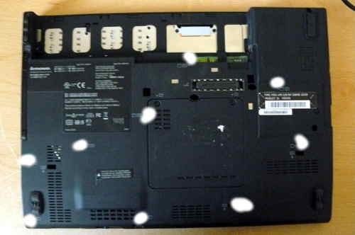

Poussez gentiment le clavier vers l'écran, puis soulevez-le, et
optionnellement déconnectez-le de la carte mère:\
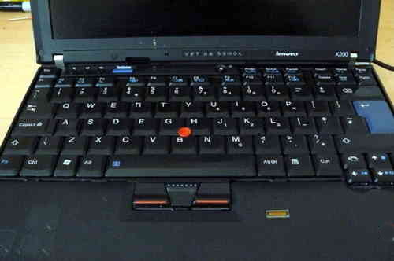
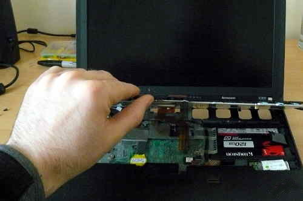

Déconnectez le câble du lecteur d'empreinte, puis ensuite prenez le
repose paume, soulevant son côté droit et gauche:\
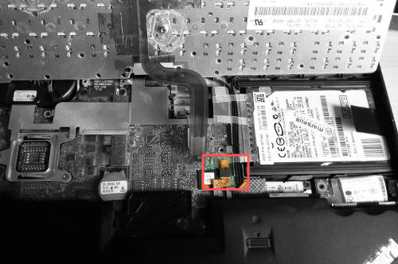
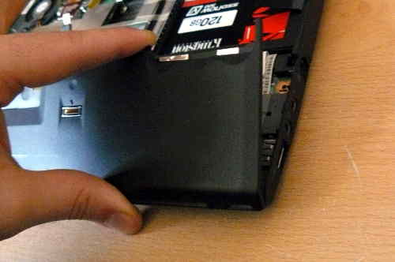

Ces images montrent l'emplacement de la puce flash, pour les SOIC-8 et
SOIC-16:
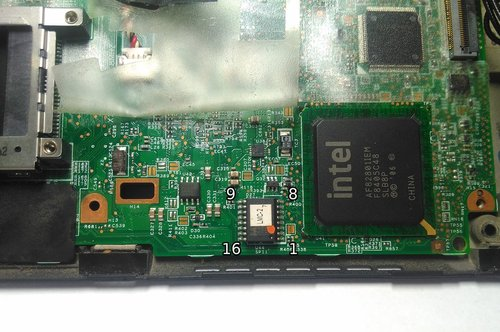
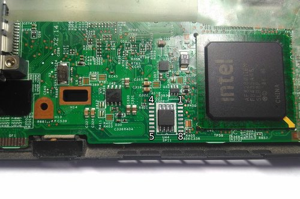

Soulevez et repliez l'adhésif couvrant une partie de la puce flash, puis
ensuite connectez la pince:\
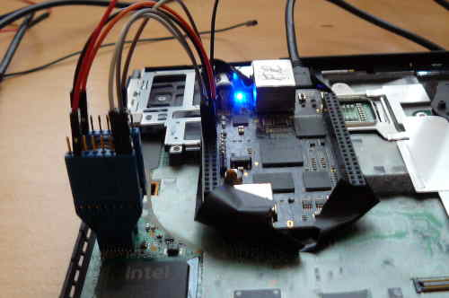

Sur le pin 2 du BBB, où se situe la terre (GND), connectez cette terre à votre
bloc d'alimentation du pc portable (PSU):\
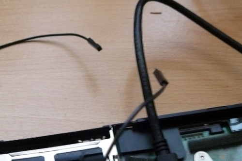
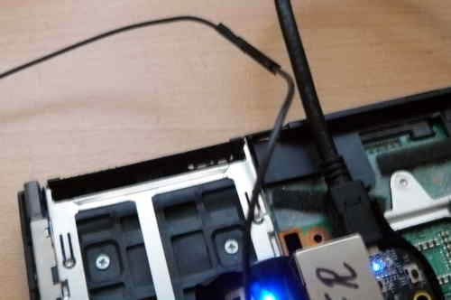

Connectez (via la pince) l'alimentation 3.3V DC de votre PSU à la puce flash:\
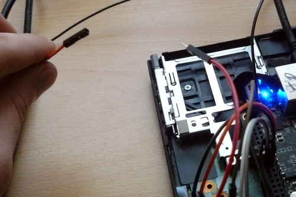
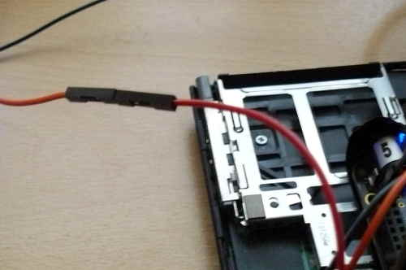

Maintenant, vous devriez être prêt à installer libreboot.

Les binaires de flashrom pour l'architecture ARM (testé sur un BBB) sont
distribués/fournis dans libreboot\_util. Alternativement, libreboot distribue
aussi le code source de flashrom pouvant être compilé.

Authentifiez-vous en tant que root sur votre BBB, en utilisant les
instructions dans le doc
[bbb\_setup.html\#bbb\_access](bbb_setup.html#bbb_access).

Testez afin de savoir si flashrom marche:

    # ./flashrom -p linux_spi:dev=/dev/spidev1.0,spispeed=512\

Dans ce cas là, la sortie était:

    flashrom v0.9.7-r1854 on Linux 3.8.13-bone47 (armv7l)
    flashrom is free software, get the source code at http://www.flashrom.org
    Calibrating delay loop... OK.
    Found Macronix flash chip "MX25L6405(D)" (8192 kB, SPI) on linux_spi.
    Found Macronix flash chip "MX25L6406E/MX25L6436E" (8192 kB, SPI) on linux_spi.
    Found Macronix flash chip "MX25L6445E/MX25L6473E" (8192 kB, SPI) on linux_spi.
    Multiple flash chip definitions match the detected chip(s): "MX25L6405(D)", "MX25L6406E/MX25L6436E", "MX25L6445E/MX25L6473E"
    Please specify which chip definition to use with the -c <chipname> option.

Voici comment sauvegarder factory.rom:

    # ./flashrom -p linux_spi:dev=/dev/spidev1.0,spispeed=512 -r factory.rom
    # ./flashrom -p linux_spi:dev=/dev/spidev1.0,spispeed=512 -r factory1.rom
    # ./flashrom -p linux_spi:dev=/dev/spidev1.0,spispeed=512 -r factory2.rom

Note: l'option `-c` n'est pas nécessaire dans la version de flashrom patchée
par libreboot, parce que les définitions redondantes de puces flash dans
*flashchips.c* ont été enlevées.

Maintenant comparez les 3 images:

    # sha512sum factory*.rom

Si les hashs correspondent, qu'un éditeur hexadécimal (comme `dhex`) montre
qu'ils ont des contenus valides (p.ex ils ne sont pas entièrement remplis avec
des `0x00`/`0xFF`)
alors copiez juste l'un d'eux (le factory.rom)
dans un endroit sûr (sur un disque connecté sur un autre système, pas le BBB).
C'est utile pour le travail d'ingénérie inversé, au cas où il y a un
comportement désirable dans le micrologiciel originel qui pourrait être
répliqué dans coreboot et libreboot.

Suivez les instructions dans le document 
[../hardware/gm45\_remove\_me.html\#ich9gen](../hardware/gm45_remove_me.html#ich9gen)
pour changer l'adresse MAC à l'intérieur de l'image ROM de libreboot, avant de
la flasher. Bien qu'il y a une adresse MAC par défaut à l'intérieur de l'image
ROM, c'est ce que vous voulez. *Soyez sûr de toujours changer l'adresse MAC
par une qui est correcte pour votre machine.*

Maintenant flashez là:
    
    # ./flashrom -p linux_spi:dev=/dev/spidev1.0,spispeed=512 -w path/to/libreboot/rom/image.rom

Vous verrez peut-être des erreurs, mais si ça dit `Verifying flash...
VERIFIED` à la fin, alors c'est flashé et ça devrait démarrer. Si vous voyez
des erreurs, essayez encore (et encore et encore); le message `Chip content is
identical to the requested image` est aussi un indicateur d'une installation
fructueuse.

Exemple de sortie lors de l'exécution de la commande ci-dessus:

    flashrom v0.9.7-r1854 on Linux 3.8.13-bone47 (armv7l)
    flashrom is free software, get the source code at http://www.flashrom.org
    Calibrating delay loop... OK.
    Found Macronix flash chip "MX25L6405(D)" (8192 kB, SPI) on linux_spi.
    Reading old flash chip contents... done.
    Erasing and writing flash chip... FAILED at 0x00001000! Expected=0xff, Found=0x00, failed byte count from 0x00000000-0x0000ffff: 0xd716
    ERASE FAILED!
    Reading current flash chip contents... done. Looking for another erase function.
    Erase/write done.
    Verifying flash... VERIFIED.

WiFi
====

Le X200 est fournit avec un jeu de puce WiFi Intel, qui ne marche pas sans
logiciel propriétaire. Pour une liste de jeux de puces qui marchent sans
logiciel propriétaire, voyez le document
[../hardware/\#recommended\_wifi](../hardware/#recommended_wifi).

Certains ordinateurs portables X200 peuvent être fournis avec un jeu de puce
Atheros, mais ont seulement le protocole 802.11g.

Il est recommandé que vous installiez un nouveau jeu de puce WiFi. Ça peut
seulement être fait après avoir installé Libreboot, parce que le micrologiciel
original a une liste blanche de puces approuvés, et refusera de démarrer si
vous utilisez un carte wifi 'non autorisée'.

Les photos suivantes montrent un Atheros AR5B95 en train d'être installé, pour
remplacer la puce Intel dont le X200 a été fourni avec:

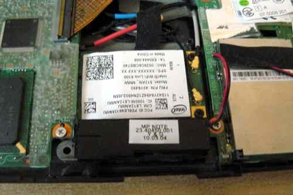
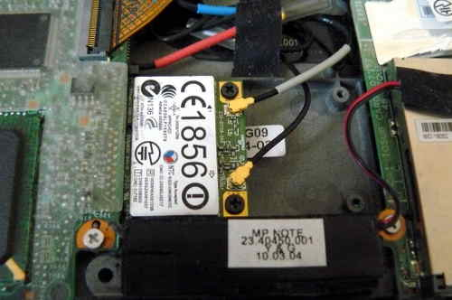

WWAN
====

Si vous avez une carte WWAN/3G et/ou un lecteur de carte sim, enlevez les
définitevement. La carte WWAN-3G a du micrologiciel propriétaire à
l'intérieur; la technologie est identique à celle utilisée dans les téléphones
mobiles, car elle peut traquer vos mouvements.

À ne pas confondre avec le WiFi (le WiFi est OK).

Mémoire Intel Turbo (Intel Turbo Memory)
==================

Certains X200 étaient vendus avec 'Intel Turbo Memory' installé dans le
réceptacle mini PCI-e le plus haut.

Si vous avez ce module installé, vous devriez problablement l'enlevez car il
n'apporte aucun bénéfices, pendant qu'il a de nombreux soucis:
-  Il a été [montré inefficace](http://www.anandtech.com/show/2252) pour mettre le disque en cache ou sauver de
   la batterie dans la majorité des cas d'utilisations. L'avoir installé
   pourrait amener à une plus grande consommation de la batterie.
-  L'utiliser aménera probablement a une perte de données parce qu'avec son
   [driver](https://github.com/yarrick/turbomem), "les données ne peuvent pas
   être lues/écrites en retour de façon fiabe". Aussi, son développement a
   stoppé.
-  Ça peut être aussii un risque de sécurité puisqu'il pourrait avoir accès à
   la RAM du système via le bus PCIe.

Mémoire
======

Vous aurez besoin que de la RAM de type DDR3 SODIMM PC3-8500 soit installé, en
paire identique en vitesse/taille. Les paires non correspondantes ne
marcheront pas. Vous pouvez aussi installer un seul module (voulant dire que
l'un des emplacements sera vide) dans l'emplacement (*slot*) 0.

Soyez sûr que la RAM que vous achetez soit de densité 2Rx8.

La photo suivante montre 8Go (2x4Go) de RAM installée:\
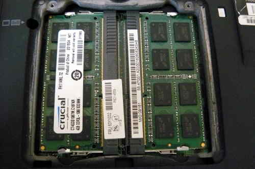

Démarrez le!
--------

Vous devriez voir quelque chose comme ceci:

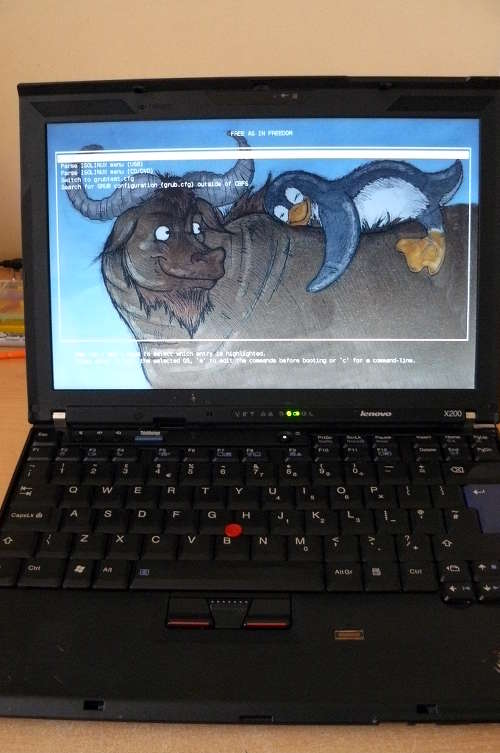

Maintenant [installez GNU+Linux](../gnulinux/).

Utilisateurs du X200S et X200 Tablet: l'astuce du GPIO33 ne marchera pas
--------------------------------------------------------

sgsit a découvert un pin appelé GPIO33, qui peut être mis à la terre
/masse pour désactiver les protections de flashages du descripteur et donc
pouvoir stopper le démarrage de la ME (Intel Management Engine), qui interfére
avec les tentatives de flashages.
La théorie s'est révélée correcte; néamoins, c'est encore à ce jour inutile en
pratique.

Jetez un coup d'oeil au dessus du '7' dans 'TP37' (c'est le GPIO33):

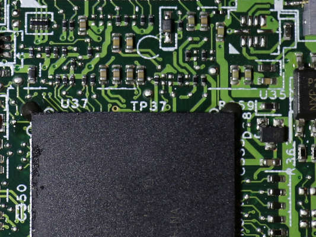

Par défaut nous devrons voir ceci dans le BIOS lenovo (lenovobios), lorsqu'on
essaye la command `flashrom -p internal -w rom.rom`:

    FREG0: Warning: Flash Descriptor region (0x00000000-0x00000fff) is read-only.
    FREG2: Warning: Management Engine region (0x00001000-0x005f5fff) is locked.

Avec le GPIO33 mis à la masse pendant le démarrage, ça a désactivé les
protections contre le flashage mises en place par le descripteur, et a arrêté
le démarrage de la ME. La sortie a changé:

    The Flash Descriptor Override Strap-Pin is set. Restrictions implied by
    the Master Section of the flash descriptor are NOT in effect. Please note
    that Protected Range (PR) restrictions still apply.

La partie en gras est ce qui nous a eu. Ceci a été quand même observé:

    PR0: Warning: 0x007e0000-0x01ffffff is read-only.
    PR4: Warning: 0x005f8000-0x005fffff is locked.

Il est actuellement possible de désactiver ces protections. Le BIOS de Lenovo
(propriétaire) le fait quand il doit se mettre à jour.
Une manière d'affronter le problème serait de déboguer l'utilitaire de mise à
jour du BIOS de Lenovo à des fins d'ingéniérie inversée, pour savoir comme il
désactive ces protections.
Plus d'éléments de recherche sont disponibles ici:
<http://www.coreboot.org/Board:lenovo/x200/internal_flashing_research>

D'autre part, libreboot a un utilitaire qui pourrait aider à l'investigation
de celà:
[../hardware/gm45\_remove\_me.html\#demefactory](../hardware/gm45_remove_me.md#demefactory)

Copyright © 2014, 2015 Leah Rowe <info@minifree.org>

Permission est donnée de copier, distribuer et/ou modifier ce document
sous les termes de la Licence de documentation libre GNU version 1.3 ou
quelconque autre versions publiées plus tard par la Free Software Foundation
sans Sections Invariantes,  Textes de Page de Garde, et Textes de Dernière de Couverture.
Une copie de cette license peut être trouvé dans [../fdl-1.3.md](fdl-1.3.md).
