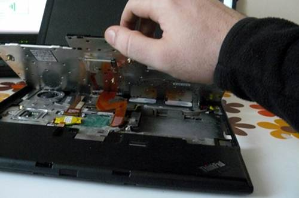
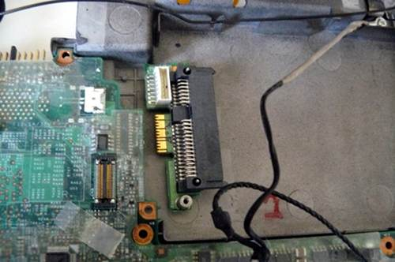
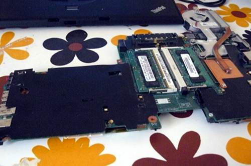
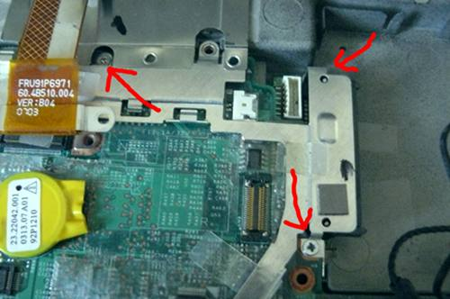
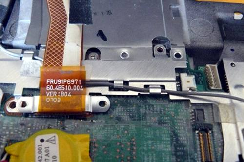
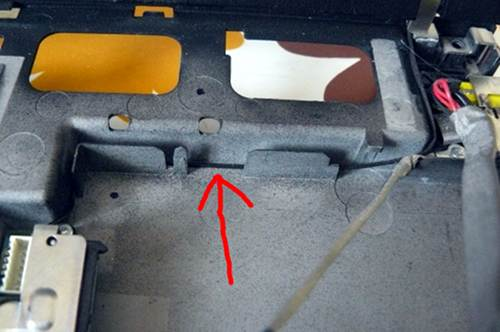
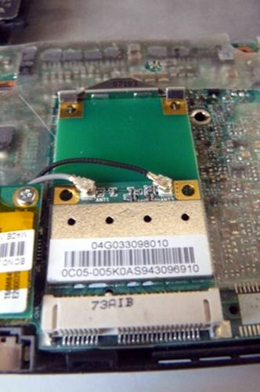
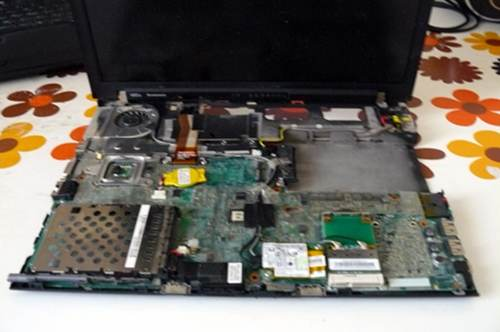

---
title: Guide de recouvrement pour le ThinkPad X60
x-toc-enable: true
...

Cette section documente comment récupérer après un mauvais flashage empêchant
le démarrage de votre ThinkPad X60.

Brick type 1: bucts not reset. {#bucts_brick}
==============================

Vous avez encore le BIOS Lenono, ou Libreboot était en cours d'exécution et
vous avez flashé une autre ROM; et 'bucts 1' était défini et la ROM n'a pas
été `dd`\* ou alors le BIOS Lenovo était présent et libreboot n'était pas
flashé.\

Dans ce cas là, la récupération est facile: réinitialisez BUC.TS à 0 en
enlevant cette pièce jaune cmos (c'est une batterie) puis en la remettant une
ou deux minutes après:\
\

\*Ces commandes dd devraient être appliquées à toutes images ROM pour X60
nouvellement compilés (les images ROM dans les archives des binaires ont déjà
ça d'appliqué!):\

    dd if=coreboot.rom of=top64k.bin bs=1 skip=\$\[\$(stat -c %s coreboot.rom) - 0x10000\] count=64k
    dd if=coreboot.rom bs=1 skip=\$\[\$(stat -c %s coreboot.rom) - 0x20000\] count=64k | hexdump
    dd if=top64k.bin of=coreboot.rom bs=1 seek=\$\[\$(stat -c %s coreboot.rom) - 0x20000\] count=64k conv=notrunc

Faire ceci rend la ROM prête pour le flashage sur un système exécutant
toujours le BIOS Lenovo, en utilisant ces instructions:
<http://www.coreboot.org/Board:lenovo/x60/Installation>

Mauvaise rom (ou erreur utilisateur), le système ne démarrera pas {#recovery}
===========================================

Dans ce scénario, vous avez compilé une ROM qui avait une configuration
incorrecte, ou il y a un véritable bug empêchant votre système de démarrer.
Ou, peut-être, vous avez défini BUC.TS à 0 et avez éteint après le premier
flash pendant que le BIOS Lenovo était en train de s'exécuter. Dans n'importe
quel cas, votre système est bousillé (*bricked*, rendu aussi utile qu'une
brique) et ne voudra pas démarrer du tout.

Le "débriquage" (*unbricking*) signifie qu'on flashe une ROM connue pour
marcher. Le problème: vous ne pouvez pas démarrer le problème, rendant cette
tâche difficile. Dans cette situation, du matériel externe (voir les requis
matériels ci-dessus) est nécessaire, pouvant flasher la puce SPI (où libreboot
réside).

Enlevez ces vis:\

Poussez le clavier vers l'avant (avec précautions):\

Soulevez le clavier et déconnectez le de la carte mère:\

Attrapez le côté droit du chassis et forcez le gentiment vers le dehors, et
faîtes levier pour enlever le reste du chassis:\

Vous devriez avoir maintenant ceci:\

Déconnectez les câbles d'antenne WiFi, les câbles du modem et le
haut-parleur:\

Déroutez les câbles en suivant le chemin inverse, soulevant avec précaute
l'adhésif qui les maintiennent en place, puis, déconnectez les câbles du modem
(autre extrémité) et d'ailmentation et déroutez tous les câbles de façon
qu'ils pendent à côté de la charnière de l'écran sur le côté droit:\

Déconnectez l'écran de la carte mère, et déroutez le câble antenne gris,
soulevant avec précaution l'adhésif qui le maintient en place:\

Soulevez avec précaution l'adhésif restant et déroutez le câble antenne gauche
pour qu'il soit détendu:\

Enlevez le vis qui est surligné (n'enlevez PAS l'autre; il maintient une
partie du dissipateur de châleur (l'autre côté) en place):\

Enlevez ces vis:\

Enlevez avec précaution la plaque, comme ceci:\

Enlevez le connecteur SATA:\

Maintenant enlevez (gentiment) la carte mère et mettez de côté l'écran LCD/ le
chassis:\

Repliez cet adhésif et tenez le avec quelque chose. Ce qui est surligné est la
puce flash SPI:\

Maintenant branchez le BBB et la pince Pomona avec votre alimentation.\
Référez-vous au document [bbb\_setup](bbb_setup.md) sur comment mettre en
place le BBB pour le flashage.

*Notez, le guide mentionne une alim DC 3.3V mais vous n'avez pas besoin de ça
sur le T60: si vous n'avez pas ou ne voulez pas utiliser une alimentation
externe, alors assurez-vous de ne pas connecter les fils/câbles 3.3V
mentionnés dans le guide; à la place, connectez l'adaptateur DC (celui qui
charge normalement votre batterie), comme ça la carte est alimentée (mais ne
la démarrez/l'allumez pas)*
\
Corrélez le suivant avec le lien du guide BBB partagé ci-dessus:

    POMONA 5250:
    ===  "doigt d'or" et interrupteur WiFi ====
     18              -       - 1
     22              -       - NC                    ---------- prise jack audio sont sur cette extrémité
     NC              -       - 21
     3.3V (alim)      -       - 17 - c'est le pin 1 sur la puce flash
    === ventilo processeur ===
    C'est comme ceci que vous connecterez. Les nombres font références au
    numéro de pins sur le BBB, sur les fiches près de la fiche mâle DC.

Connectez le BBB et le pomona (dans cette image, une alimentation 3.3V DC a
été utilisée):\

Les binaires de flashrom pour l'architecture ARM (testé sur un BBB) sont
distribués/fournis dans libreboot\_util. Alternativement, libreboot distribue
aussi le code source de flashrom pouvant être compilé.

Connectez-vous via SSH sur le BBB:

    # ./flashrom -p linux_spi:dev=/dev/spidev1.0,spispeed=512 -w yourrom.rom

La sortie de cette commande devrait dire `Verifying flash... VERIFIED` à la
fin. Si flashrom se plaint de multiples définitions de puces flash détectées,
alors choisissez l'une d'elles en suivant les instructions mentionnées dans la
sortie de la commande.

Enlevez le programmeur et mettez le ailleurs quelque part. Remettez l'adhésif
en pressant fermement:\

Votre chassis vide:\

Remettez la carte mère dedans:\

Reconnectez le(s) SATA:\

Remettez la plaque et réinsérez ces vis:\

Reroutez ce câble antenne autour du ventilateur et réappliquez un adhésif:\

Routez le câble ici puis, (pas montré, à cause d'une erreur de ma part)
reconnectez le câble de l'écran à la carte mère et réinsérez les vis:\

Réinsérez ce vis:\

Routez le câble antenne noir comme ceci:\

Rentrez-le bien comme il faut comme ceci:\

Routez le câble modem comme ceci:\

Connectez le câble modem à la carte mère et rentrez-le bien comme il faut
comme ceci:\

Routez la connection de l'alimentation et connectez-la à la carte mère comme
ceci:\

Routez les câbles d'antenne et modem bien comme il faut comme ceci:\

Connectez les câbles antenne WiFi. Au début du tuto, ce système avait une puce
WiFi Intel. Ici vous pouvez voir que je l'ai remplacé par un Atheros AR5B95
(supporte le protocole 802.11n et peut être utilisé sans blobs):\

Connectez le câble modem:\

Connectez l'haut-parleur:\

Vous devriez maintenant avoir ceci:\

Reconnectez le chassis supérieur:\

Reconnectez le clavier:\

Réinsérez les vis enlevés plus tôt:\

Allumez!\

Système d'exploitation:\

Copyright © 2014, 2015 Leah Rowe <info@minifree.org>\

Permission est donnée de copier, distribuer et/ou modifier ce document
sous les termes de la Licence de documentation libre GNU version 1.3 ou
quelconque autre versions publiées plus tard par la Free Software Foundation
sans Sections Invariantes,  Textes de Page de Garde, et Textes de Dernière de Couverture.
Une copie de cette license peut être trouvé dans [../fdl-1.3.md](fdl-1.3.md).
