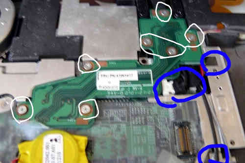
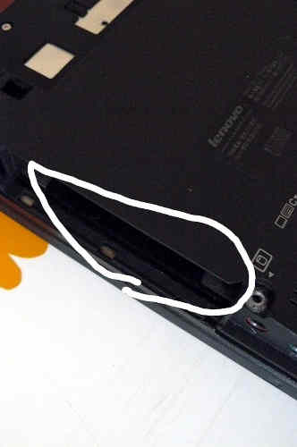

---
title: Guide de récupération du X60 Tablet
x-toc-enable: true
...

Cette section documente comment recouvrir d'un mauvaise flashage qui empêche
votre ThinkPad X60 Tablet de démarrer.

Bousillage (brick) de type 1: bucts pas réinitialisé. {#bucts_brick}
==============================

Vous avez encore le BIOS de Lenovo, ou si vous avez Libreboot en cours
d'exécution et vous avez flashé une autre ROM; et vous avez défini bucts sur 1
et la ROM n'a pas été `dd`.\* Ou si le BIOS Lenovo était présent et Libreboot
n'était pas flashé.\

Dans ce cas, le recouvrement est facile: réinitialisez BUC.TS à 0 en enlevant
cette pièce jaune cmos (c'est une batterie) et en la remettant une ou deux
minutes plus tard:
\

\*Ces commandes dd devrait être appliquée à toutes les nouvelles images ROM
pour X60 compilées (les images ROM dans les archives de binaires de libreboot
ont déjà ça d'appliqué!):

    dd if=coreboot.rom of=top64k.bin bs=1 skip=\$\[\$(stat -c %s coreboot.rom) - 0x10000\] count=64k
    dd if=coreboot.rom bs=1 skip=\$\[\$(stat -c %s coreboot.rom) - 0x20000\] count=64k | hexdump
    dd if=top64k.bin of=coreboot.rom bs=1 seek=\$\[\$(stat -c %s coreboot.rom) - 0x20000\] count=64k conv=notrunc

(faire ça rend le bios enclin à l'utilisation lors du flashage d'un système
ayant toujours le BIOS Lenovo en marche, en utilisant ces instructions:
<http://www.coreboot.org/Board:lenovo/x60/Installation>.)

ROM corrompue (ou erreur de l'utilsateur), le système ne veut pas démarrer {#recovery}
===========================================

Dans ce cas de figure, vous avez compilé une ROM ayant une configuration
incorrecte, ou il y a un véritable bogue empêchant votre système de démarrer.
flashage pendant que le BIOS Lenovo s'exécutait.
Dans tout les cas, votre machine est bousillée (*bricked*) et ne démarrera
pas du tout.

Le "débriquage" (*unbricking*) signifie qu'on flashe une ROM connue pour
marcher. Le problème: vous ne pouvez pas démarrer le problème, rendant cette
tâche difficile. Dans cette situation, du matériel externe (voir les requis
matériels ci-dessus) est nécessaire, pouvant flasher la puce SPI (où libreboot
réside).

Enlevez ces vis:\

Enlevez le disque dur:\

Poussez le clavier vers l'avant pour le déserrer:\

Soulevez:\

Enlevez ces vis:\

Aussi, enlevez ce qui est marqué et déroutez les câbles d'antenne:\

Pour certains ordinateurs portables X60T, vous devez déroutez ceux-là aussi:\

Enlevez les vis de la carte d'extension de l'écran LCD. Enlevez aussi ces vis
(voir marques bleues) et enlevez/déroutez ces câbles puis enlevez la plaque en
métal:\

Enlevez cette vis puis ensuite enlevez la carte:\

Maintenant branchez la BBB et la pince Pomona sur votre alimentation.\
Référez au document [bbb\_setup.md](bbb_setup.md) pour savoir comment
configurer le BBB pour le flashage.\

*Notez, le guide mentionne une alim DC 3.3V mais vous n'avez pas besoin de ça
sur le X60 Tablet:: si vous n'avez pas ou ne voulez pas utiliser une alimentation
externe, alors assurez-vous de ne pas connecter les fils/câbles 3.3V
mentionnés dans le guide; à la place, connectez l'adaptateur DC (celui qui
charge normalement votre batterie), comme ça la carte est alimentée (mais ne
la démarrez/l'allumez pas)*

\
Corrélez le suivant avec le guide BBB partagé au-dessus:

    POMONA 5250:
    ===  "doigt d'or" et interrupteur wifi ====
     18              -       - 1
     22              -       - NC                    ---------- les prises jacks audio sont à cette extrêmité
     NC              -       - 21
     3.3V (PSU)      -       - 17 - c'est le pin 1 sur la puce flash.
    === ventilo processeur ===
    C'est comme ceci que vous connecterez. Les nombres font références au
    numéro de pins sur le BBB, sur les fiches près de la fiche mâle DC.

Connexion du BBB et de la pince pomona (dans cette image un PSU externe DC de
3.3V a été utilisé):\

Les binaires de flashrom pour l'architecture ARM (testé sur un BBB) sont
distribués/fournis dans libreboot\_util. Alternativement, libreboot distribue
aussi le code source de flashrom pouvant être compilé.

Connectez-vous via SSH sur le BBB:

    # ./flashrom -p linux_spi:dev=/dev/spidev1.0,spispeed=512 -w yourrom.rom

La sortie de cette commande devrait dire `Verifying flash... VERIFIED` à la
fin. Si flashrom se plaint de multiples définitions de puces flash détectées,
alors choisissez l'une d'elles en suivant les instructions mentionnées dans la
sortie de la commande.

Faites l'inverse pour ré-assembler votre système.

Copyright © 2014, 2015 Leah Rowe <info@minifree.org>\

Permission est donnée de copier, distribuer et/ou modifier ce document
sous les termes de la Licence de documentation libre GNU version 1.3 ou
quelconque autre versions publiées plus tard par la Free Software Foundation
sans Sections Invariantes,  Textes de Page de Garde, et Textes de Dernière de Couverture.
Une copie de cette license peut être trouvé dans [../fdl-1.3.md](fdl-1.3.md).
