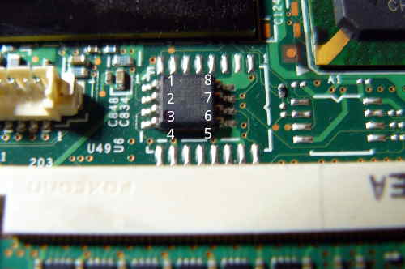

---
title: Foire aux questions
x-toc-enable: true
...


Questions importantes
================

Est-ce que le projet Libreboot est encore actif ?
-------------------------------------------

Oui ! Le [répertoire git](https://notabug.org/libreboot/libreboot) montre tout le travail que nous sommes en train de faire en ce moment.
Libreboot est plutôt actif.


Alors, quand est-ce que la prochaine version de Libreboot va sortir ?
-------------------------------------------------------

Réponse courte: ça sort quand ça sort. Si vous voulez aider et soumettre des patchs, référez-vous à [la page Git](git.md).

Nous n'annonçons pas de temps estimé de sortie.

Réponse longue:

Nous avons réécris l'entiereté du système de build de Libreboot de rien, depuis la dernière version. Ça a pris plus longtemps que nous avons prévu, mais le système de build arrive à maturité. Nous sommes en train de le polir.

Une fois que le système de build est stable, notre prochaine priorité est de s'assurer que toutes les cibles de build supportées maintenant se buildent proprement dans Libreboot.

Après celà, la priorité est de s'assurer que toutes les cartes mères dans Libreboot utilise la révision la plus à jour de Coreboot, avec tous les correctifs et améliorations. 
Tester ces cartes mères sera juste une affaire d'un examen collégial, étendu à la communauté entière via les versions alpha/bêta/RC.

Généralement, toutes les problèmes bloquant la production d'une version doit être adressé avant qu'une nouvelle sorte.
Voyez : 
<https://notabug.org/libreboot/libreboot/issues>

Les plus importantes tâches sont maintenant les suivantes:

- Étudier le système de build de Libreboot (écrit en Bash), et y apporter des corrections.
- Travailler sur de nouvelles améliorations et aider avec les builds une fois que toutes les ROMs sont construites pour toutes les cartes mères, quand le système de build est stable.
- En particulier, il y a quelques nouvelles cartes mères dans coreboot que nous pouvons ajouter à Libreboot, comme documenté dans le traqueur de bogues de Libreboot.
Celles-ci devront être ajoutées, et complétement testées. Les instructions pour mettre en place les outils de flashing matériels peuvent être trouvés dans [les guides d'installation de Libreboot](docs/install/)
- Bogues ! Signalez les bogues ! <https://notabug.org/libreboot/libreboot/issues> 
- Quelques nouvelles adaptions de cartes mères serait bienvenue ;).
- Si vous avez les compétences, cela serait très apprécié. Adaptez les à coreboot d'abord, où faites en sorte que les cibles existantes de coreboot marchent sans blobs binaires.

Plus généralement:

- Parlez à vos amis à propos de Libreboot ! Libreboot veut libérer autant de personnes que possible.
- Si vous avez des moyens d'ameliorer la documentation, vous pouvez faire ça aussi.
Référez-vous à la [page Git](git.md) pour des instructions sur la soumission des patchs dans la documentation.
- Encouragez les entreprises, où n'importe quelles personnes avec les compétences/ressources, de s'impliquer dans le développement de Libreboot.


Quelle version de Libreboot ai-je ?
----------------------------------------------------------------

Regardez la version [dans la documentation](../docs/#version)

Flashrom se plaint de l'accés à DEVMEM
--------------------------------------

Si exécuter `flashrom -p internal` pour le flashage basé logiciel vous
sort une erreur se relatant à l'accés à /dev/mem, vous devriez redémarrer
avec le paramètre de kernel `iomem=relaxed` avant d'exécuter flashrom ou
d'utiliser un kernel dont les options `CONFIG_STRICT_DEVMEM` et
`CONFIG_IO_STRICT_DEVMEM` ne sont pas activées.


Un exemple de la sortie de flashrom avec les options du kernel
`CONFIG_STRICT_DEVMEM` et  `CONFIG_IO_STRICT_DEVMEM` activé:
```
flashrom v0.9.9-r1955 on Linux 4.11.9-1-ARCH (x86_64)
flashrom is free software, get the source code at https://flashrom.org

Calibrating delay loop... OK.
Error accessing high tables, 0x100000 bytes at 0x000000007fb5d000
/dev/mem mmap failed: Operation not permitted
Failed getting access to coreboot high tables.
Error accessing DMI Table, 0x1000 bytes at 0x000000007fb27000
/dev/mem mmap failed: Operation not permitted
```
Le rétroéclairage est plus sombre sur le côté gauche de l'écran quand je baisse la luminosité sur mon X200/T400/T500/R400
---------------------------------------------------------------------------------------------------------------

Nous ne savons pas comment détecter les valeurs PWM correctes à utiliser dans
coreboot-libre, donc nous utilisons celles par défaut dans coreboot qui a ces
problèmes avec quelques écrans CCFL, mais pas les écrans LED.

Vous pouvez contourner celà dans votre distribution, en suivant les notes dans
[docus: control du rétroéclairage](../docs/misc/#finetune-backlight-control-on-intel-gpus).

Mon ethernet ne marche pas sur le X200/T400/X60/T60 lorsque je branche le cable
-------------------------------------------------------------------

Ça a été observé sur quelque systèmes utilisant network-manager.
Ça arrive à la fois sur le BIOS original et sur libreboot. C'est une
particularité dans le matériel. Sur les systèmes debian, une solution de
contournement est de redémarrer le service réseau quand vous connectez le
câble ethernet:

    $ sudo service network-manager restart

Sur Parabola, vous pouvez essayer:

    $ sudo systemctl restart network-manager

(le nom du service peut être différent pour vous, dépendant de votre
configuration)

Mon KCMA-D8 ou KGPE-D16 ne démarre pas avec le module PIKE2008 installé
-----------------------------------------------------------------------

Libreboot version 20160818, 20160902 et 20160907 ont toutes un bug: dans
SeaBIOS, les options ROMs PCI sont chargés et disponible, par défaut. Ce n'est
techniquement pas un problème, car une ROM optionnelle peut être libre ou non.
En pratique cependant, elles sont généralement non libres.

Charger la ROM optionnelle depuis le module PIKE2008 sur soit l'ASUS KCMA-D8
ou KGPE-D16 cause un gel du système lors du démarrage. C'est possible
d'utiliser le module dans la charge utile (si vous utilisez une charge utile
pour le kernel linux, ou petitboot), ou pour démarrer (avec SeaGRUB et/ou
SeaBIOS) à partir d'un port SATA normal puis ensuite utiliser GNU+Linux.
Le kernel Linux est capable d'utiliser le module PIKE2008 sans chargé la ROM
optionnelle.

Libreboot-instable (ou git) désactive dès maintenant le chargements des ROM
option PCI, mais les versions précédentes avec SeaGRUB (20160818-20160907) ne
le font pas. Vous pouvez contourner celà en exécutant la commande suivante:

    $ ./cbfstool yourrom.rom add-int -i 0 -n etc/pci-optionrom-exec

Vous pouvez trouver l'utilitaire *cbfstool* dans l'archive \_util avec la
version de libreboot que vous utilisez.

Quelles sont les erreurs ata/ahci que je vois dans le GRUB de libreboot ?
-----------------------------------------------------------------------

Vous pouvez ignorer sûrement ces erreurs, elles existent par ce qu'on ne peut
pas faire taire la commande cryptomount de la boucle `for` dans le 
[grub.cfg](https://notabug.org/libreboot/libreboot/src/r20160907/resources/grub/config/menuentries/common.cfg#L66).
de libreboot. Ça pourrait être corrigé en amont grâce à la contribution d'une
rustine lui ajoutant un drapeau 'mode silencieux'.

Comment sauvegarder les journaux de la panique du kernel sur les ordinateurs portables ThinkPad ?
--------------------------------------------------

La façon la plus facile de faire est d'utiliser la netconsole du kernel et de
reproduire la panique. La netconsole nécessite deux machines, celle qui est
paniquée (source) et celle qui recevra les journaux d'échecs (target). La
source doit être connecté via un câble ethernet et la cible doit être
atteignable sur le réseau lors de la panique. Pour configurer ce système,
exécutez les commandes suivantes en tant que root sur la source (`source#`) et
un utilisateur normal sur la cible (`target$`):

1.  Démarrez un server d'écoute sur la machine cible (netcat marche bien):

    `target$ nc -u -l -p 6666`

2.  Monter configfs (une fois seulement par démarrage, vous pouvez vérifier
    qu'il est déjà monté avec  `mount | grep /sys/kernel/config`. Il n'y aura
    pas de texte en sortie si il ne l'est pas).

    `source# modprobe configfs`

    `source# mkdir -p /sys/kernel/config`

    `source# mount none -t configfs /sys/kernel/config`

3.  cherchez le nom de l'interface ethernet de la source, ça devrait être de
    la forme `enp*`ou `eth*`, voyez la sortie de `ip address` ou `ifconfig`.

    `source# iface="enp0s29f8u1"` adaptez cela 

    remplissez l'IPV4 de la machine cible ici:

    `source# tgtip="192.168.1.2"` adaptez cela

4.  Créez la cible de journalisation netconsole sur la machine source:

    `source# modprobe netconsole`

    `source# cd /sys/kernel/config/netconsole`

    `source# mkdir target1; cd target1`

    `source# srcip=$(ip -4 addr show dev "$iface" | grep -Eo '[0-9]+\.[0-9]+\.[0-9]+\.[0-9]+')`

    `source# echo "$srcip" > local_ip`

    `source# echo "$tgtip" > remote_ip`

    `source# echo "$iface" > dev_name`

    `source# arping -I "$iface" "$tgtip" -f | grep -o '..:..:..:..:..:..' > remote_mac`

    `source# echo 1 > enabled`

5.  Changez le niveau de la journalisation sur déboguage:

    `source# dmesg -n debug`

6.  Testez si la journalisation marche p.ex en insérant ou enlevant un
    appareil USB sur la source. Il devrait y avoir quelques lignes
    apparaissant dans le terminal où vous avez démarré netcat (nc), sur l'hôte
    cible.

7.  Tentez de reproduire la panique du kernel.

Erreurs de la vérification de la machine sur quelque ordinateurs portables Montevina (CPU Penryn)
---------------------------------------------------------------

Quelques ordinateurs portables GM45 ont gelé (niveau logiciel) ou expérimenté
une panique du kernel (la LED du Verr. Maj clignotante et une machine
ne répondant totalement pas, défois suivi d'un redémarrage automatique dans
les 30secondes).
Nous ne savons pas ce qu'est (sont) le(s) problème(s), mais dans quelques cas
une mise à jour du microcode processeur empêche ceci de se reproduire.
Voyez les rapports de bogues suivant pour plus d'informations:
- [T400 Machine check: Processor context corrupt](https://notabug.org/libreboot/libreboot/issues/493)
- [X200 Machine check: Processor context corrupt](https://notabug.org/libreboot/libreboot/issues/289)

- [Sans rapport, incompatibilité de la RAM et problèmes de suspension dans la RAM sur le
  X200](https://libreboot.org/docs/hardware/x200.html#ram_s3_microcode)


Compatibilité matérielle
======================

Quels systèmes sont compatibles avec libreboot?
-----------------------------------------------------------------------------------

Jetez un coup d'oeil à la [liste de compatibilité matérielle](docs/hardware/).

Est-ce que les ordinateurs portables Purism seront supportés?
----------------------------------------------------------------------

Réponse courte: non.

Il y a des problèmes sévères de sécurité, confidentialité et de liberté avec
ces ordinateurs portables, dû aux jeux de puces Intel qu'ils utilisent. Voyez:

- [Intel Management Engine](#intelme)
- [Plus de problèmes de liberté sur le matériel Intel moderne](#intel)

Plus en détail, ces ordinateurs portables utilise aussi le blob binaire Intel
FSP pour l'entière initialisation matérielle. Coreboot supporte une révision
particulière d'un de leurs ordinateurs portables, mais la majorité sont soit
non supportés ou dépendent de blobs binaires pour la majorité de
l'initialisation matérielle.

En particulier, l'Intel Management Engine est une menace sévère à la
confidentialité et la sécurité, sans mentionner la liberté, puisque c'est une
porte dérobée à distance dans un ordinateur où elle est présente.

Intel l'a même admis,
[publiquement](https://www.intel.com/content/www/us/en/support/articles/000025619/software.html).

Pourquoi le matériel récent d'Intel n'est pas supporté dans Libreboot? {#intel}
-----------------------------------------------------------

Ce n'est pas certain que n'importe quel matériel Intel produit après 2008 sera
supporté dans Libreboot, dû à de sévères problèmes de sécurité et de libertés;
si sévère, que *le projet libreboot recommande d'éviter tout matériel Intel
moderne. Si vous avez un système basé sur Intel affligé des problèmes
ci-dessous, alors vous devriez vous en débarrasser le plus vite possible*. Les
problèmes principaux sont les suivants:

### Intel Management Engine (ME) {#intelme}

Introduit en Juin 2006 dans la "Intel's 965 Express Chipset Family of
(Graphics and) Memory Controller Hubs", ou (G)MCHs, et la famille des
controlleurs entrée/sortie ICH8, l'Intel Management Engine (ME, ou en français
*Moteur d'administration*) est un environnement informatique séparé
physiquement situé dans la puce (G)MCH.
Dans le dernier trimestre de 2009, la première génération des processeurs
Intel Core i3/i5/i7 (Nehalem) et la série 5 de la famille des jeux de puces
des "Platform Controller Hubs", ou PCHs, ont amenés une ME plus étroitement
intégrée (maintenant à la version 6.0) à l'intérieur de la puce PCH, qui
elle-même remplace l'ICH. Donc, la ME est **présente dans tout les ordinateur,
ordinateurs portables et systèmes serveurs depuis mi-2006**.

La ME consiste en un coeur de processeur ARC (remplacés par d'autres coeurs de
processeur dans les générations d'après), caches de codes et de données, une
horloge, et un bus sécurisé internel auquel des appareils supplémentaires sont
attachés, incluant un moteur cryptographique, ROM et RAM interne, contrôleurs
de mémoire, et un **moteur d'accés mémoire direct (Direct Memory Access, ou
DMA)** pour accéder à la mémoire du système d'exploitation hôte ainsi que
réserver une région de la mémoire externe protégée pour s'additionner à la RAM
interne limitée de la ME.
La ME a aussi un **accés au réseau** avec sa propre adresse MAC à travers un
Contrôleur Ethernet Gigabit Intel. Son programme de démarrage, stocké dans la
ROM interne, charge un "manifeste" micrologiciel depuis la puce flash SPI du
PC. Ce manifest est signé **avec une robuste clé cryptographique**, qui
différe selon les versions du micrologiciel de la ME.
Si le manifeste n'est pas signé par une clé Intel spécifique, la ROM de
démarrage ne se chargera pas et n'exécutera pas le micrologicel, amenant à
l'arrêt du coeur processeur de la ME.

Le micrologiciel de la ME est compressé et consiste en des modules qui sont
listés dans le manifest à côté d'une empreinte numérique (hash) sécurisée de
leur contenu. Un des modules est le kernel du système d'exploitation, qui est
basé sur un ***kernel propriétaire de système d'exploitation en temps réel
(RTOS, real-time operating system)*** appelé "ThreadX". Le développeur, Express Logic, vend des
licenses et code source pour ThreadX. Les clients tel qu'Intel sont exclus de
dévoiler ou sous-licencer le code source de ThreadX.
Un autre module est le Chargeur Dynamique D'applications (DAL, Dynamic
Application Loader), qui consiste en une **machine virtuelle Java** et un
ensemble de classes Java préinstallées pour le chiffrement, stockage
sécurisé, etc. Le module DAL peut charger et exécuter des modules ME
supplémentaires depuis le HDD/SSD du PC. Le micrologiciel de la ME inclut
aussi des modules d'applications natives à l'intérieur de la mémoire flash,
comprenant "Intel Active Management Technology" (AMT), une implémentation d'un
"Trusted Platform Module" (TPM), Intel Boot Guard, et des systèmes de DRM
audios et vidéos.

L'AMT (ou Technologie d'administration active), qui fait partie de la marque
d'Intel "vPro", est un serveur web et code d'application qui permet à des
utilisateurs distant de démarrer, éteindre, voir des informations à propos de,
et autrement d'administrer le PC. Ça peut être ***utilisé à distance même
quand le PC est éteint*** (via Wake-on-Lan, WoL). Le traffic est chiffré en
utilisant des bibliothèques SSL/TLS, mais rappelez-vous que toutes les
implémentations majeures et répandues de SSL/TLS ont eu des vulnérabilités
largement publiées. L'application AMT elle-même a des ***[vulnérabilités
connues](https://en.wikipedia.org/wiki/Intel_Active_Management_Technology#Known_vulnerabilities_and_exploits)***
qui ont été exploitées pour développer des maliciels furtifs (rootkits) et
enregistreurs de frappes et avoir discrétement accés aux fonctionnalitées
d'administration d'un PC.
Rappelez vous que la ME a un accés complet à la RAM d'un PC. Ça veut dire
qu'un attaquant exploitant ces vulnérabilités pourrait avoir accés à tout sur
le PC en état de marche; tous les fichiers ouverts, toutes les applications
s'exécutant, toutes les touches pressées, et plus.

L'[Intel Boot Guard](https://mjg59.dreamwidth.org/33981.md)
est une application de la ME introduite dans le troisième trimestre de 2013
avec la version 9.0 du micrologiciel de la ME sur les processeurs Intel Core
i3/i5/i7 de 4ième génération (Haswell).
Ça permet à un manufactureur de PC de générer une paire de clés asymmétrique,
installer la clé publique dans le processeur, et d'empêcher le processeur
d'exécuter du micrologiciel de démarrage qui n'est pas signé avec leur clé
privée. Ça veut dire que ***coreboot et libreboot sont impossibles à adapter***
à de tels PCs, sans la clé privée de signature du manufactureur. Notez que les
systèmes construit à partir de parties séparées de carte mères et de
processeurs ne sont pas affectés, puisque le vendeur de la carte mère (sur
laquelle le micrologiciel de démarrage est stocké) ne peut pas affecter la clé
publique stockée sur le processeur.

Les versions 4.0 et au-delà de la ME (Intel 4 Series et jeux de puces d'après)
incluent une application de la ME pour ***la
[DRM](https://defectivebydesign.org/what_is_drm_digital_restrictions_management) de l'audio et de la
vidéo***, appelé "Protected Audio Video Path" (PAVP). La ME reçoit du système
d'exploitation hôte un flux média chiffré et une clé chiffré, déchiffre la
clé, et envoie la clé déchiffré à la carte graphique, qui ensuite déchiffre
le média. PAVP est aussi utilisé par une autre application ME pour dessiner un
pavé d'authentification PIN directement sur l'écran. Dans ce cas,
l'application PAVP contrôle directement les graphiques apparaissant sur
l'écran du PC d'une manière que le système d'exploitation du PC hôte ne
peut pas détecter. La version 7.0 de la ME sur les PCHs avec processeurs 
Intel Core seconde Génération (Sandy Bridge) i3/i5/i7 remplace PAVP avec une
application de DRM similaire appelée "Intel Insider". Comme l'application AMT,
ces applications DRM, qui en elles-mêmes sont défectueuses par conception,
démontre les capacités d'omnipotences de la ME; ce matériel et son
micrologiciel propriétaire peut accéder et contrôler tout ce qui est dans la
RAM et même ***tout ce qui est montré sur l'écran***.


In this usage, the PAVP application directly controls the graphics that
appear on the PC's screen in a way that the host OS cannot detect. ME
firmware version 7.0 on PCHs with 2nd Generation Intel Core i3/i5/i7
(Sandy Bridge) CPUs replaces PAVP with a similar DRM application called
"Intel Insider". Like the AMT application, these DRM applications,
which in themselves are defective by design, demonstrate the omnipotent
capabilities of the ME: this hardware and its proprietary firmware can
access and control everything that is in RAM and even ***everything that
is shown on the screen***.

The Intel Management Engine with its proprietary firmware has complete
access to and control over the PC: it can power on or shut down the PC,
read all open files, examine all running applications, track all keys
pressed and mouse movements, and even capture or display images on the
screen. And it has a network interface that is demonstrably insecure,
which can allow an attacker on the network to inject rootkits that
completely compromise the PC and can report to the attacker all
activities performed on the PC. It is a threat to freedom, security, and
privacy that can't be ignored.

Before version 6.0 (that is, on systems from 2008/2009 and earlier), the
ME can be disabled by setting a couple of values in the SPI flash
memory. The ME firmware can then be removed entirely from the flash
memory space. libreboot [does this](../docs/hardware/gm45_remove_me.md) on
the Intel 4 Series systems that it supports, such as the [Libreboot
X200](../docs/install/x200_external.md) and [Libreboot
T400](../docs/install/t400_external.md). ME firmware versions 6.0 and
later, which are found on all systems with an Intel Core i3/i5/i7 CPU
and a PCH, include "ME Ignition" firmware that performs some hardware
initialization and power management. If the ME's boot ROM does not find
in the SPI flash memory an ME firmware manifest with a valid Intel
signature, the whole PC will shut down after 30 minutes.

Due to the signature verification, developing free replacement firmware
for the ME is basically impossible. The only entity capable of replacing
the ME firmware is Intel. As previously stated, the ME firmware includes
proprietary code licensed from third parties, so Intel couldn't release
the source code even if they wanted to. And even if they developed
completely new ME firmware without third-party proprietary code and
released its source code, the ME's boot ROM would reject any modified
firmware that isn't signed by Intel. Thus, the ME firmware is both
hopelessly proprietary and "tivoized".

**In summary, the Intel Management Engine and its applications are a
backdoor with total access to and control over the rest of the PC. The
ME is a threat to freedom, security, and privacy, and the libreboot
project strongly recommends avoiding it entirely. Since recent versions
of it can't be removed, this means avoiding all recent generations of
Intel hardware.**

More information about the Management Engine can be found on various Web
sites, including [me.bios.io](http://me.bios.io/Main_Page),
[unhuffme](http://io.netgarage.org/me/), [coreboot
wiki](http://www.coreboot.org/Intel_Management_Engine), and
[Wikipedia](https://en.wikipedia.org/wiki/Intel_Active_Management_Technology).
The book ***[Platform Embedded Security Technology
Revealed](https://www.apress.com/9781430265719)*** describes in great
detail the ME's hardware architecture and firmware application modules.

If you're stuck with the ME (non-libreboot system), you might find this
interesting:
<http://hardenedlinux.org/firmware/2016/11/17/neutralize_ME_firmware_on_sandybridge_and_ivybridge.html>

Also see (effort to disable the ME):
<https://www.coreboot.org/pipermail/coreboot/2016-November/082331.html>
- look at the whole thread

### Firmware Support Package (FSP) {#fsp}

On all recent Intel systems, coreboot support has revolved around
integrating a blob (for each system) called the *FSP* (firmware support
package), which handles all of the hardware initialization, including
memory and CPU initialization. Reverse engineering and replacing this
blob is almost impossible, due to how complex it is. Even for the most
skilled developer, it would take years to replace. Intel distributes
this blob to firmware developers, without source.

Since the FSP is responsible for the early hardware initialization, that
means it also handles SMM (System Management Mode). This is a special
mode that operates below the operating system level. **It's possible
that rootkits could be implemented there, which could perform a number
of attacks on the user (the list is endless). Any Intel system that has
the proprietary FSP blob cannot be trusted at all.** In fact, several
SMM rootkits have been demonstrated in the wild (use a search engine to
find them).

### CPU microcode updates {#microcode}

All modern x86 CPUs (from Intel and AMD) use what is called *microcode*.
CPUs are extremely complex, and difficult to get right, so the circuitry
is designed in a very generic way, where only basic instructions are
handled in hardware. Most of the instruction set is implemented using
microcode, which is low-level software running inside the CPU that can
specify how the circuitry is to be used, for each instruction. The
built-in microcode is part of the hardware, and read-only. Both the
circuitry and the microcode can have bugs, which could cause reliability
issues.

Microcode *updates* are proprietary blobs, uploaded to the CPU at boot
time, which patches the built-in microcode and disables buggy parts of
the CPU to improve reliability. In the past, these updates were handled
by the operating system kernel, but on all recent systems it is the boot
firmware that must perform this task. Coreboot does distribute microcode
updates for Intel and AMD CPUs, but libreboot cannot, because the whole
point of libreboot is to be 100% [free
software](https://www.gnu.org/philosophy/free-sw.html).

On some older Intel CPUs, it is possible to exclude the microcode
updates and not have any reliability issues in practise. All current
libreboot systems work without microcode updates (otherwise, they
wouldn't be supported in libreboot). However, all modern Intel CPUs
require the microcode updates, otherwise the system will not boot at
all, or it will be extremely unstable (memory corruption, for example).

Intel CPU microcode updates are *signed*, which means that you could not
even run a modified version, even if you had the source code. If you try
to upload your own modified updates, the CPU will reject them.

The microcode updates alter the way instructions behave on the CPU. That
means they affect the way the CPU works, in a very fundamental way. That
makes it software. The updates are proprietary, and are software, so we
exclude them from libreboot. The microcode built into the CPU already is
not so much of an issue, since we can't change it anyway (it's
read-only).

### Intel is uncooperative 

For years, coreboot has been struggling against Intel. Intel has been
shown to be extremely uncooperative in general. Many coreboot
developers, and companies, have tried to get Intel to cooperate; namely,
releasing source code for the firmware components. Even Google, which
sells millions of *chromebooks* (coreboot preinstalled) have been unable
to persuade them.

Even when Intel does cooperate, they still don't provide source code.
They might provide limited information (datasheets) under strict
corporate NDA (non-disclosure agreement), but even that is not
guaranteed. Even ODMs and IBVs can't get source code from Intel, in
most cases (they will just integrate the blobs that Intel provides).

Recent Intel graphics chipsets also [require firmware
blobs](https://01.org/linuxgraphics/intel-linux-graphics-firmwares?langredirect=1).

Intel is [only going to get
worse](https://www.phoronix.com/scan.php?page=news_item&px=Intel-Gfx-GuC-SLPC)
when it comes to user freedom. Libreboot has no support recent Intel
platforms, precisely because of the problems described above. The only
way to solve this is to get Intel to change their policies and to be
more friendly to the [free
software](https://www.gnu.org/philosophy/free-sw.html) community.
Reverse engineering won't solve anything long-term, unfortunately, but
we need to keep doing it anyway. Moving forward, Intel hardware is a
non-option unless a radical change happens within Intel.

**Basically, all Intel hardware from year 2010 and beyond will never be
supported by libreboot. The libreboot project is actively ignoring all
modern Intel hardware at this point, and focusing on alternative
platforms.**

Why is the latest AMD hardware unsupported in libreboot? {#amd}
----------------------------------------------------------------------------

It is extremely unlikely that any post-2013 AMD hardware will ever be
supported in libreboot, due to severe security and freedom issues; so
severe, that *the libreboot project recommends avoiding all modern AMD
hardware. If you have an AMD based system affected by the problems
described below, then you should get rid of it as soon as possible*. The
main issues are as follows:

[We call on AMD to release source code and specs for the new AMD Ryzen
platforms! We call on the community to put pressure on AMD. Click here
to read more](amd-libre.md)

### AMD Platform Security Processor (PSP) 

This is basically AMD's own version of the [Intel Management
Engine](#intelme). It has all of the same basic security and freedom
issues, although the implementation is wildly different.

The Platform Security Processor (PSP) is built in on all Family 16h +
systems (basically anything post-2013), and controls the main x86 core
startup. PSP firmware is cryptographically signed with a strong key
similar to the Intel ME. If the PSP firmware is not present, or if the
AMD signing key is not present, the x86 cores will not be released from
reset, rendering the system inoperable.

The PSP is an ARM core with TrustZone technology, built onto the main
CPU die. As such, it has the ability to hide its own program code,
scratch RAM, and any data it may have taken and stored from the
lesser-privileged x86 system RAM (kernel encryption keys, login data,
browsing history, keystrokes, who knows!). To make matters worse, the
PSP theoretically has access to the entire system memory space (AMD
either will not or cannot deny this, and it would seem to be required to
allow the DRM "features" to work as intended), which means that it has
at minimum MMIO-based access to the network controllers and any other
PCI/PCIe peripherals installed on the system.

In theory any malicious entity with access to the AMD signing key would
be able to install persistent malware that could not be eradicated
without an external flasher and a known good PSP image. Furthermore,
multiple security vulnerabilities have been demonstrated in AMD firmware
in the past, and there is every reason to assume one or more zero day
vulnerabilities are lurking in the PSP firmware. Given the extreme
privilege level (ring -2 or ring -3) of the PSP, said vulnerabilities
would have the ability to remotely monitor and control any PSP enabled
machine completely outside of the user's knowledge.

Much like with the Intel Boot Guard (an application of the Intel
Management Engine), AMD's PSP can also act as a tyrant by checking
signatures on any boot firmware that you flash, making replacement boot
firmware (e.g. libreboot, coreboot) impossible on some boards. Early
anecdotal reports indicate that AMD's boot guard counterpart will be
used on most OEM hardware, disabled only on so-called "enthusiast"
CPUs.

### AMD IMC firmware 

Read <https://www.coreboot.org/AMD_IMC>.

### AMD SMU firmware 

Handles some power management for PCIe devices (without this, your
laptop will not work properly) and several other power management
related features.

The firmware is signed, although on older AMD hardware it is a symmetric
key, which means that with access to the key (if leaked) you could sign
your own modified version and run it. Rudolf Marek (coreboot hacker)
found out how to extract this key [in this video
demonstration](https://media.ccc.de/v/31c3_-_6103_-_en_-_saal_2_-_201412272145_-_amd_x86_smu_firmware_analysis_-_rudolf_marek),
and based on this work, Damien Zammit (another coreboot hacker)
[partially replaced it](https://github.com/zamaudio/smutool/) with free
firmware, but on the relevant system (ASUS F2A85-M) there were still
other blobs present (Video BIOS, and others) preventing the hardware
from being supported in libreboot.

### AMD AGESA firmware 

This is responsible for virtually all core hardware initialization on
modern AMD systems. In 2011, AMD started cooperating with the coreboot
project, releasing this as source code under a free license. In 2014,
they stopped releasing source code and started releasing AGESA as binary
blobs instead. This makes AGESA now equivalent to [Intel FSP](#fsp).

### AMD CPU microcode updates 

Read the Intel section 
practically the same, though it was found with much later hardware in
AMD that you could run without microcode updates. It's unknown whether
the updates are needed on all AMD boards (depends on CPU).

### AMD is incompetent (and uncooperative) 

AMD seemed like it was on the right track in 2011 when it started
cooperating with and releasing source code for several critical
components to the coreboot project. It was not to be. For so-called
economic reasons, they decided that it was not worth the time to invest
in the coreboot project anymore.

For a company to go from being so good, to so bad, in just 3 years,
shows that something is seriously wrong with AMD. Like Intel, they do
not deserve your money.

Given the current state of Intel hardware with the Management Engine, it
is our opinion that all performant x86 hardware newer than the AMD
Family 15h CPUs (on AMD's side) or anything post-2009 on Intel's side
is defective by design and cannot safely be used to store, transmit, or
process sensitive data. Sensitive data is any data in which a data
breach would cause significant economic harm to the entity which created
or was responsible for storing said data, so this would include banks,
credit card companies, or retailers (customer account records), in
addition to the "usual" engineering and software development firms.
This also affects whistleblowers, or anyone who needs actual privacy and
security.

What *can* I use, then? {#whatcaniuse}
-------------------------

Libreboot has support for fam15h AMD hardware (~2012 gen) and some
older Intel platforms like Napa, Montevina, Eagle Lake, Lakeport (2004-2006).
We also have support for some
ARM chipsets (rk3288). On the Intel side, we're also interested in some
of the chipsets that use Atom CPUs (rebranded from older chipsets,
mostly using ich7-based southbridges).

Will libreboot work on a ThinkPad T400 or T500 with an ATI GPU?
---------------------------------------------------------------------------------------------------

Short answer: yes. These laptops also have an Intel GPU inside, which
libreboot uses. The ATI GPU is ignored by libreboot.

These laptops use what is called *switchable graphics*, where it will
have both an Intel and ATI GPU. Coreboot will allow you to set (using
nvramtool) a parameter, specifying whether you would like to use Intel
or ATI. The ATI GPU lacks free native graphics initialization in
coreboot, unlike the Intel GPU.

Libreboot modifies coreboot, in such a way where this nvramtool setting
is ignored. Libreboot will just assume that you want to use the Intel
GPU. Therefore, the ATI GPU is completely disabled on these laptops.
Intel is used instead, with the free native graphics initialization
(VBIOS replacement) that exists in coreboot.

Will desktop/server hardware be supported?
------------------------------------------------------------------------

Libreboot now supports desktop hardware:
[(see list)](../docs/hardware/#supported_desktops_x86/intel)
(with full native video initialization).

A common issue with desktop hardware is the Video BIOS, when no onboard
video is present, since every video card has a different Video BIOS.
Onboard GPUs also require one, so those still have to be replaced with
free software (non-trivial task). Libreboot has to initialize the
graphics chipset, but most graphics cards lack a free Video BIOS for
this purpose. Some desktop motherboards supported in coreboot do have
onboard graphics chipsets, but these also require a proprietary Video
BIOS, in most cases.

Hi, I have &lt;insert random system here&gt;, is it supported?
--------------------------------------------------------------------------------------------------------

Most likely not. First, you must consult coreboot's own hardware
compatibility list at <http://www.coreboot.org/Supported_Motherboards>
and, if it is supported, check whether it can run without any
proprietary blobs in the ROM image. If it can: wonderful! Libreboot can
support it, and you can add support for it. If not, then you will need
to figure out how to reverse engineer and replace (or remove) those
blobs that do still exist, in such a way where the system is still
usable in some defined way.

For those systems where no coreboot support exists, you must first port
it to coreboot and, if it can then run without any blobs in the ROM
image, it can be added to libreboot. See: [Motherboard Porting
Guide](http://www.coreboot.org/Motherboard_Porting_Guide) (this is just
the tip of the iceberg!)

Please note that board development should be done upstream (in coreboot)
and merged downstream (into libreboot). This is the correct way to do
it, and it is how the libreboot project is coordinated so as to avoid
too much forking of the coreboot source code.

What about ARM?
-----------------------------------

Libreboot has support for some ARM based laptops, using the *Rockchip
RK3288* SoC. Check the libreboot [hardware compatibility
list](../docs/hardware/#supported_list), for more information.

General questions
=================

How do I install libreboot?
-------------------------------------------------------

See [installation guide](docs/install/)

How do I program an SPI flash chip?
---------------------------------------------------------------------------------

SPI flash chips can be programmed with the [BeagleBone
Black](../docs/install/bbb_setup.md) or the [Raspberry
Pi](../docs/install/rpi_setup.md).

It's possible to use a 16-pin SOIC test clip on an 8-pin SOIC chip, if you
align the pins properly. The connection is generally more sturdy.

How do I set a boot password?
-------------------------------------------------------------------

If you are using the GRUB payload, you can add a username and password
(salted, hashed) to your GRUB configuration that resides inside the
flash chip. The following guides (which also cover full disk encryption,
including the /boot/ directory) show how to set a boot password in GRUB:
[(Installing Debian or Devuan with FDE)](../docs/gnulinux/encrypted_debian.md)
and
[(Installing Parabola or Arch GNU+Linux-Libre, with FDE)](../docs/gnulinux/encrypted_parabola.md)

How do I write-protect the flash chip?
----------------------------------------------------------------------------

By default, there is no write-protection on a libreboot system. This is
for usability reasons, because most people do not have easy access to an
external programmer for re-flashing their firmware, or they find it
inconvenient to use an external programmer.

On some systems, it is possible to write-protect the firmware, such that
it is rendered read-only at the OS level (external flashing is still
possible, using dedicated hardware). For example, on current GM45
laptops (e.g. ThinkPad X200, T400), you can write-protect (see
[ICH9 gen utility](../docs/hardware/gm45_remove_me.html#ich9gen)).

It's possible to write-protect on all libreboot systems, but the instructions
need to be written. The documentation is in the main git repository, so you are
welcome to submit patches adding these instructions.

How do I change the BIOS settings?
------------------------------------------------------------------------

Libreboot actually uses the [GRUB
payload](http://www.coreboot.org/GRUB2). More information about payloads
can be found at
[coreboot.org/Payloads](http://www.coreboot.org/Payloads).

Libreboot inherits the modular payload concept from coreboot, which
means that pre-OS bare-metal *BIOS setup* programs are not very
practical. Coreboot (and libreboot) does include a utility called
*nvramtool*, which can be used to change some settings. You can find
nvramtool under *coreboot/util/nvramtool/*, in the libreboot source
archives.

The *-a* option in nvramtool will list the available options, and *-w*
can be used to change them. Consult the nvramtool documentation on the
coreboot wiki for more information.

In practise, you don't need to change any of those settings, in most
cases.

Libreboot locks the CMOS table, to ensure consistent functionality for
all users. You can use:

    $ nvramtool -C yourrom.rom -w somesetting=somevalue

This will change the default inside that ROM image, and then you can
re-flash it.

Do I need to install a bootloader when installing a distribution?
---------------------------------------------------------------------------------------------------

Libreboot integrates the GRUB bootloader already, as a
*[payload](http://www.coreboot.org/Payloads)*. This means that the GRUB
bootloader is actually *flashed*, as part of the boot firmware
(libreboot). This means that you do not have to install a boot loader on
the HDD or SSD, when installing a new distribution. You'll be able to
boot just fine, using the bootloader (GRUB) that is in the flash chip.

This also means that even if you remove the HDD or SSD, you'll still
have a functioning bootloader installed which could be used to boot a
live distribution installer from a USB flash drive. See
[How to install GNU+Linux on a libreboot system](../docs/gnulinux/grub_boot_installer.md)

Do I need to re-flash when I re-install a distribution?
-------------------------------------------------------------------------------------------

Not anymore. Recent versions of libreboot (using the GRUB payload) will
automatically switch to a GRUB configuration on the HDD or SSD, if it
exists. You can also load a different GRUB configuration, from any kind
of device that is supported in GRUB (such as a USB flash drive). For
more information, see
[Modifying the GRUB Configuration in Libreboot Systems](../docs/gnulinux/grub_cbfs.md)

What does a flash chip look like?
-----------------------------------------------------------------

SOIC-8 SPI flash chip:



SOIC-16 SPI flash chip:


Who did the logo?
----------------------------------------------------------------

See the [license information](logo/license.md).

The Libreboot logo is available as a [bitmap](logo/logo.png), a
[vector](logo/logo.svg), or a [greyscale vector](logo/logo_grey.svg).

Libreboot Inside stickers are available as a
[PDF](logo/stickers/libreboot-inside-simple-bold-1.60cmx2.00cm-diecut-3.pdf) or
a
[vector](logo/stickers/libreboot-inside-simple-bold-1.60cmx2.00cm-diecut-3.svg)

What other firmware exists outside of libreboot?
==================================================

The main freedom issue on any system, is the boot firmware (usually
referred to as a BIOS or UEFI). Libreboot replaces the boot firmware
with fully free code, but even with libreboot, there may still be other
hardware components in the system (e.g. laptop) that run their own
dedicated firmware, sometimes proprietary. These are on secondary
processors, where the firmware is usually read-only, written for very
specific tasks. While these are unrelated to libreboot, technically
speaking, it makes sense to document some of the issues here.

Note that these issues are not unique to libreboot systems. They apply
universally, to most systems. The issues described below are the most
common (or otherwise critical).

Dealing with these problems will most likely be handled by a separate
project.

### External GPUs

The Video BIOS is present on most video cards. For integrated graphics,
the VBIOS (special kind of OptionROM) is usually embedded
in the main boot firmware. For external graphics, the VBIOS is
usually on the graphics card itself. This is usually proprietary; the
only difference is that SeaBIOS can execute it (alternatively, you embed it
in a coreboot ROM image and have coreboot executes it, if you use a
different payload, such as GRUB).

On current libreboot systems, instead of VBIOS, coreboot native GPU init is used,
which is currently only implemented for Intel GPUs.
Other cards with proper KMS drivers can be initialized once Linux boots,
but copy of VBIOS may be still needed to fetch proper VRAM frequency
and other similar parameters (without executing VBIOS code).

In configurations where SeaBIOS and native GPU init are used together,
a special shim VBIOS is added that uses coreboot linear framebuffer.


### EC (embedded controller) firmware 

Most (all?) laptops have this. The EC (embedded controller) is a small,
separate processor that basically processes inputs/outputs that are
specific to laptops. For example:

-   When you flick the radio on/off switch, the EC will enable/disable
    the wireless devices (wifi, bluetooth, etc) and enable/disable an
    LED that indicates whether it's turned on or not
-   Listen to another chip that produces temperature readings, adjusting
    fan speeds accordingly (or turning the fan(s) on/off).
-   Takes certain inputs from the keyboard, e.g. brightness up/down,
    volume up/down.
-   Detect when the lid is closed or opened, and send a signal
    indicating this.
-   Etc.

Alexander Couzens from coreboot (lynxis on coreboot IRC) is working on a
free EC firmware replacement for the ThinkPads that are supported in
libreboot. See: <https://github.com/lynxis/h8s-ec> (not ready yet).

Most (all?) chromebooks have free EC firmware. Libreboot is currently
looking into supporting a few ARM-based chromebooks.

EC is present on nearly all laptops. Other devices use, depending on complexity,
either EC or variant with firmware in Mask ROM - SuperIO.

### HDD/SSD firmware 

HDDs and SSDs have firmware in them, intended to handle the internal
workings of the device while exposing a simple, standard interface (such
as AHCI/SATA) that the OS software can use, generically. This firmware
is transparent to the user of the drive.

HDDs and SSDs are quite complex, and these days contain quite complex
hardware which is even capable of running an entire operating system (by
this, we mean that the drive itself is capable of running its own
embedded OS), even GNU+Linux or BusyBox/Linux.

SSDs and HDDs are a special case, since they are persistent storage
devices as well as computers.

Example attack that malicious firmware could do: substitute your SSH
keys, allowing unauthorized remote access by an unknown adversary. Or
maybe substitute your GPG keys. SATA drives can also have DMA (through
the controller), which means that they could read from system memory;
the drive can have its own hidden storage, theoretically, where it could
read your LUKS keys and store them unencrypted for future retrieval by
an adversary.

With proper IOMMU and use of USB instead of SATA, it might be possible
to mitigate any DMA-related issues that could arise.

Some proof of concepts have been demonstrated. For HDDs:
<https://spritesmods.com/?art=hddhack&page=1> For SSDs:
<http://www.bunniestudios.com/blog/?p=3554>

Viable free replacement firmware is currently unknown to exist. For
SSDs, the
[OpenSSD](http://www.openssd-project.org/wiki/The_OpenSSD_Project)
project may be interesting.

Apparently, SATA drives themselves don't have DMA but can make use of
it through the controller. This
<http://www.lttconn.com/res/lttconn/pdres/201005/20100521170123066.pdf>
(pages 388-414, 420-421, 427, 446-465, 492-522, 631-638) and this
<http://www.intel.co.uk/content/dam/www/public/us/en/documents/technical-specifications/serial-ata-ahci-spec-rev1_3.pdf>
(pages 59, 67, 94, 99).

The following is based on discussion with Peter Stuge (CareBear\\) in
the coreboot IRC channel on Friday, 18 September 2015, when
investigating whether the SATA drive itself can make use of DMA. The
following is based on the datasheets linked above:

According to those linked documents, FIS type 39h is *"DMA Activate FIS
- Device to Host"*. It mentions *"transfer of data from the host to
the device, and goes on to say: Upon receiving a DMA Activate, if the
host adapter's DMA controller has been programmed and armed, the host
adapter shall initiate the transmission of a Data FIS and shall transmit
in this FIS the data corresponding to the host memory regions indicated
by the DMA controller's context."* FIS is a protocol unit (Frame
Information Structure). Based on this, it seems that a drive can tell
the host controller that it would like for DMA to happen, but unless the
host software has already or will in the future set up this DMA transfer
then nothing happens. **A drive can also send DMA Setup**. If a DMA
Setup FIS is sent first, with the Auto-Activate bit set, then it is
already set up, and the drive can initiate DMA. The document goes on to
say *"Upon receiving a DMA Setup, the receiver of the FIS shall
validate the received DMA Setup request."* - in other words, the host
is supposed to validate; but maybe there's a bug there. The document
goes on to say *"The specific implementation of the buffer identifier
and buffer/address validation is not specified"* - so noone will
actually bother. *"the receiver of the FIS"* - in the case we're
considering, that's the host controller hardware in the chipset and/or
the kernel driver (most likely the kernel driver). All SATA devices have
flash-upgradeable firmware, which can usually be updated by running
software in your operating system; **malicious software running as root
could update this firmware, or the firmware could already be
malicious**. Your HDD or SSD is the perfect place for a malicious
adversary to install malware, because it's a persistent storage device
as well as a computer.

Based on this, it's safe to say that use of USB instead of SATA is
advisable if security is a concern. USB 2.0 has plenty of bandwidth for
many HDDs (a few high-end ones can use more bandwidth than USB 2.0 is
capable of), but for SSDs it might be problematic (unless you're using
USB 3.0, which is not yet usable in freedom. See

Use of USB is also not an absolute guarantee of safety, so do beware.
The attack surface becomes much smaller, but a malicious drive could
still attempt a "fuzzing" attack (e.g. sending malformed USB
descriptors, which is how the tyrant DRM on the Playstation 3 was
broken, so that users could run their own operating system and run
unsigned code). (you're probably safe, unless there's a security flaw
in the USB library/driver that your OS uses. USB is generally considered
one of the safest protocols, precisely because USB devices have no DMA)

Other links:

-   <http://motherboard.vice.com/read/the-nsas-undetectable-hard-drive-hack-was-first-demonstrated-a-year-ago>

It is recommended that you use full disk encryption, on HDDs connected
via USB. There are several adapters available online, that allow you to
connect SATA HDDs via USB. Libreboot documents how to install several
distributions with full disk encryption. You can adapt these for use
with USB drives:

-   [Full disk encryption with Debian](../docs/gnulinux/encrypted_debian.md)
-   [Full disk encryption with Parabola](../docs/gnulinux/encrypted_parabola.md)

The current theory (unproven) is that this will at least prevent
malicious drives from wrongly manipulating data being read from or
written to the drive, since it can't access your LUKS key if it's only
ever in RAM, provided that the HDD doesn't have DMA (USB devices don't
have DMA). The worst that it could do in this case is destroy your data.
Of course, you should make sure never to put any keyfiles in the LUKS
header. **Take what this paragraph says with a pinch of salt. This is
still under discussion, and none of this is proven.**

### NIC (ethernet controller) 

Ethernet NICs will typically run firmware inside, which is responsible
for initializing the device internally. Theoretically, it could be
configured to drop packets, or even modify them.

With proper IOMMU, it might be possible to mitigate the DMA-related
issues. A USB NIC can also be used, which does not have DMA.

### CPU microcode 

Implements an instruction set. See 
description. Here we mean microcode built in to the CPU. We are not
talking about the updates supplied by the boot firmware (libreboot does
not include microcode updates, and only supports systems that will work
without it) Microcode can be very powerful. No proof that it's
malicious, but it could theoretically

There isn't really a way to solve this, unless you use a CPU which does
not have microcode. (ARM CPUs don't, but most ARM systems require blobs
for the graphics hardware at present, and typically have other things
like soldered wifi which might require blobs)

CPUs often on modern systems have a processor inside it for things like
power management. ARM for example, has lots of these.

### Sound card 

Sound hardware (integrated or discrete) typically has firmware on it
(DSP) for processing input/output. Again, a USB DAC is a good
workaround.

### Webcam 

Webcams have firmware integrated into them that process the image input
into the camera; adjusting focus, white balancing and so on. Can use USB
webcam hardware, to work around potential DMA issues; integrated webcams
(on laptops, for instance) are discouraged by the libreboot project.

### USB host controller 

Doesn't really apply to current libreboot systems (none of them have
USB 3.0 at the moment), but USB 3.0 host controllers typically rely on
firmware to implement the XHCI specification. Some newer coreboot ports
also require this blob, if you want to use USB 3.0.

This doesn't affect libreboot at the moment, because all current
systems that are supported only have older versions of USB available.
USB devices also don't have DMA (but the USB host controller itself
does).

With proper IOMMU, it might be possible to mitigate the DMA-related
issues (with the host controller).

### WWAN firmware 

Some laptops might have a simcard reader in them, with a card for
handling WWAN, connecting to a 3g/4g (e.g. GSM) network. This is the
same technology used in mobile phones, for remote network access (e.g.
internet).

NOTE: not to be confused with wifi. Wifi is a different technology, and
entirely unrelated.

The baseband processor inside the WWAN chip will have its own embedded
operating system, most likely proprietary. Use of this technology also
implies the same privacy issues as with mobile phones (remote tracking
by the GSM network, by triangulating the signal).

On some laptops, these cards use USB (internally), so won't have DMA,
but it's still a massive freedom and privacy issue. If you have an
internal WWAN chip/card, the libreboot project recommends that you
disable and (ideally, if possible) physically remove the hardware. If
you absolutely must use this technology, an external USB dongle is much
better because it can be easily removed when you don't need it, thereby
disabling any external entities from tracking your location.

Use of ethernet or wifi is recommended, as opposed to mobile networks,
as these are generally much safer.

On all current libreboot laptops, it is possible to remove the WWAN card
and sim card if it exists. The WWAN card is next to the wifi card, and
the sim card (if installed) will be in a slot underneath the battery, or
next to the RAM.

Operating Systems
=================

Can I use GNU+Linux?
--------------------------------------------------

Absolutely! It is well-tested in libreboot, and highly recommended. See
[installing GNU+Linux](../docs/gnulinux/grub_boot_installer.md) and
[booting GNU+Linux](../docs/gnulinux/grub_cbfs.md).

Any recent distribution should work, as long as it uses KMS (kernel mode
setting) for the graphics.

Fedora won't boot? (may also be applicable to Redhat/CentOS)
-----------------------------------------------------------

On Fedora, by default the grub.cfg tries to boot linux in 16-bit mode. You
just have to modify Fedora's GRUB configuration.
Refer to [the GNU+Linux page](docs/gnulinux/index.md#fedora-wont-boot).


Can I use BSD?
----------------------------------

Absolutely! Libreboot has native support for NetBSD, OpenBSD and LibertyBSD.
Other distros are untested.

See:
[docs/bsd/](docs/bsd/)

Are other operating systems compatible?
-------------------------------------------------------------------

Unknown. Probably not.

Where can I learn more about electronics
==========================================

* Basics of soldering and rework by PACE  
    Both series of videos are mandatory regardless of your soldering skill.
    * [Basic Soldering](https://www.youtube.com/watch?v=vIT4ra6Mo0s&list=PL926EC0F1F93C1837)
    * [Rework and Repair](https://www.youtube.com/watch?v=HKX-GBe_lUI&list=PL958FF32927823D12)
* [edX course on basics of electronics](https://www.edx.org/course/circuits-and-electronics-1-basic-circuit-analysis)  
    In most countries contents of this course is covered during
    middle and high school. It will also serve well to refresh your memory
    if you haven't used that knowledge ever since.
* Impedance intro
    * [Similiarities of Wave Behavior](https://www.youtube.com/watch?v=DovunOxlY1k)
    * [Reflections in tranmission line](https://www.youtube.com/watch?v=y8GMH7vMAsQ)
    * Stubs:
        * [Wikipedia article on stubs](https://en.wikipedia.org/wiki/Stub_(electronics))
        * [Polar Instruments article on stubs](http://www.polarinstruments.com/support/si/AP8166.html)  
        With external SPI flashing we only care about unintended PCB stubs
* Other YouTube channels with useful content about electronics
    * [EEVblog](https://www.youtube.com/channel/UC2DjFE7Xf11URZqWBigcVOQ)
    * [Louis Rossmann](https://www.youtube.com/channel/UCl2mFZoRqjw_ELax4Yisf6w)
    * [mikeselectricstuff](https://www.youtube.com/channel/UCcs0ZkP_as4PpHDhFcmCHyA)
    * [bigclive](https://www.youtube.com/channel/UCtM5z2gkrGRuWd0JQMx76qA)
    * [ElectroBOOM](https://www.youtube.com/channel/UCJ0-OtVpF0wOKEqT2Z1HEtA)
    * [Jeri Ellsworth](https://www.youtube.com/user/jeriellsworth/playlists)
* Boardview files can be open with [OpenBoardview](https://github.com/OpenBoardView/OpenBoardView),
which is free software under MIT license.

Use of youtube-dl with mpv would be recommended for youtube links

Lastly the most important message to everybody gaining this wonderful new hobby - [Secret to Learning Electronics](https://www.youtube.com/watch?v=xhQ7d3BK3KQ)
