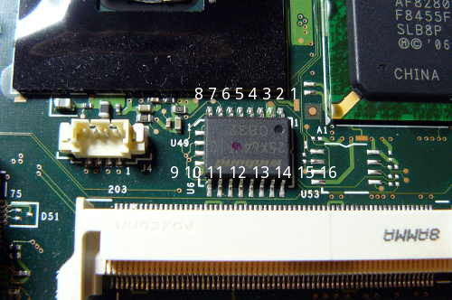

---
title: Foire aux questions
x-toc-enable: true
...


Questions importantes
================

Est-ce que le projet Libreboot est encore actif ?
-------------------------------------------

Oui ! Le [répertoire git](https://notabug.org/libreboot/libreboot) montre tout le travail que nous sommes en train de faire en ce moment.
Libreboot est plutôt actif.


Alors, quand est-ce que la prochaine version de Libreboot va sortir ?
-------------------------------------------------------

Réponse courte: ça sort quand ça sort. Si vous voulez aider et soumettre des patchs, référez-vous à [la page Git](git.md).

Nous n'annonçons pas de temps estimé de sortie.

Réponse longue:

Nous avons réécris l'entiereté du système de build de Libreboot de rien, depuis la dernière version. Ça a pris plus longtemps que nous avons prévu, mais le système de build arrive à maturité. Nous sommes en train de le polir.

Une fois que le système de build est stable, notre prochaine priorité est de s'assurer que toutes les cibles de build supportées maintenant se buildent proprement dans Libreboot.

Après celà, la priorité est de s'assurer que toutes les cartes mères dans Libreboot utilise la révision la plus à jour de Coreboot, avec tous les correctifs et améliorations. 
Tester ces cartes mères sera juste une affaire d'un examen collégial, étendu à la communauté entière via les versions alpha/bêta/RC.

Généralement, toutes les problèmes bloquant la production d'une version doit être adressé avant qu'une nouvelle sorte.
Voyez : 
<https://notabug.org/libreboot/libreboot/issues>

Les plus importantes tâches sont maintenant les suivantes:

- Étudier le système de build de Libreboot (écrit en Bash), et y apporter des corrections.
- Travailler sur de nouvelles améliorations et aider avec les builds une fois que toutes les ROMs sont construites pour toutes les cartes mères, quand le système de build est stable.
- En particulier, il y a quelques nouvelles cartes mères dans coreboot que nous pouvons ajouter à Libreboot, comme documenté dans le traqueur de bogues de Libreboot.
Celles-ci devront être ajoutées, et complétement testées. Les instructions pour mettre en place les outils de flashing matériels peuvent être trouvés dans [les guides d'installation de Libreboot](docs/install/)
- Bogues ! Signalez les bogues ! <https://notabug.org/libreboot/libreboot/issues> 
- Quelques nouvelles adaptions de cartes mères serait bienvenue ;).
- Si vous avez les compétences, cela serait très apprécié. Adaptez les à coreboot d'abord, où faites en sorte que les cibles existantes de coreboot marchent sans blobs binaires.

Plus généralement:

- Parlez à vos amis à propos de Libreboot ! Libreboot veut libérer autant de personnes que possible.
- Si vous avez des moyens d'ameliorer la documentation, vous pouvez faire ça aussi.
Référez-vous à la [page Git](git.md) pour des instructions sur la soumission des patchs dans la documentation.
- Encouragez les entreprises, où n'importe quelles personnes avec les compétences/ressources, de s'impliquer dans le développement de Libreboot.


Quelle version de Libreboot ai-je ?
----------------------------------------------------------------

Regardez la version [dans la documentation](../docs/#version)

Flashrom se plaint de l'accés à DEVMEM
--------------------------------------

Si exécuter `flashrom -p internal` pour le flashage basé logiciel vous
sort une erreur se relatant à l'accés à /dev/mem, vous devriez redémarrer
avec le paramètre de kernel `iomem=relaxed` avant d'exécuter flashrom ou
d'utiliser un kernel dont les options `CONFIG_STRICT_DEVMEM` et
`CONFIG_IO_STRICT_DEVMEM` ne sont pas activées.


Un exemple de la sortie de flashrom avec les options du kernel
`CONFIG_STRICT_DEVMEM` et  `CONFIG_IO_STRICT_DEVMEM` activé:
```
flashrom v0.9.9-r1955 on Linux 4.11.9-1-ARCH (x86_64)
flashrom is free software, get the source code at https://flashrom.org

Calibrating delay loop... OK.
Error accessing high tables, 0x100000 bytes at 0x000000007fb5d000
/dev/mem mmap failed: Operation not permitted
Failed getting access to coreboot high tables.
Error accessing DMI Table, 0x1000 bytes at 0x000000007fb27000
/dev/mem mmap failed: Operation not permitted
```
Le rétroéclairage est plus sombre sur le côté gauche de l'écran quand je baisse la luminosité sur mon X200/T400/T500/R400
---------------------------------------------------------------------------------------------------------------

Nous ne savons pas comment détecter les valeurs PWM correctes à utiliser dans
coreboot-libre, donc nous utilisons celles par défaut dans coreboot qui a ces
problèmes avec quelques écrans CCFL, mais pas les écrans LED.

Vous pouvez contourner celà dans votre distribution, en suivant les notes dans
[docus: control du rétroéclairage](../docs/misc/#finetune-backlight-control-on-intel-gpus).

Mon ethernet ne marche pas sur le X200/T400/X60/T60 lorsque je branche le cable
-------------------------------------------------------------------

Ça a été observé sur quelque systèmes utilisant network-manager.
Ça arrive à la fois sur le BIOS original et sur libreboot. C'est une
particularité dans le matériel. Sur les systèmes debian, une solution de
contournement est de redémarrer le service réseau quand vous connectez le
câble ethernet:

    $ sudo service network-manager restart

Sur Parabola, vous pouvez essayer:

    $ sudo systemctl restart network-manager

(le nom du service peut être différent pour vous, dépendant de votre
configuration)

Mon KCMA-D8 ou KGPE-D16 ne démarre pas avec le module PIKE2008 installé
-----------------------------------------------------------------------

Libreboot version 20160818, 20160902 et 20160907 ont toutes un bug: dans
SeaBIOS, les options ROMs PCI sont chargés et disponible, par défaut. Ce n'est
techniquement pas un problème, car une ROM optionnelle peut être libre ou non.
En pratique cependant, elles sont généralement non libres.

Charger la ROM optionnelle depuis le module PIKE2008 sur soit l'ASUS KCMA-D8
ou KGPE-D16 cause un gel du système lors du démarrage. C'est possible
d'utiliser le module dans la charge utile (si vous utilisez une charge utile
pour le kernel linux, ou petitboot), ou pour démarrer (avec SeaGRUB et/ou
SeaBIOS) à partir d'un port SATA normal puis ensuite utiliser GNU+Linux.
Le kernel Linux est capable d'utiliser le module PIKE2008 sans chargé la ROM
optionnelle.

Libreboot-instable (ou git) désactive dès maintenant le chargements des ROM
option PCI, mais les versions précédentes avec SeaGRUB (20160818-20160907) ne
le font pas. Vous pouvez contourner celà en exécutant la commande suivante:

    $ ./cbfstool yourrom.rom add-int -i 0 -n etc/pci-optionrom-exec

Vous pouvez trouver l'utilitaire *cbfstool* dans l'archive \_util avec la
version de libreboot que vous utilisez.

Quelles sont les erreurs ata/ahci que je vois dans le GRUB de libreboot ?
-----------------------------------------------------------------------

Vous pouvez ignorer sûrement ces erreurs, elles existent par ce qu'on ne peut
pas faire taire la commande cryptomount de la boucle `for` dans le 
[grub.cfg](https://notabug.org/libreboot/libreboot/src/r20160907/resources/grub/config/menuentries/common.cfg#L66).
de libreboot. Ça pourrait être corrigé en amont grâce à la contribution d'une
rustine lui ajoutant un drapeau 'mode silencieux'.

Comment sauvegarder les journaux de la panique du kernel sur les ordinateurs portables ThinkPad ?
--------------------------------------------------

La façon la plus facile de faire est d'utiliser la netconsole du kernel et de
reproduire la panique. La netconsole nécessite deux machines, celle qui est
paniquée (source) et celle qui recevra les journaux d'échecs (target). La
source doit être connecté via un câble ethernet et la cible doit être
atteignable sur le réseau lors de la panique. Pour configurer ce système,
exécutez les commandes suivantes en tant que root sur la source (`source#`) et
un utilisateur normal sur la cible (`target$`):

1.  Démarrez un server d'écoute sur la machine cible (netcat marche bien):

    `target$ nc -u -l -p 6666`

2.  Monter configfs (une fois seulement par démarrage, vous pouvez vérifier
    qu'il est déjà monté avec  `mount | grep /sys/kernel/config`. Il n'y aura
    pas de texte en sortie si il ne l'est pas).

    `source# modprobe configfs`

    `source# mkdir -p /sys/kernel/config`

    `source# mount none -t configfs /sys/kernel/config`

3.  cherchez le nom de l'interface ethernet de la source, ça devrait être de
    la forme `enp*`ou `eth*`, voyez la sortie de `ip address` ou `ifconfig`.

    `source# iface="enp0s29f8u1"` adaptez cela 

    remplissez l'IPV4 de la machine cible ici:

    `source# tgtip="192.168.1.2"` adaptez cela

4.  Créez la cible de journalisation netconsole sur la machine source:

    `source# modprobe netconsole`

    `source# cd /sys/kernel/config/netconsole`

    `source# mkdir target1; cd target1`

    `source# srcip=$(ip -4 addr show dev "$iface" | grep -Eo '[0-9]+\.[0-9]+\.[0-9]+\.[0-9]+')`

    `source# echo "$srcip" > local_ip`

    `source# echo "$tgtip" > remote_ip`

    `source# echo "$iface" > dev_name`

    `source# arping -I "$iface" "$tgtip" -f | grep -o '..:..:..:..:..:..' > remote_mac`

    `source# echo 1 > enabled`

5.  Changez le niveau de la journalisation sur déboguage:

    `source# dmesg -n debug`

6.  Testez si la journalisation marche p.ex en insérant ou enlevant un
    appareil USB sur la source. Il devrait y avoir quelques lignes
    apparaissant dans le terminal où vous avez démarré netcat (nc), sur l'hôte
    cible.

7.  Tentez de reproduire la panique du kernel.

Erreurs de la vérification de la machine sur quelque ordinateurs portables Montevina (CPU Penryn)
---------------------------------------------------------------

Quelques ordinateurs portables GM45 ont gelé (niveau logiciel) ou expérimenté
une panique du kernel (la LED du Verr. Maj clignotante et une machine
ne répondant totalement pas, défois suivi d'un redémarrage automatique dans
les 30secondes).
Nous ne savons pas ce qu'est (sont) le(s) problème(s), mais dans quelques cas
une mise à jour du microcode processeur empêche ceci de se reproduire.
Voyez les rapports de bogues suivant pour plus d'informations:
- [T400 Machine check: Processor context corrupt](https://notabug.org/libreboot/libreboot/issues/493)
- [X200 Machine check: Processor context corrupt](https://notabug.org/libreboot/libreboot/issues/289)

- [Sans rapport, incompatibilité de la RAM et problèmes de suspension dans la RAM sur le
  X200](https://libreboot.org/docs/hardware/x200.html#ram_s3_microcode)


Compatibilité matérielle
======================

Quels systèmes sont compatibles avec libreboot?
-----------------------------------------------------------------------------------

Jetez un coup d'oeil à la [liste de compatibilité matérielle](docs/hardware/).

Est-ce que les ordinateurs portables Purism seront supportés?
----------------------------------------------------------------------

Réponse courte: non.

Il y a des problèmes sévères de sécurité, confidentialité et de liberté avec
ces ordinateurs portables, dû aux jeux de puces Intel qu'ils utilisent. Voyez:

- [Intel Management Engine](#intelme)
- [Plus de problèmes de liberté sur le matériel Intel moderne](#intel)

Plus en détail, ces ordinateurs portables utilise aussi le blob binaire Intel
FSP pour l'entière initialisation matérielle. Coreboot supporte une révision
particulière d'un de leurs ordinateurs portables, mais la majorité sont soit
non supportés ou dépendent de blobs binaires pour la majorité de
l'initialisation matérielle.

En particulier, l'Intel Management Engine est une menace sévère à la
confidentialité et la sécurité, sans mentionner la liberté, puisque c'est une
porte dérobée à distance dans un ordinateur où elle est présente.

Intel l'a même admis,
[publiquement](https://www.intel.com/content/www/us/en/support/articles/000025619/software.html).

Pourquoi le matériel récent d'Intel n'est pas supporté dans Libreboot? {#intel}
-----------------------------------------------------------

Ce n'est pas certain que n'importe quel matériel Intel produit après 2008 sera
supporté dans Libreboot, dû à de sévères problèmes de sécurité et de libertés;
si sévère, que *le projet libreboot recommande d'éviter tout matériel Intel
moderne. Si vous avez un système basé sur Intel affligé des problèmes
ci-dessous, alors vous devriez vous en débarrasser le plus vite possible*. Les
problèmes principaux sont les suivants:

### Intel Management Engine (ME) {#intelme}

Introduit en Juin 2006 dans la "Intel's 965 Express Chipset Family of
(Graphics and) Memory Controller Hubs", ou (G)MCHs, et la famille des
controlleurs entrée/sortie ICH8, l'Intel Management Engine (ME, ou en français
*Moteur d'administration*) est un environnement informatique séparé
physiquement situé dans la puce (G)MCH.
Dans le dernier trimestre de 2009, la première génération des processeurs
Intel Core i3/i5/i7 (Nehalem) et la série 5 de la famille des jeux de puces
des "Platform Controller Hubs", ou PCHs, ont amenés une ME plus étroitement
intégrée (maintenant à la version 6.0) à l'intérieur de la puce PCH, qui
elle-même remplace l'ICH. Donc, la ME est **présente dans tout les ordinateur,
ordinateurs portables et systèmes serveurs depuis mi-2006**.

La ME consiste en un coeur de processeur ARC (remplacés par d'autres coeurs de
processeur dans les générations d'après), caches de codes et de données, une
horloge, et un bus sécurisé internel auquel des appareils supplémentaires sont
attachés, incluant un moteur cryptographique, ROM et RAM interne, contrôleurs
de mémoire, et un **moteur d'accés mémoire direct (Direct Memory Access, ou
DMA)** pour accéder à la mémoire du système d'exploitation hôte ainsi que
réserver une région de la mémoire externe protégée pour s'additionner à la RAM
interne limitée de la ME.
La ME a aussi un **accés au réseau** avec sa propre adresse MAC à travers un
Contrôleur Ethernet Gigabit Intel. Son programme de démarrage, stocké dans la
ROM interne, charge un "manifeste" micrologiciel depuis la puce flash SPI du
PC. Ce manifest est signé **avec une robuste clé cryptographique**, qui
différe selon les versions du micrologiciel de la ME.
Si le manifeste n'est pas signé par une clé Intel spécifique, la ROM de
démarrage ne se chargera pas et n'exécutera pas le micrologicel, amenant à
l'arrêt du coeur processeur de la ME.

Le micrologiciel de la ME est compressé et consiste en des modules qui sont
listés dans le manifest à côté d'une empreinte numérique (hash) sécurisée de
leur contenu. Un des modules est le kernel du système d'exploitation, qui est
basé sur un ***kernel propriétaire de système d'exploitation en temps réel
(RTOS, real-time operating system)*** appelé "ThreadX". Le développeur, Express Logic, vend des
licenses et code source pour ThreadX. Les clients tel qu'Intel sont exclus de
dévoiler ou sous-licencer le code source de ThreadX.
Un autre module est le Chargeur Dynamique D'applications (DAL, Dynamic
Application Loader), qui consiste en une **machine virtuelle Java** et un
ensemble de classes Java préinstallées pour le chiffrement, stockage
sécurisé, etc. Le module DAL peut charger et exécuter des modules ME
supplémentaires depuis le HDD/SSD du PC. Le micrologiciel de la ME inclut
aussi des modules d'applications natives à l'intérieur de la mémoire flash,
comprenant "Intel Active Management Technology" (AMT), une implémentation d'un
"Trusted Platform Module" (TPM), Intel Boot Guard, et des systèmes de DRM
audios et vidéos.

L'AMT (ou Technologie d'administration active), qui fait partie de la marque
d'Intel "vPro", est un serveur web et code d'application qui permet à des
utilisateurs distant de démarrer, éteindre, voir des informations à propos de,
et autrement d'administrer le PC. Ça peut être ***utilisé à distance même
quand le PC est éteint*** (via Wake-on-Lan, WoL). Le traffic est chiffré en
utilisant des bibliothèques SSL/TLS, mais rappelez-vous que toutes les
implémentations majeures et répandues de SSL/TLS ont eu des vulnérabilités
largement publiées. L'application AMT elle-même a des ***[vulnérabilités
connues](https://en.wikipedia.org/wiki/Intel_Active_Management_Technology#Known_vulnerabilities_and_exploits)***
qui ont été exploitées pour développer des maliciels furtifs (rootkits) et
enregistreurs de frappes et avoir discrétement accés aux fonctionnalitées
d'administration d'un PC.
Rappelez vous que la ME a un accés complet à la RAM d'un PC. Ça veut dire
qu'un attaquant exploitant ces vulnérabilités pourrait avoir accés à tout sur
le PC en état de marche; tous les fichiers ouverts, toutes les applications
s'exécutant, toutes les touches pressées, et plus.

L'[Intel Boot Guard](https://mjg59.dreamwidth.org/33981.md)
est une application de la ME introduite dans le troisième trimestre de 2013
avec la version 9.0 du micrologiciel de la ME sur les processeurs Intel Core
i3/i5/i7 de 4ième génération (Haswell).
Ça permet à un manufactureur de PC de générer une paire de clés asymmétrique,
installer la clé publique dans le processeur, et d'empêcher le processeur
d'exécuter du micrologiciel de démarrage qui n'est pas signé avec leur clé
privée. Ça veut dire que ***coreboot et libreboot sont impossibles à adapter***
à de tels PCs, sans la clé privée de signature du manufactureur. Notez que les
systèmes construit à partir de parties séparées de carte mères et de
processeurs ne sont pas affectés, puisque le vendeur de la carte mère (sur
laquelle le micrologiciel de démarrage est stocké) ne peut pas affecter la clé
publique stockée sur le processeur.

Les versions 4.0 et au-delà de la ME (Intel 4 Series et jeux de puces d'après)
incluent une application de la ME pour ***la [DRM](https://defectivebydesign.org/what_is_drm_digital_restrictions_management) de l'audio et de la
vidéo***, appelé "Protected Audio Video Path" (PAVP). La ME reçoit du système
d'exploitation hôte un flux média chiffré et une clé chiffré, déchiffre la
clé, et envoie la clé déchiffré à la carte graphique, qui ensuite déchiffre
le média. PAVP est aussi utilisé par une autre application ME pour dessiner un
pavé d'authentification PIN directement sur l'écran. Dans ce cas,
l'application PAVP contrôle directement les graphiques apparaissant sur
l'écran du PC d'une manière que le système d'exploitation du PC hôte ne
peut pas détecter. La version 7.0 de la ME sur les PCHs avec processeurs 
Intel Core seconde Génération (Sandy Bridge) i3/i5/i7 remplace PAVP avec une
application de DRM similaire appelée "Intel Insider". Comme l'application AMT,
ces applications DRM, qui en elles-mêmes sont défectueuses par conception,
démontre les capacités d'omnipotences de la ME; ce matériel et son
micrologiciel propriétaire peut accéder et contrôler tout ce qui est dans la
RAM et même ***tout ce qui est montré sur l'écran***.

L' "Intel Management Engine" avec son micrologiciel propriétaire a un accés et
un contrôle complet sur le PC: il peut allumer ou éteindre le PC, lire toutes
les fichiers ouverts, examiner toutes les applications en cours d'exéution,
traquer toutes les touches pressées et mouvements de souris, et même faire des
captures ou montrer des images sur l'écran.
Et elle a une interface réseau qui est démontrée non sécurisée, qui peut
permettre un attaquant sur le réseau d'injecter des maliciels furtifs qui
peuvent complétement compromettre le PC et reporter toutes les activités ayant
lieu sur le PC à l'attaquant. C'est une menace à la liberté, sécurité et la
confidentialité qui ne peut pas être ignorée.

Avant la version 6.0 (c'est à dire, sur les systèmes de 2008/2009 et plus
tôt), la ME peut être désactivée en configurant quelques valeurs dans la
mémoire flash SPI. Le micrologiciel de la ME peut être ensuite entiérement
enlevé de l'espace mémoire de la puce. libreboot [le
fait](../docs/hardware/gm45_remove_me.md) sur les systèmes avec Intel 4 Series
qu'il supporte, tel que le [Libreboot X200](../docs/install/x200_external.md)
et [Libreboot T400](../docs/install/t400_external.md). Le micrologiciel de la
ME version 6.0 et après, qui est trouvé sur tout système avec un processeur
Intel Core i3/i5/i7 et un PCH, inclut le micrologiciel "ME Ignition" qui
enclenche quelques initialisations matérielle et la gestion de l'alimentation.
Si la ROM de démarrage de la ME ne trouve pas dans la mémoire flash SPI un
manifeste de micrologiciel de la ME avec une signature d'Intel valide, le pc
tout entier s'éteindra après 30 minutes.

Dû à la vérification de la signature, développer un micrologiciel de
remplacement libre de la ME est basiquement impossible. La seule entité
capabll e de remplacer le micrologiciel ME est Intel. Comme déclaré
auparavant, le micrologiciel de la ME inclut du code licensé par des parties
tierces, donc Intel ne pourrait même pas publier le code source si ils
voulaient. Et même s'ils développaient un micrologiciel de la ME complètement
nouveau, la ROM de démarrage de la ME rejecterait quelconque micrologiciel
modifié n'étant pas signé par Intel.
Donc, le micrologiciel de la ME est désespérement propriétaire et
[tivoisé](https://fr.wiktionary.org/wiki/tivo%C3%AFsation#Nom_commun).

**En résumé, l'IME et ses applications sont une porte dérobée avec un accés
et un contrôle total sur le reste du PC. La ME est une menace à la liberté,
sécurité, la confidentialité et le projet libreboot recommande fortement de
l'éviter complètement. Puisque les versions récentes ne peuvent pas être
enlevées, ça veut dire éviter toutes générations récentes du matériel Intel.**

Plus d'informations à propos de la ME peuvent être trouvées sur de nombreux
sites webs, incluant :
    * [me.bios.io](http://me.bios.io/Main_Page)
    * [unhuffme](http://io.netgarage.org/me/)
    * [wiki de coreboot](http://www.coreboot.org/Intel_Management_Engine)
    * [Wikipedia](https://en.wikipedia.org/wiki/Intel_Active_Management_Technology)


Le livre ***[Platform Embedded Security Technology Revealed](https://www.apress.com/9781430265719)***
décrit en grand détail l'architecture matérielle de la ME et des modules
applications du micrologiciel.

Si vous êtes bloqué avec la ME (système non-libreboot), vous pourrez peut-être
trouver cela intéressant:
<http://hardenedlinux.org/firmware/2016/11/17/neutralize_ME_firmware_on_sandybridge_and_ivybridge.html>

Voyez aussi (efforts pour désactiver la ME):
<https://www.coreboot.org/pipermail/coreboot/2016-November/082331.html>

### Paquetage de support micrologiciel (Firmware Support Package, FSP) {#fsp}

Sur tout les systèmes Intel récents, le support de coreboot tourne autour de
l'intégration d'un blob (pour chaque système) appelé le *FSP* (firmware
support package), qui s'occupe de toute l'initialisation matérielle, incluant
la mémoire et l'initialisation du processeur. Déconstruire et remplacer ce
blob est presque impossible à la vue de sa complexité. Même pour le
développeur le plus talentueux, ça prendrait des années à remplacer.
Intel distribue ce blob aux développeurs de micrologiciels, sans le code
source.

Puisque le FSP est responsable de l'initialisation matérielle précoce, ça veut
que ça gère aussi SMM (System Management Mode <=> Mode d'Administration
Système). C'est un mode spécial qui opère à un niveau en dessous le système
d'exploitation. **Il est possible que des rootkits soit implémentés ici, qui
pourrait lancer des attaques sur l'utilisateur (et la liste est sans fin).
Tout système Intel qui a le blob FSP propriétaire ne peut pas être digne de
confiance**.
D'ailleurs, quelques rootkits SMM se sont manifestés dans la jungle d'Internet
(utilisez un moteur de recherche pour les trouver).

### Mises à jour du microcode du processeur {#microcode}

Tout les processeurs modernes (d'Intel et AMD) d'architecte x86 utilise ce
qu'on appele le *microcode*. Les processeurs sont extremement complexe et
difficule a bien concevoir, donc la circuiterie est conçue d'une manière très
générique, où seulement les instructions basiques sont gérés dans le
matériel. La majorité du jeu d'instructions est implémenté via le microcode,
qui est du logiciel bas-niveau s'exéutant dans le processeur pouvant spécifier
comment la circuiterie doit être utilisée, pour chaque instruction. Le
microcode embarqué fait partie du matériel, et en mode lecture seulement. Le
microcode et la circuiterie peuvent avoir des bogues, ce qui peut causer des
problèmes de stabilité.

Les *mises à jour* du microcode sont des blobs propriétaires, téléversé dans
le processeur pendant le démarrage, qui rustinent le microcode embarqué et
désactive les parties boguées du processeur pour améliorer la stabilité.
Avant, ces mises à jour étaient gérées par le kernel du système
d'exploitation, mais dans tout les systèmes récents c'est le micrologiciel de
démarrage qui doit s'occuper de ça. Coreboot distribue des mises à jour du
microcode pour les processeurs Intel et AMD, mais libreboot ne peut pas, parce
que le but de libreboot est d'être 100% [logiciel
libre](https://www.gnu.org/philosophy/free-sw.fr.html).

Sur certains processeurs Intel plus vieux, il est possible d'exclure les mises
à jour du microcode et de n'avoir aucun problèmes de stabilité en pratique.
Tout les systèmes libreboot actuels marche sans les mises à jour du microcode
(sinon, ils ne seraient pas supportés dans libreboot). Cependant, tout
processeur Intel moderne nécessite une mise à jour du microcode, sinon le
système ne démarrera pas du tout, et sera extrêmement instable (corruption de
la mémoire, par exemple).

Les mises à jour du microcode des processeurs Intel sont *signés*, ce qui veut
dire vous ne pourriez même pas exécuter une version modifiée, même si vous
avez le code source. Si vous essayez de téléverser vos propres mise à jour
modifiée, le processeur les rejétera.

Les mises à jour du microcode altèrent la façon dont les instructions se
comportent sur le processeurs. Ça veut dire qu'elles peuvent affecter la façon
dont le processeur fonctionne de manière fondamentale. C'est ce en fait un
logiciel. Les mises à jour sont propriétaires, et sont des logiciels, donc
nous les excluons de libreboot. Le microcode compilé dans le processeur n'est
pas tellement un problème, puisque on ne peut pas le changer de toute façon
(il est en lecture seule).

### Intel n'est pas coopératif

Depuis des années, coreboot a du mal contre Intel. Intel s'est montré
extremement non coopératif en général. Beaucoup de développeurs de Coreboot,
et d'entreprises, ont tenté d'amener Intel à coopérer; en particulier, de
publier le code source de composants micrologiciel. Même Google, qui vend des
millions de *chrombebook* (avec coreboot préinstallé) ont été incapables de
les persuader.

Même quand Intel coopére, ils ne fournissent toujours pas de codes sources.
Ils peuvent fournir des informations limitées (fiches techniques) sous un
accord de non-divulgation d'entreprise strict (appelé aussi NDA, "non
disclosure agreement"), mais même cela n'est pas garanti.
Même les [ODMs](https://fr.wikipedia.org/wiki/Original_Design_Manufacturer)
et IBVs ne peuvent pas recevoir le code source de la part d'Intel, dans la
majorité des cas (ils intégreront juste les blobs qu'Intel fournissent).

Par ailleurs, les jeux de puces graphiques d'Intel récents [nécessite des
blobs
micrologiciels](https://01.org/linuxgraphics/intel-linux-graphics-firmwares?langredirect=1)

Intel va [uniquement devenir pire](https://www.phoronix.com/scan.php?page=news_item&px=Intel-Gfx-GuC-SLPC)
en ce qui concerne la liberté de l'utilisateur. Libreboot ne supporte pas les
plateformes Intel récentes, précisément à cause des problèmes décris
au-dessus. La seule façon de régler cela est de faire qu'Intel change ses
politiques et soit plus amical à la communauté du [logiciel
 libre](https://www.gnu.org/philosophy/free-sw.fr.html).
L'ingénérie inversée ne réglera rien sur le long terme malheuresement, mais
nous devons continuer de le faire de toute façon. En avançant, le matériel
Intel n'est pas une option à moins qu'un changement radical se passe à
l'intérieur d'Intel.

**Basiquement, tout matériel de l'année 2010 et au-delà ne sera jamais
supporté par libreboot. Le project libreboot ignore activement tout matériel
Intel moderne à ce point, et se concentre sur des plateformes alternatives.**

Pourquoi le matériel d'AMD récent n'est pas supporté dans Libreboot? {#amd}
----------------------------------------------------------------------------

Il est extrêmement improbable que n'importe quel matériel d'après 2013 sera
supporté dans libreboot, à cause de problèmes de sécurité et de liberté
sévères; si sévère, que *le projet libreboot recommande d'éviter tout matériel
AMD moderne. Si vous avez un machine sous AMD affecté par les problèmes
décris ci-dessous, alors vous devriez vous en débarasser dès que possible*.
Les problèmes principaux sont comme il suit:

[Nous demandons à AMD de publier le code source et les spécifications pour les
nouvelles plateformes AMD Ryzen! Nous appelons la communauté à faire pression
sur AMD. Cliquez ici pour en savoir plus](amd-libre.md)

### Processeur de Sécurité de la Plateforme AMD (PSP)

C'est basiquement la version de l'[Intel Management Engine](#intelme) propre à
AMD. Elle a tous les mêmes problèmes basiques de sécurité et de liberté, bien
que l'implémentation est radicalement différente.

Le Processeur de Sécurité de la Plateforme (PSP ou "Platform Security
Processor") est embarqué dans tout les systèmes Family 16h+ (basiquement tout
ce que AMD a produit après 2013), et contrôle le démarrage de l'architecture
x86.
Le micrologiciel PSP est signé cryptographiquement avec une clé robuste
similaire à l'IME. Si le micrologiciel de la PSP n'est pas présent, ou si la clé de
signature d'AMD n'est pas présente, les coeurs d'architecture x86 ne seront
pas libérés de la réinitialisation, rendant le système inopérant.

La PSP est un coeur ARM avec la technologie TrustZone, embarqué dans le *die*
(circuit intégré) du processeur. Alors donc, il a la possibilité de cacher le
code de son propre programme, gratter dans la RAM, et n'importe quelle données
il aurait pu prendre et stocker depuis la RAM moins privilégié du système x86
(clés de chiffrement du kernel, données d'authentification, historique de
recherche, touches tapées, qui sait!).
Histoire d'empirer les tracas, le PSP a théoriquement accés à l'entièreté de
la mémoire système (AMD soit reniera ou ne pourra renier cela, et ça semble
être nécessaire pour permettre aux "fonctionnalités" de la DRM de marcher
comme prévues), ce qui veut dire qu'au minimum il a un accés basée MMIO aux
contrôleurs réseaux et n'importe quels autres périphériques PCI/PCIe installés
sur le système.

En théorie n'importe quel entité malveillante avec un accés à la clé de
signature d'AMD serait capable d'installer des maliciels persistants qui ne
pourrait pas être éradiqués sans un flasheur externe et une image saine PSP.
Plus encore, de multiples failles de sécurité ont été démontrée dans le
micrologiciel d'AMD par le passé, et il y a toute les raisons d'assumer qu'une
ou plusieurs failles 'jour zéro' traînent dans le micrologiciel du PSP. É
tant donnée le privilège extrême (ring -2 ou -3) du PSP, lesdites
vulnérabilitées auraient la capacité d'observer et de contrôler n'importe
qu'elle machine avec PSP activé, sans que l'utilisateur s'en aperçoive.

Comme avec l'Intel Boot Guard (Gardien de Démarrage Intel, une application de
l'Intel Management Engine), le PSP d'AMD peut aussi agir comme un tyrant en
vérifiant la signature sur n'importe quel micrologiciel de démarrage que vous
flashez, rendant le remplacement du micrologiciel de démarrage (p.ex par
libreboot, coreboot) impossible sur certaines cartes mères.
Des rapports anecdotiques précoces indiquent que la contrepartie du gardien de
démarrage d'AMD sera utilisé dans la majorité des matériels manufactureur,
désactivé seulement sur les processeurs pour 'enthousiaste'.

### Micrologiciel IMC d'AMD

Lisez <https://www.coreboot.org/AMD_IMC>.

### Micrologiciel SMU d'AMD

Prend en charge la gestion de l'alimentation des périphériques PCIe (sans ça,
votre ordinateur portable ne marchera pas correctement) et quelques autres
fonctionnalités concernant la gestion de l'alimentation.

Le micrologiciel est signé, bien que sur du matériel AMD plus vieux c'est une
clé symmétrique, ce qui veut dire qu'avec l'accés à celle-ci (si elle a
fuité) vous pourriez signer votre propre version modifiée du micrologiciel et
l'exécuter.

Handles some power management for PCIe devices (without this, your
laptop will not work properly) and several other power management
related features. Rudolf Marel (un hacker de chez Coreboot) a trouvé comment
extraire cette clé [dans cette vidéo de
démonstration](https://media.ccc.de/v/31c3_-_6103_-_en_-_saal_2_-_201412272145_-_amd_x86_smu_firmware_analysis_-_rudolf_marek),
et basé sur son travail, Damien Zammit (un autre hacker de chez Coreboot) [l'a
partiellement remplacé](https://github.com/zamaudio/smutool/) avec du
micrologiciel libre, mais sur le système concerné (ASUS F2A85-M) il y avait
encore d'autres blobs présents (Video BIOS, et autres) empêchant le matériel
d'être supporté dans libreboot.

### Micrologiciel AGESA d'AMD

Il est responsable pour virtuellement toute l'initialisation du coeur matériel
sur les systèmes AMD modernes. En 2011, AMD a commencé à coopérer avec le
projet coreboot, publiant son code source sous une licence libre. En 2014, ils
sont arrêté de publier du code source et au lieu de ça ont commencé à publier AGESA en tant
que blobs binaires. Désormais, cela rend l'AGESA équivalent au [FSP
d'Intel](#fsp).

### Mises à jour du microcode des processeurs AMD

Lisez la section Intel.
Pratiquement la même chose, bien que il a été découvert qu'avec du matériel
plus récent d'AMD ont pouvait marcher sans mises à jour du microcode. Il est
inconnu si oui ou non les mises à jours sont nécessaires sur toutes les cartes
mères AMD (dépend du CPU).

### AMD est incompétent (et pas coopératif)

AMD semblait sur le bon chemin en 2011 lorsqu'ils ont commencé à coopérer,
publiant le code source de quelques composants très importants au projet
coreboot. Ce n'était pas
fait pour durer. Pour des soi-disantes raisons économiques, ils ont décidé que
ça ne vallait plus la peine d'investir dans le projet coreboot.

Quelque chose ne va sérieusement pas avec AMD pour qu'en 3 ans, une entreprise
évolue de si bonne à si mauvaise. Comme Intel, ils ne méritent pas votre
argent.

Étant donné l'état actuel du matériel Intel avec la Management Engine, il est
de notre avis que tout matériel performant d'architecture x86 plus récent que
les processeurs AMD Family 15h ou quoi que ce soit après 2009 côté Intel est
défectueux dès la conception, et ne peut pas être utilisé pour stocker,
transmettre, où traiter des données sensibles. Les données sensibles est
n'importe quelle donnée qui, lors d'une fuite de données, pourrait provoquer
un dommage économique significatif à l'entité qui a créé ou était responsable
du stockage desdites données, cela incluerait alors les banques, entreprises
de cartes bleues, marchands (détails des comptes clients), en addition de
l'ingénérie habituelle et firmes de développement logiciel.
Ça touche aussi les lanceurs d'alertes, ou n'importe qui ayant besoin d'une
veritable confidentialité et sécurité.

Qu'est ce que je *peux* utiliser, alors? {#whatcaniuse}
-------------------------

Libreboot supporte le matériel AMD fam15h (génération ~2012) et d'autres
plateformes Intel plus vieilles comme Napa, Montevina, Eagle Lake, Lakeport
(2004-2006) et d'autres plateformes Intel plus vieilles comme Napa, Montevina,
Eagle Lake, Lakeport (2004-2006).

Nous supportons aussi quelques jeux de puces ARM (rk3288). Côté Intel, nous
sommes aussi interessé par certains jeux de puces qui utilisent des
processeurs Atom (modifié à partir de jeux de puces plus vieux, en utilisant
principalement des bus contrôleurs entrées/sorties basés ich7).

Libreboot marchera t-il sur un ThinkPad T400 ou T500 avec une carte graphique ATI ?
---------------------------------------------------------------------------------------------------

Réponse courte: oui. Ces ordinateurs portables ont aussi une carte graphique Intel
à l'intérieur, que libreboot utilise. La carte graphique ATI est ignorée par
libreboot.

Ces ordinateurs portables utilisent ce qu'on appelle des *graphiques
interchangeables*, où ils ont à la fois une carte graphique Intel et une ATI.
Coreboot vous permettra (en utilisant nvramtool) de définir un paramètre
indiquant si vous voulez utiliser une des deux, Intel ou ATI. Les cartes
graphiques ATI n'ont pas d'initialisation graphique libre dans coreboot,
contrairement aux cartes graphiques Intel.

Libreboot modifie coreboot d'une telle façon que la configuration nvramtool
est ignoré. Libreboot assumera juste que vous voulez utiliser la carte
graphique Intel. Donc, la carte graphique ATI est complétement désactivée sur
ces ordinateurs portables. Intel est utilisé à la place, avec l'initialisation
native libre des graphiques (remplacement du VBIOS) qui existe dans coreboot.

Est-ce que matériel bureau/serveur sera supporté?
------------------------------------------------------------------------

Libreboot supporte maitenant du matériel d'ordinateur de bureau:
[(voyez la liste)](../docs/hardware/#supported_desktops_x86/intel)
(avec l'initialisation complètement native de la vidéo).

Un problème commun avec le matériel de bureau est le BIOS Vidéo, quand pas de
vidéo embarquée n'est présente, puisque chaque carte vidéo a un BIOS Vidéo
différent.
Les cartes graphiques embarquées en nécessite un aussi, donc cela ont encore a
être remplacés par du logiciel libre (tâche non triviale). Libreboot doit
initiliaser le jeu de puces graphique, mais la majorité des cartes graphiques
n'ont pas de BIOS Vidéo libre pour cela. Quelques cartes mères d'ordinateurs
de bureau supportés dans coreboot ont des jeux de puces graphiques intégrés,
mais ceux-ci nécessite aussi un BIOS Vidéo propriétaire, dans la majorité des
cas.

Bonjour, j'ai &lt;insérer système/carte mère/&gt;, est ce que c'est supporté?
--------------------------------------------------------------------------------------------------------

Problablement pas. En premier, vous devez consulter la propre liste de
compatibilité matérielle de coreboot sur
<http://www.coreboot.org/Supported_Motherboards>, et si il est supporté,
vérifiez si oui ou non il peut marcher sans blobs propriétaires dans
l'imageROM. Si ça le peut: merveilleux! Libreboot peut le supporter, et vous
pouvez le rajouter à la liste. Sinon, alors vous aurez besoin de savoir
comment destructurer logiciellement et remplacer (ou enlever) ces blobs
existant encore, d'une telle façon que le système est encore utilisable.

Pour ces systèmes où pas de support de coreboot existe, vous devez d'abord les
adapter pour coreboot et, si ça peut alors marcher sans aucun blobs dans
l'image ROM, il peut être ajouté à libreboot. Voyez [le guide d'adaption des
cartes mères](http://www.coreboot.org/Motherboard_Porting_Guide) (c'est juste
le bout de l'iceberg!)

Notez silvouplaît que le développement des cartes mères devrait être fait en
amont (dans coreboot) et fusionné en aval (à l'intérieur de libreboot). C'est
la bonne façon de le faire, et c'est comment le projet libreboot est coordonné
pour éviter trop de branchage (fork) du code source de coreboot.

Et à propos de l'ARM?
-----------------------------------

Libreboot supporte pour quelques ordinateurs portables basés ARM, utilisant le
SoC *Rockchip RK3288*. Vérifiez la [liste de compatibilité
matérielle](../docs/hardware/#supported_list) de
libreboot, pour plus d'informations.

Questions générales
=================

Comment j'installe libreboot?
-------------------------------------------------------

Voyez [le guide d'installation](docs/install/)

Comment je programme une puce flash SPI?
---------------------------------------------------------------------------------

Les puces flash SPI peuvent être programmées avec le [BeagleBone
Black](../docs/install/bbb_setup.md) ou la [Raspberry
Pi](../docs/install/rpi_setup.md).

Il est possible d'utiliser une puce de test SOIC à 16-pin sur une puce SOIC à
8-pin, si vous alignez les pins proprement. La connection est généralement
plus robuste.

Comment définir un mot de passe de démarrage?
-------------------------------------------------------------------

Si vous utilisez la charge utile GRUB, vous pouvez ajouter un utilisateur et
un mot de passe (hashé et 'salé') dans votre configuration GRUB qui réside à
l'intérieur de la puce flash. Les guides suivants (qui couvrent aussi le
chiffrement du disque en entier, incluant le répertoire /boot/) montrent
comment définir un mot de passe de démarrage dans GRUB:
[(Installer Debian ou Devuan avec FDE)](../docs/gnulinux/encrypted_debian.md)
et
[(Installer Parabola ou Arch GNU+Linux-libre, avec FDE)](../docs/gnulinux/encrypted_parabola.md)

NdT: FDE est un acronyme pour "Full Disk Encryption", c'est à dire le
chiffrement du disque tout entier.

Comment est-ce que je protège en écriture la puce flash?
----------------------------------------------------------------------------

Par défaut, il n'y a pas de protection en écriture sur un système libreboot.
C'est pour des raisons d'ergonomie, parce que la majorité des gens n'ont pas
accés à un programmeur externe pour le reflashage de leur micrologiciel, ou
ils trouvent que c'est inconvénient d'utiliser un programmeur externe.

Sur certains systèmes, il est possible de protéger en écriture le
micrologiciel, de tel sorte qu'il est en lecture seule au niveau du système
d'exploitation (le flashage externe est encorfe possible, en utilisant du
matériel dédicacé). Par exemple, sur les ordinateurs portables GM45 d'en
ce moment (p.ex ThinkPad X200, T400), vous pouvez protéger en écriture (voyez
l'[utilitaire ICH9 gen](../docs/hardware/gm45_remove_me.html#ich9gen)).

Il est possible de protéger en écriture sur tout les systèmes libreboot, mais
les instructions/guides ont besoin d'être écris. La documentation est dans le
répertoire git principal, donc vous êtes bienvenus pour soumettre des patches
(rustines) ajoutant ces instructions.

Comment je change les paramètres du BIOS?
------------------------------------------------------------------------

Libreboot utilise en fait la [charge utile
GRUB](http://www.coreboot.org/GRUB2). Plus d'informations sur les charges
utiles peuvent être trouvées à
[coreboot.org/Payloads](http://www.coreboot.org/Payloads)

Libreboot inhérite du concept modulaire des charges utiles de coreboot, ce qui
veut dire que les programmes de *configuration du BIOS* pré-système
d'exploitation sur machines "nues" ne sont pas très pratiques.
Coreboot (et libreboot) incluent un utilitaire appelé *nvramtool*, qui peut
être utilisé pour changer quelques paramtères. Vous pouvez trouver nvramtool
sous *coreboot/util/nvramtool*, dans les archives du code source de libreboot.

L'option *-a* de nvramtool listera les options disponibles, et *-w* peut être
utilisé pour les changer. Consultez la documentation de nvramtool sur le wiki
coreboot pour plus d'informations.

En pratique, vous n'avez pas besoin de changer aucun de ces paramètres, dans
la majorité des cas.

Libreboot verouille la table CMOS, pour assurer une fonctionnalité consistante
pour tout les utilisateurs. Vous pouvez utiliser:

    $ nvramtool -C yourrom.rom -w somesetting=somevalue

Cela changera un paramètre par défaut à l'intérieur de cette image ROM
(yourrom.rom), et ensuite vous pouvez la reflasher.

This will change the default inside that ROM image, and then you can
re-flash it.

Ai-je besoin d'installer un chargeur d'amorçage quand j'installe une distribution?
---------------------------------------------------------------------------------------------------

Libreboot intègre déjà le chargeur d'amorçage GRUB, en tant que *[charge
utile](http://www.coreboot.org/Payloads)*. Ça veut dire que le chargeur
d'amorçage GRUB est en fait *flashé* comme une partie du micrologiciel de
démarrage (libreboot). Ça signifie que vous n'avez pas besoin d'installer un
chargeur d'amorçage sur le DD/SSD quand vous installez une nouvelle
distribution. Vous serez capable de démarrer juste comme il faut, en utilisant
le chargeur d'amorçage (GRUB) qui est à l'intérieur de la puce flash.

Ça veut aussi dire que même si vous enlevez le DD ou SSD, vous aurez encore un
chargeur d'amorçage fonctionnel installé qui pourrait être utilisé pour
démarrer un distribution *live* d'une clé USB flash.
Voyez [Comment installer GNU+Linux sur un système
libreboot](../docs/gnulinux/grub_boot_installer.md).

Ai-je besoin de re-flasher quand je ré-installe une distribution?
-------------------------------------------------------------------------------------------

Plus maintenant. Les versions récentes de Libreboot (utilisant la charge utile
GRUB) basculeront automatiquement sur une configuration GRUB stocké sur  le
DD ou SSD, si elle existe. Vous pouvez aussi chargeur une configuration GRUB
différente, pour n'importe quel type d'appareil qui est supporté dans GRUB
(tel qu'une clef USB flash). Pour plus d'informations, voyez [Modifier la
configuration GRUB dans les systèmes Libreboot](../docs/gnulinux/grub_cbfs.md)

À quoi ressemble une puce flash?
-----------------------------------------------------------------

Puce flash SPI SOIC-8:


Puce flash SPI SOIC-16:



Qui a fait le logo?
----------------------------------------------------------------

Voyez [l'information de licence](logo/license.md).

Le logo de libreboot est disponible en tant que [bitmap](logo/logo.png), un 
[vector](logo/logo.svg), ou un [vector avec niveaux de
gris](logo/logo_grey.svg).

Les stickers 'Libreboot Inside' sont disponibles en tant que
[PDF](logo/stickers/libreboot-inside-simple-bold-1.60cmx2.00cm-diecut-3.pdf)
ou un 
[vecteur](logo/stickers/libreboot-inside-simple-bold-1.60cmx2.00cm-diecut-3.svg)

Quels autres micrologiciels existent en dehors de libreboot?
==================================================

Le problème principal sur n'importe quel système est le micrologiciel de
démarrage (habituellement appelé BIOS ou UEFI). Libreboot remplace le
micrologiciel de démarrage avec du code totalement libre, mais même avec
libreboot, il pourrait y avait d'autres composants matériels dans le système
(p.ex ordinateur portable) qui exécutent leur propre micrologiciel dédicacé,
quelquefois propriétaire. Ceux-ci sont sur des processeurs secondaires, où le
micrologiciel est généralement en lecture seule, écrit pour des tâches très
spécifiques. Bien qu'ils sont sans relation avec libreboot techniquement
parlant, il fait sens de documenter quelques un des problèmes ici.

Notez que ces problèmes ne sont pas unique à des systèmes libreboot. Ils
s'appliquent universellement, à la majorité des systèmes. Les problèmes décrit
ci-dessousa sont les plus communs (ou autrement critique).

Faire face à ces problèmes sera certainement géré par un projet séparé.

### Cartes graphiques externes

Le BIOS Vidéo est présent sur la majorité des cartes vidéos. Pour les
graphiques intégrés, le VBIOS (type spécial d'OptionROM) sont habituellement
embarqué dans le micrologiciel principal de démarrage. Pour les graphiques
externes, le VBIOS est habituellement sur la carte graphique elle-même. Il (le
VBIOS) typiquement propriétaire; la seule différence est que SeaBIOS peut
l'exécuter, alternativement, vous l'embarquez dans une image ROM de coreboot
et coreboot va l'exécuter, si vous utiilisez une charge utile différente, tel
que GRUB).

Sur les systèmes libreboot d'en ce moment, au lieu de VBIOS, l'initialisation
native de la carte graphique par coreboot est utilisée, celle-ci étant
implémentée seulement pour les cartes graphiques Intel en ce moment.
Les autres cartes avec de bons pilotes KMS peuvent être initialisés une fois
que Linux démarre, mais une copie du VBIOS serait peut-être encore nécessaire
pour récupérer la bonne fréquence de la VRAM et autre paramètres similares
(sans exécuter le code du VBIOS).

Dans des configurations ou le SeaBIOS et l'initialisation native de la carte
graphique sont utilisés ensemble, une cale ('shim') spéciale du VBIOS qui utilise le
tampon d'image linéaire de coreboot.

### Micrologiciel de l'EC (Embedded Controller = contrôleur embarqué)

La majorité (tous?) des ordinateurs portables ont ceci. L'EC est un petit
processeur séparé qui, basiquement, traite les entrées/sorties qui sont
spécifiques aux ordinateurs portables. Par exemple:

-   Quand vous basculer l'interrupteur radio marche/arrêt, l'EC
    activera/désactivera les appareils sans fil (wifi, bluetooth, etc) et
    activera/désactivera une LED qui indique si c'est en marche ou non.
-   Écoute une autre puce qui produit des lectures de température, ajustant la
    vitesse des ventilateurs en accordance (ou met en marche/arrête les
    ventilateurs).
-   Gère certaines entrées du clavier, p.ex plus/moins de luminosité,
    plus/moins de volume.
-   Détecte quand l'écran est rabattu ou ouvert, et envoie un signal
    l'indiquant.
-   Etc.

Alexander Couzens de coreboot (lynxis sur l'IRC de coreboot) est en train de
travailler sur un remplacement libre du micrologiciel de l'EC pour les
ThinkPads étants supportés par Libreboot. Voyez
<https://github.com/lynxis/h8s-ec> (pas encore prêt).

La majorité (tous?) les chromebooks ont un micrologiciel d'EC libre. Libreboot
est en ce moment en train de considérer le support de quelques chromebooks
basés sur l'architecture ARM.

L'EC est présent sur presque tout ordinateur portable. Les autres appareils
utilisent, dépendant de leur complexité, soit l'EC ou une variante avec le
micrologiciel dans la 'Mask ROM' - SuperIO.

### Micrologiciel du DD/SSD

Les DDs et SSDs ont un micrologiciel eux, sensé gérer les fonctionnements
internes de l'appareil tout en exposant un interface standard et simple (tel
que AHCI/SATA) que le logiciel du système d'exploitationpeut utiliser,
génériquement. Ce micrologiciel est opaque pour l'utilisateur du disque.

Les DD et SSDs sont plutôt complexes, et de nos jours contiennent du matériel
plutôt complexe qui est même capable d'exécuter un système d'exploitation tout
entier (par celà, on veut dire que le disque en lui-même est capable de faire
marcher son propre système d'exploitation embarqué), même GNU+Linux ou
BusyBox/Linux.

Les DDs et SSDs sont un cas spécial, puisqu'ils sont des appareils de
stockage persistants ainsi que des ordinateurs.

Exemple d'attaque qu'un micrologiciel malveillant pourrait faire: soudoyer
vos clés SSH, autorisant un accés à distance par un adversaire inconnu. Ou
peut-être voler vos clés GPG. Les disques SATA ont aussi le DMA (à travers le
controleur), voulant dire qu'ils pourraient lire la mémoire du système; le
disque peut avoir son propre stockage caché, théoriquement, où il pourrait
lire votre clé LUKS et les stocker non chiffrée pour une future récupération
par un adversaire.

Avec un bon IOMMU et utilisation de l'USB au lieu de SATA, il pourrait être
possible de mitiger tout problèmes concernant le DMA (direct memory access)
qui pourrait se présenter.

Quelques preuves conceptuelles ont été démontrée. Pour les DDs
<https://spritesmods.com/?art=hddhack&page=1>.
Pour les SSDs:
<http://www.bunniestudios.com/blog/?p=3554>

L'existence d'un remplacement libre du micrologicel viable n'est pour
l'instant pas connue. Pour les SSDs, le projet
[OpenSSD](http://www.openssd-project.org/wiki/The_OpenSSD_Project) pourrait
être intéressant.

Apparemment, les disques SATA eux-mêmes n'ont pas le DMA mais peuvent le
manipuler à travers le contrôleur.
Regardez
<http://www.lttconn.com/res/lttconn/pdres/201005/20100521170123066.pdf>
(pages 388-414, 420-421, 427, 446-465, 492-522, 631-638) et ça
<http://www.intel.co.uk/content/dam/www/public/us/en/documents/technical-specifications/serial-ata-ahci-spec-rev1_3.pdf>
(pages 59, 67, 94, 99).

Ce qui suit est basé sur des discussions avec Peter Stuge (Carebear\\) dans le
canal IRC de coreboot le Vendredi 18 Septembre 2015, lors de l'investigation
si oui ou non le disque SATA en lui même peut utiliser le DMA.
Le suivant est basé sur les fiches techniques mises en lien juste au dessus:

D'après ces documents mis en lien, le FIS type 39h est *"DMA Activate FIS -
appareil vers hôte"*. Ça mentionne le *"transfert de données de l'hôte vers
l'appareil, et continue pour déclarer: lors de la réception d'un DMA Activate,
si l'adapteur du contrôleur DMA de l'hôte a été programmé et armé, l'adapteur
hôte doit initier la transmission d'un Data FIS et doit transmettre dans ce
FIS les données correspondantes aux régions de la mémoire hôte indiquées par
le contexte du contrôleur DMA."*
FIS est une unité de protocole (Frame Information Structure = Information
de Structure de Trames). Basé sur cela, il semble qu'un disque peut dire le
contrôleur hôte qu'il voudrait que le DMA se fasse, mais à moins que le
logiciel hôte a déjà configuré ou configurera le transfer DMA, alors rien ne se
passe.**Un disque peut aussi envoyer des configurations/mises en place DMA**.
Si un FIS de configuration DMA est d'abord envoyé, avec le bit Auto-Activate
défini, alors c'est qu'il est déjà configuré, et le disque peut initier le
DMA. Le document enchaîne pour dire *"lors de la réception d'une configuration
DMA, le récepteur de la FIS doit valider la requête de configuration DMA
reçue."* - en d'autres mots, l'hôté est supposé valider; mais peut-être il y a
un bug là-bas. Le document continue, *"L'implémentation spécifique
de l'identifieur de tampon et de la validation du tampon/adresse n'est pas
spécifiée"* - donc personne ne va véritablement y faire attention. *"Le
récepteur de la FIS"* - dans le cas que nous considérons, c'est le matériel du
contrôleur hôte dans le jeu de puces et/ou le pilote du kernel (plus
probablement le pilote du kernel). Tout les périphériques SATA ont un
micrologiciel pouvant être mis à jour via flashage, qui peut être
habituellement mis à jour en exécutant un logiciel dans votre système
d'exploitation; **un maliciel s'exécutant avec des droits root pourrait mettre
à jour ce micrologiciel, ou le micrologiciel pourrait être déjà malicieux**.
Votre DD/SSD est le lieu parfait pour un adversaire malveillant, parce que
c'est un périphérique de stockage persistent ainsi qu'un ordinateur.

En se basant sur ça, on peut dire sans crainte que l'utilisation de l'USB au
le de SATA est à conseiller si la sécurité est une préoccupation. L'USB 2.0 a
plein de bande passante pour pas mal de DDs (quelques uns haut de gamme
peuvent utiliser plus de bande passante qu'USB 2.0 n'en est capable), mais
pour les SSDs ça pourrait être  problématique (à moins que vous utilisiez USB
3.0, qui n'est pas encore utilisable en liberté.

L'utilisation de l'USB n'est aussi pas une garantie absolue de sécurité, donc
faites attention.
La surface d'attaque devient bien plus pette, mais un disque malveillant
pourrait encore tenter une attaque "fuzzing" (injection de données
aléatoires
pour tester un logiciel, p.ex ici, envoyer des descripteurs USB
malformés, qui
est d'ailleus comment la DRM tyrannique de la PlayStation 3 a été
cassée, permettant aux utilisateurs d'exécuter leur propre système
d'exploitation et exécuter du code non signé).
(Vous être probablement en sécurité, à moins qu'il y a une faille de sécurité
dans la bibliothèque/pilote que votre système d'exploitation utilise. L'USB
est généralement considéré comme l'un des protocoles les plus sécurisés,
précisément parce que les périphériques USB n'ont pas le DMA).

Autres liens:
-   <http://motherboard.vice.com/read/the-nsas-undetectable-hard-drive-hack-was-first-demonstrated-a-year-ago>

Il est recommandé que vous utilisez le chiffrement du disque tout entier sur
les DDs connectés via USB. Il y a pas mal d'adaptateurs en ligne disponibles,
permettant de connecter un DD SATA via USB. Libreboot documente comment
installer quelques distributions avec le chiffrement du disque tout entier.
Vous pouvez adapter ceux-là pour une utilisation avec des clés USB:

-   [Chiffrement du disque tout entier avec Debian](../docs/gnulinux/encrypted_debian.md)
-   [Chiffrement du disque tout entier avec Parabola](../docs/gnulinux/encrypted_parabola.md)

La théorie (non prouvée) en ce moment est que ça empêchera au moins des
disques malveillants de manipuler de manière erronée des données étant lues ou
écrites du disque, puisque il ne peut pas accéder votre clé LUKS si elle est
jamais dans la RAM, en admettant que le DD n'a pas le DMA (les périphériques
USB ne l'ont pas). Le pire qu'il pourrait faire dans ce cas est détruire vos
données. Bien sûr, vous devriez vous assurer que vous ne mettez jamais de
fichiers clés dans l'en-tête LUKS. **Prenez ce paragraphe avec une pincée de
sel. C'est encore en discussion, et rien de celà n'a été prouvé**.

### NIC (contrôleur Ethernet)

Les cartes réseaux Ethernet exécuteront typiquement un micrologiciel à
l'intérieur d'elles, qui est responsable à l'initialisation interne de
l'appareil. Théoriquement, il pourrait être configuré pour ignorer des
paquets, ou même les modifier.

Avec un bon IOMMU, il pourrait être possible de mitiger les problèmes
concernant la DMA. Un carte réseau USB (qui n'a pas le DMA) pourrait être aussi utilisée.

### Microde du processeur

Il implémente un ensemble d'instructions, voyez la description. Ici nous
voulons dire du microcode embarqué dans le processeur. Nous ne parlons pas à
propos des mises à jours fournies par le micrologiciel de démarrage (libreboot
n'inclut pas des mises à jour du microcode et supporte seulement les systèmes
qui marcheront sans). Le microcode peut être très puissant. Aucune preuve
qu'il peut être malveillant, mais théoriquement il le pourrait.

Il n'y pas vraiment de façon de remédier à cela, à moins que vous utilisiez un
processeur qui n'a pas de microcode. (Les processeurs ARM n'en ont pas, mais
la majorité des systèmes ARM en ce moment nécessitent des blobs pour le
matériel graphique, et typiquement ont d'autres choses comme le WiFi soudé à
la carte mère qui pourrait avoir besoin de blobs)

Sur les systèmes modernes les processeurs ont un processeur à l'intérieur
d'eux pour gérer des choses tel que l'alimentation. L'architecte ARM par
exemple en a beaucoup de ceux-ci.

### Carte son

Le matériel audio (intégré ou discret) a typiquement un micrologiciel dedans
(DSP) pour traiter l'entréé/sortie. Encore une fois, un DAC par USB est une
bonne solution de contournement.

### Webcam

Les webcams ont un micrologiciel intégré à l'intérieur d'elles qui traite
l'image en entrée; ajustant le focus, la balance des blancs et ainsi de suite.
Vous pouvez utiliser des webcams par USB afin de contourner les problèmes
posés par le DMA; les webcams intégrées (sur les ordinateurs portables, par
exemple) sont découragées par le projet Libreboot.

### Contrôleur USB hôte

Ne s'applique pas vraiment aux systèmes Libreboot d'en ce moment (aucun d'eux
n'a USB 3.0 pour l'instant), mais les contrôleurs USB3.0 hôte dépendent
généralement sur l'implémentation de XHCI par le micrologiciel. Des
adaptations plus récentes de coreboot nécessite aussi ce blob, si vous voulez
utiliser USB 3.0.

Ça n'affecte pas libreboot pour l'instant, parce que tout les systèmes
supportés ont seulement des versions plus anciennes du protocole USB
disponibles. Aussi, les périphériques USB n'ont pas le DMA (mais le contrôleur
USB hôte en lui même oui).

Avec un bon IOMMU, il est peut-être possible de mitiger les problèmes
concernant le DMA (avec le contrôleur hôte).

This doesn't affect libreboot at the moment, because all current
systems that are supported only have older versions of USB available.
USB devices also don't have DMA (but the USB host controller itself
does).

### Micrologiciel WWAN (réseaux étendus sans fil)

Quelques ordinateurs portables ont un lecteur de cartes SIM, avec une carte
pour gérer le WWAN et par ailleurs se connecter à un réseau 3g/4g (p.ex GSM).
C'est la même technologies qui est utilisé dans les téléphones portable pour
un accés distant au réseau (ici internet).

NOTE: à ne pas confondre avec le wifi. La WiFi est une technologie
complètement différente et totalement sans lien.

Le processeur de bande de bases à l'intérieur de la puce WWAN aura son propre
système d'exploitation embarqué, la majorité étant probablement propriétaire.
Utilisation de cette technologie implique les mêmes problèmes de
confidentialité qu'avec les téléphones portables (traquage à distance par le
réseau GSM, en triagulant le signal).

Sur certains ordinateurs portables, ces cartes utilisent l'USB
(intérieurement), donc n'auront pasle DMA, mais ça reste un problème de
confidentialité et de liberté. Si vous avez une carte/puce WWAN interne, le
projet libreboot recommande que vous la désactiver et (idéalement si possible)
l'enlevez physiquement. Si vous devez absolument utiliser cette technologie,
un dongle USB WWAN est bien mieux parce qu'il peut être facilement enlevé
lorsque vous n'en avez pas besoin, désactivant par là tout traquage de votre
position géographique par des entités externes.

L'utilisation de l'Ethernet ou du WiFi est recommandée, contrairement aux
réseaux mobiles, puisque ceux-ci sont généralement plus sécurisés.

Sur tout les ordinateurs portables supportés dans libreboot en ce moment, il
est possible d'enlever la carte WWAN et la carte SIM si elles existent. La
carte WWAN est à côté de la carte WiFi, et la carte SIM (si installé) sera
dans une fente sous la batterie, ou à côté de la RAM.


Systèmes d'exploitation
=================

Puis-je utiliser GNU+Linux?
--------------------------------------------------

Absolument! C'est bien testé dans libreboot, et hautement recommandé. Jetez un
coup d'oeil à la documentation pour [installer
GNU+Linux]((../docs/gnulinux/grub_boot_installer.md)
et
[démarrer sur GNU+Linux](../docs/gnulinux/grub_cbfs.md).

N'importe quelle distribution récente devrait marcher, tant qu'elle utilise
KMS (Kernel Mode Setting) pour les graphiques.

Fedora ne veut pas démarrer? (appliquable peut-être aussi à RedHat/CentOS)
-----------------------------------------------------------

Sur Fedora, le grub.cfg par défaut essaye de démarrer Linux dans un mode
16-bit. Vous avez juste à modifier la configuration GRUB de Fedora. Référez
vous [à la page concernant
GNU+Linux](../docs/gnulinux/index#fedora-wont-boot).

Puis-je utiliser BSD?
----------------------------------

Absolument! Libreboot supporte nativement NetBSD, OpenBSD et LibertyBSD.
D'autres distributions basées sur BSD ne sont pas testées pour le moment.

Voyez:
[docs/bsd/](docs/bsd/)

D'autres systèmes d'exploitations sont compatible ?
-------------------------------------------------------------------

C'est inconnu. Probablement pas.

Où est-ce que je peux en apprendre plus sur l'électronique ?
==========================================
:

* Basiques du soudage et resoudage par PACE (NdT: en anglais, il me semble
  qu'il y a des traductions en français).
    Les deux séries de vidéos sont obligatoires quelque soit votre compétence
    en soudage
    * [Soudage basique](https://www.youtube.com/watch?v=vIT4ra6Mo0s&list=PL926EC0F1F93C1837)
    * [Resoudage et réparation](https://www.youtube.com/watch?v=HKX-GBe_lUI&list=PL958FF32927823D12)
* [cours edX sur les basiques de l'électronique](https://www.edx.org/course/circuits-and-electronics-1-basic-circuit-analysis)  
    In most countries contents of this course is covered during
    middle and high school. It will also serve well to refresh your memory
    if you haven't used that knowledge ever since.
* Impedance intro
    * [Similarités du comportement des ondes électronmagnétiques](https://www.youtube.com/watch?v=DovunOxlY1k)
    * [Réflections dans la ligne de transmission](https://www.youtube.com/watch?v=y8GMH7vMAsQ)
    * Guides d'onde:
        * [Article Wikipédia sur les guides d'onde/section de ligne](https://en.wikipedia.org/wiki/Stub_(electronics))
        * [Article de Polar Instruments sur les guides d'ondes/sections de ligne](http://www.polarinstruments.com/support/si/AP8166.html)  

        Avec le flashage SPI externe nous nous préoccupons seulement des
        sections de lignes non intentionnelles sur le PCB.

* D'autres chaînes Youtube avec du contenu utile par rapport avec l'électronique.

    * [EEVblog](https://www.youtube.com/channel/UC2DjFE7Xf11URZqWBigcVOQ)
    * [Louis Rossmann](https://www.youtube.com/channel/UCl2mFZoRqjw_ELax4Yisf6w)
    * [mikeselectricstuff](https://www.youtube.com/channel/UCcs0ZkP_as4PpHDhFcmCHyA)
    * [bigclive](https://www.youtube.com/channel/UCtM5z2gkrGRuWd0JQMx76qA)
    * [ElectroBOOM](https://www.youtube.com/channel/UCJ0-OtVpF0wOKEqT2Z1HEtA)
    * [Jeri Ellsworth](https://www.youtube.com/user/jeriellsworth/playlists)

* Les fichiers Boardview (.brd) peuvent être ouverts avec
[OpenBoardview](https://github.com/OpenBoardView/OpenBoardView)
qui est un logiciel libre sous la license MIT.

* Boardview files can be open with [OpenBoardview](https://github.com/OpenBoardView/OpenBoardView),
which is free software under MIT license.

L'utilisation de
[youtube-dl](https://github.com/ytdl-org/youtube-dl)+[mpv](https://mpv.io) est recommandée pour les liens youtube.

Enfin, le message le plus important pour tout le monde qui acquiert ce
magnifique nouvel hobby : [le secret de l'apprentissage en électronique](https://www.youtube.com/watch?v=xhQ7d3BK3KQ)
